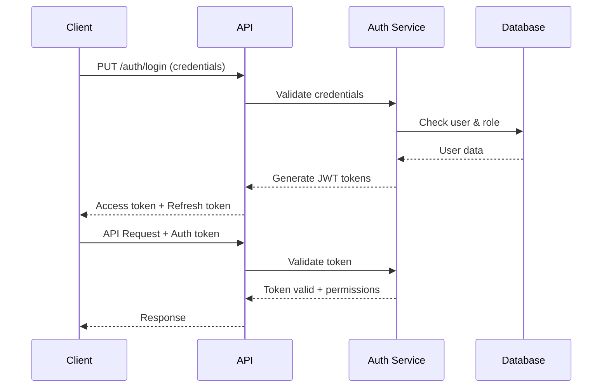

FinCode uses a role-based authentication system with JWT tokens to secure API access. Each user is assigned a specific role that determines their permissions and accessible resources within your tenant.

<Info>
  All API requests must include a valid access token in the Authorization header
  otherwise stated.
</Info>

## Authentication Flow



## User Roles & Permissions

<CardGroup cols={2}>
  <Card title="MANAGER">
    - Plugins management
    - Agent configuration
    - KYC/AML configuration
    - Analytics and reporting
    - Process transaction refunds.
    - Organisation user management
    - Crossboarder setup & operations
  </Card>
  <Card title="AGENT">
  - Call-over reports
  - Corridor management
  - View customer profiles
  - Transaction status updates
  - Exchange rate and fee markups
  - Tenant-specific analytics and reporting
  </Card>
<Card title="CASHIER">
  - Print receipts
  - Process payments
  - Create transactions
  - Handle cash collections
  - View transaction history
  - Verify transaction details
</Card>

<Card title="CUSTOMER">
  - Request quotes
  - Initiate transfers
  - Create beneficiaries
  - View own transactions
  - View transaction history
  - Update profile information
</Card>
</CardGroup>

---

## Interactive Authentication Testing

Test authentication for different user roles in your sandbox environment. Select a role to see the appropriate login request and response.

<Tabs>
  <Tab title="MANAGER">
    ### Manager Authentication

    Managers have full access to all platform features and administrative functions.

    **Login Request:**
    ```bash
    curl -X PUT "https://{domain}.fincode.software/api/v6/services/securitymanagement/login" \
      -H "Content-Type: application/json" \
      -H "platform: fincode" \
      -H "uuid: 200" \
      -d '{
        "email": "manager@yourcompany.com",
        "currentPassword": "your-secure-password"
      }'
    ```

    **Node.js Example:**
    ```javascript
    const axios = require('axios');

    async function loginAsManager() {
      const response = await axios.put(
        'https://{domain}.fincode.software/api/v6/services/securitymanagement/login',
        {
          email: 'manager@yourcompany.com',
          currentPassword: 'your-secure-password'
        },
        {
          headers: {
            'Content-Type': 'application/json',
            'platform': "fincode",
            'uuid': "200",
          }
        }
      );

      return response.data;
    }
    ```

    **Expected Response:**
    ```json
    {
      "access_token": "eyJhbGciOiJIUzI1NiIsInR5cCI6IkpXVCJ9...",
      "expires_in": 3600,
      "refresh_token": "def50200a1b2c3d4e5f6...",
      "user": {
        "id": "user_mgr_123",
        "email": "manager@yourcompany.com",
        "role": "MANAGER",
        "tenant_id": "tenant_456",
        "permissions": [
          "users:read",
          "users:write",
          "transactions:read",
          "transactions:write",
          "reports:read",
          "settings:write",
          "webhooks:manage"
        ]
      }
    }
    ```

  </Tab>

  <Tab title="AGENT">
    ### Agent Authentication

    Agents handle customer-facing operations and transaction processing.

    **Login Request:**
    ```bash
    curl -X PUT "https://{domain}.fincode.software/api/v6/services/securitymanagement/login" \
      -H "Content-Type: application/json" \
      -H "platform: fincode" \
      -H "uuid: 200" \
      -d '{
        "email": "agent@yourcompany.com",
        "currentPassword": "your-secure-password"
      }'
    ```

    **Node.js Example:**
    ```javascript
    const axios = require('axios');

    async function loginAsAgent() {
      const response = await axios.put(
        'https://{domain}.fincode.software/api/v6/services/securitymanagement/login',
        {
          email: 'agent@yourcompany.com',
          currentPassword: 'your-secure-password'
        },
        {
          headers: {
            'Content-Type': 'application/json',
            'platform': 'fincode',
            'uuid': '200'
          }
        }
      );

      return response.data;
    }
    ```

    **Expected Response:**
    ```json
    {
      "access_token": "eyJhbGciOiJIUzI1NiIsInR5cCI6IkpXVCJ9...",
      "expires_in": 3600,
      "refresh_token": "def50200a1b2c3d4e5f6...",
      "user": {
        "id": "user_agt_456",
        "email": "agent@yourcompany.com",
        "role": "AGENT",
        "tenant_id": "tenant_456",
        "permissions": [
          "transactions:read",
          "transactions:create",
          "transactions:update",
          "customers:read",
          "customers:verify",
          "kyc:perform",
          "reports:read"
        ]
      }
    }
    ```

  </Tab>

  <Tab title="CASHIER">
    ### Cashier Authentication

    Cashiers handle payment processing and cash transactions at physical locations.

    **Login Request:**
    ```bash
    curl -X PUT "https://{domain}.fincode.software/api/v6/services/securitymanagement/login" \
      -H "Content-Type: application/json" \
      -H "platform: fincode" \
      -H "uuid: 200" \
      -d '{
        "email": "cashier@yourcompany.com",
        "currentPassword": "your-secure-password"
      }'
    ```

    **Node.js Example:**
    ```javascript
    const axios = require('axios');

    async function loginAsCashier() {
      const response = await axios.put(
        'https://{domain}.fincode.software/api/v6/services/securitymanagement/login',
        {
          email: 'cashier@yourcompany.com',
          currentPassword: 'your-secure-password'
        },
        {
          headers: {
            'Content-Type': 'application/json',
            'platform': 'fincode',
            'uuid': '200',
          }
        }
      );

      return response.data;
    }
    ```

    **Expected Response:**
    ```json
    {
      "access_token": "eyJhbGciOiJIUzI1NiIsInR5cCI6IkpXVCJ9...",
      "expires_in": 3600,
      "refresh_token": "def50200a1b2c3d4e5f6...",
      "user": {
        "id": "user_csh_789",
        "email": "cashier@yourcompany.com",
        "role": "CASHIER",
        "tenant_id": "tenant_456",
        "permissions": [
          "transactions:create",
          "transactions:read",
          "payments:process",
          "cash:handle",
          "receipts:print"
        ]
      }
    }
    ```

  </Tab>

  <Tab title="CUSTOMER">
    ### Customer Authentication

    Registered customers can access self-service features through your customer portal.

    **Login Request:**
    ```bash
    curl -X PUT "https://{domain}.fincode.software/api/v6/services/securitymanagement/login" \
      -H "Content-Type: application/json" \
      -H "platform: fincode" \
      -H "uuid: 200" \
      -d '{
        "email": "customer@example.com",
        "currentPassword": "customer-password"
      }'
    ```

    **Node.js Example:**
    ```javascript
    const axios = require('axios');

    async function loginAsCustomer() {
      const response = await axios.put(
        'https://{domain}.fincode.software/sandbox/api/v6/services/securitymanagement/login',
        {
          email: 'customer@example.com',
          currentPassword: 'customer-password'
        },
        {
          headers: {
            'Content-Type': 'application/json',
            'platform': 'fincode',
            'uuid': '200',
          }
        }
      );

      return response.data;
    }
    ```

    **Expected Response:**
    ```json
    {
      "access_token": "eyJhbGciOiJIUzI1NiIsInR5cCI6IkpXVCJ9...",
      "expires_in": 3600,
      "refresh_token": "def50200a1b2c3d4e5f6...",
      "user": {
        "id": "user_cust_101",
        "email": "customer@example.com",
        "role": "CUSTOMER",
        "tenant_id": "tenant_456",
        "customer_id": "cust_202",
        "permissions": [
          "profile:read",
          "profile:update",
          "transactions:create",
          "transactions:read:own",
          "beneficiaries:manage",
          "quotes:request"
        ]
      }
    }
    ```

  </Tab>
</Tabs>

## Making Authenticated Requests

Once authenticated, include the access token in all subsequent API requests:

```javascript
const axios = require('axios');

const response = await axios.get(
  'https://{domain}.fincode.software/api/v6/services/admin/organisation-preference-management/fetch-organisaction-preference',
  {
    headers: {
      'X-Auth-Token': process.env.JWT_ACCESS_TOKEN,
      'Content-Type': 'application/json',
      platform: 'fincode',
      uuid: '200',
    },
  }
);
```

**Required Headers:**

- `Authorization: Bearer {access_token}` - Your JWT access token
- `X-Auth-Token: {api_token}` - Your JWT access token
- `Content-Type: application/json` - For POST/PUT requests
- `platform: fincode` - For identifying request platform
- `uuid: 200` - Unique uuid string

## Token Management

### Token Expiration

Access tokens expire after **1 hour**. You have two options to maintain authentication:

<Tabs>
  <Tab title="Refresh Token">
    Use the refresh token to obtain a new access token without re-authentication:

    ```javascript
    async function refreshAccessToken(refreshToken) {
      const response = await axios.post(
        'https://{domain}.fincode.software/api/v6/services/securitymanagement/refresh',
        {
          refresh_token: refreshToken
        },
        {
          headers: {
            'Content-Type': 'application/json',
            'X-Auth-Token': process.env.JWT_ACCESS_TOKEN,
            'platform': 'fincode',
            'uuid': '200',
          }
        }
      );

      return response.data;
    }
    ```

    **Response:**
    ```json
    {
      "access_token": "eyJhbGciOiJIUzI1NiIsInR5cCI6IkpXVCJ9...",
      "expires_in": 3600
    }
    ```

  </Tab>

  <Tab title="Auto-Refresh">
    Implement automatic token refresh in your application:

    ```javascript
    let accessToken = null;
    let refreshToken = null;
    let tokenExpiry = null;

    async function ensureValidToken() {
      if (!tokenExpiry || Date.now() >= tokenExpiry - 300000) {
        if (refreshToken) {
          const data = await refreshAccessToken(refreshToken);
          accessToken = data.access_token;
          tokenExpiry = Date.now() + (data.expires_in * 1000);
        } else {
          const data = await login();
          accessToken = data.access_token;
          refreshToken = data.refresh_token;
          tokenExpiry = Date.now() + (data.expires_in * 1000);
        }
      }

      return accessToken;
    }

    const token = await ensureValidToken();
    ```

  </Tab>
</Tabs>

### Token Revocation

Revoke tokens when logging out or if compromised:

```javascript
async function logout(accessToken) {
  await axios.post(
    'https://{domain}.fincode.software/api/v6/services/securitymanagement/logout',
    {},
    {
      headers: {
        'X-Auth-Token': process.env.JWT_ACCESS_TOKEN,
        platform: 'fincode',
        uuid: '200',
      },
    }
  );
}
```

## Security Best Practices

<CardGroup cols={2}>
  <Card title="Secure Storage" icon="lock">
    - Store tokens in secure, httpOnly cookies for web apps
    - Use secure storage mechanisms on mobile (Keychain/KeyStore)
    - Never store tokens in localStorage or sessionStorage
    - Encrypt tokens at rest in your backend
  </Card>
<Card title="Token Rotation" icon="rotate">
  - Rotate refresh tokens after each use - Implement token expiration monitoring
  - Set up automatic token refresh - Handle token refresh failures gracefully
</Card>
<Card title="Network Security" icon="shield-halved">
  - Always use HTTPS in production
  - Implement certificate pinning for apps
  - Use secure communication channels
  - Monitor for man-in-the-middle attacks
</Card>

  <Card title="Access Control" icon="user-shield">
    - Follow principle of least privilege
    - Regularly audit user permissions
    - Implement session timeout
    - Log all authentication attempts
  </Card>
</CardGroup>

## Role Permission Matrix

| Permission            | MANAGER | AGENT        | CASHIER | CUSTOMER |
| --------------------- | ------- | ------------ | ------- | -------- |
| Create Transactions   | ❌      | ❌           | ✅      | ✅ (own) |
| View All Transactions | ✅      | ✅           | ❌      | ❌       |
| Update Transactions   | ✅      | ✅           | ✅      | ❌       |
| Manage Users          | ✅      | ✅ (own)     | ✅      | ❌       |
| KYC/AML Configuration | ✅      | ❌           | ❌      | ❌       |
| KYC/AML Verification  | ❌      | ❌           | ❌      | ✅       |
| Tenant Configuration  | ✅      | ❌           | ❌      | ❌       |
| Process Refunds       | ✅      | ❌           | ❌      | ❌       |
| Analytics/Reports     | ✅      | ✅ (limited) | ❌      | ❌       |
| Manage Beneficiaries  | ✅      | ❌           | ❌      | ✅ (own) |
| Plugin Management     | ✅      | ❌           | ❌      | ❌       |
| Agent Configuration   | ✅      | ❌           | ❌      | ❌       |
| Rate/Fee Markups      | ❌      | ❌           | ❌      | ✅ (own) |
| Request quotes        | ❌      | ❌           | ✅      | ✅       |

## Error Handling

<AccordionGroup>
  <Accordion title="401 Unauthorized" icon="circle-xmark">
    **Causes:**
    - Invalid or expired access token
    - Missing Authorization header
    - Malformed JWT token

    **Solution:**
    ```javascript

    axios.interceptors.response.use(
      response => response,
      async error => {
        if (error.response?.status === 401) {

          try {
            const newToken = await refreshAccessToken(refreshToken);

            error.config.headers['Authorization'] = `Bearer ${newToken.access_token}`;
            return axios.request(error.config);
          } catch (refreshError) {
            window.location.href = '/login';
          }
        }
        return Promise.reject(error);
      }
    );
    ```

  </Accordion>

  <Accordion title="403 Forbidden" icon="ban">
    **Causes:**
    - Insufficient permissions for the requested resource
    - Role doesn't have access to the endpoint
    - Attempting to access another user's data

    **Response:**
    ```json
    {
      "error": "forbidden",
      "message": "Insufficient permissions to access this resource",
      "role": "CASHIER"
    }
    ```

  </Accordion>

  <Accordion title="429 Too Many Requests" icon="clock">
    **Causes:**
    - Exceeded rate limits for authentication endpoints
    - Too many failed login attempts

    **Response:**
    ```json
    {
      "error": "rate_limit_exceeded",
      "message": "Too many authentication attempts",
      "retry_after": 300
    }
    ```

    **Solution:** Implement exponential backoff and respect the `Retry-After` header.

  </Accordion>
</AccordionGroup>

## Next Steps

<CardGroup cols={2}>
  <Card title='API Keys' icon='key' href='/integration/api-keys'>
    Learn about generating and managing API keys for your tenant
  </Card>
  <Card title='Webhooks' icon='webhook' href='/integration/webhooks'>
    Set up real-time notifications for authentication events
  </Card>
  <Card title='Rate Limits' icon='gauge-high' href='/api/rate-limits'>
    Understand authentication rate limits and best practices
  </Card>
  <Card title='Security' icon='shield-check' href='/overview/security'>
    Deep dive into FinCode's security architecture
  </Card>
</CardGroup>
