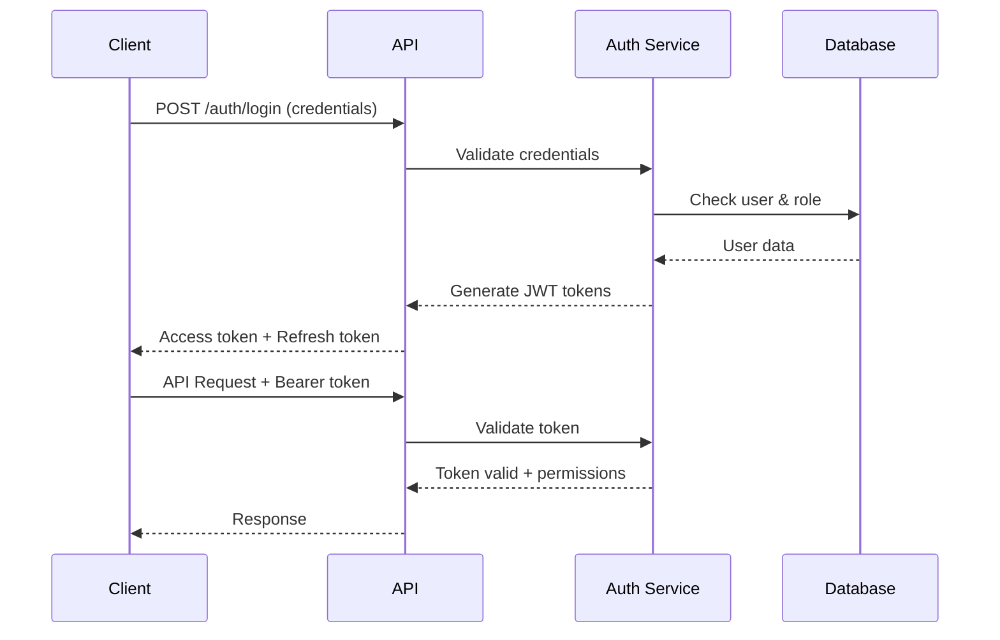

# Authentication

FinCode uses a role-based authentication system with JWT tokens to secure API access. Each user is assigned a specific role that determines their permissions and accessible resources within your tenant.

<Info>
  All API requests must include a valid access token in the Authorization
  header.
</Info>

---

## Authentication Flow



---

## User Roles & Permissions

<CardGroup cols={2}>
  <Card title="Manager" icon="user-tie">
    - Tenant configuration - User management - All transaction operations - Analytics and reporting - Webhook configuration - API key management
  </Card>

{" "}

<Card title="AGENT" icon="headset">
  - Create and manage transactions - Customer verification (KYC) - Transaction
  status updates - View customer profiles - Process refunds access
</Card>

{" "}

<Card title="CASHIER" icon="cash-register">
  - Create transactions - Process payments - Verify transaction details - Handle
  cash collections - View transaction history - Print receipts
</Card>

  <Card title="CUSTOMER" icon="user">
  - View own transactions - Create beneficiaries - Request quotes - Initiate transfers - View transaction history  - Update profile information
  </Card>
</CardGroup>

---

## Interactive Authentication Testing

Test authentication for different user roles in your sandbox environment. Select a role to see the appropriate login request and response.

<Tabs>
  <Tab title="MANAGER">
    ### Manager Authentication

    Managers have full access to all platform features and administrative functions.

    **Login Request:**
    ```bash
    curl -X POST "https://your-company.fincode.software/sandbox/api/v1/auth/login" \
      -H "Content-Type: application/json" \
      -H "X-Auth-Token: YOUR_API_TOKEN" \
      -d '{
        "email": "manager@yourcompany.com",
        "password": "your-secure-password",
        "role": "MANAGER"
      }'
    ```

    **Node.js Example:**
    ```javascript
    const axios = require('axios');

    async function loginAsManager() {
      const response = await axios.post(
        'https://your-company.fincode.software/sandbox/api/v1/auth/login',
        {
          email: 'manager@yourcompany.com',
          password: 'your-secure-password',
          role: 'MANAGER'
        },
        {
          headers: {
            'Content-Type': 'application/json',
            'X-Auth-Token': process.env.FINCODE_API_TOKEN
          }
        }
      );

      return response.data;
    }
    ```

    **Expected Response:**
    ```json
    {
      "access_token": "eyJhbGciOiJIUzI1NiIsInR5cCI6IkpXVCJ9...",
      "token_type": "Bearer",
      "expires_in": 3600,
      "refresh_token": "def50200a1b2c3d4e5f6...",
      "user": {
        "id": "user_mgr_123",
        "email": "manager@yourcompany.com",
        "role": "MANAGER",
        "tenant_id": "tenant_456",
        "permissions": [
          "users:read",
          "users:write",
          "transactions:read",
          "transactions:write",
          "reports:read",
          "settings:write",
          "webhooks:manage"
        ]
      }
    }
    ```

  </Tab>

  <Tab title="AGENT">
    ### Agent Authentication

    Agents handle customer-facing operations and transaction processing.

    **Login Request:**
    ```bash
    curl -X POST "https://your-company.fincode.software/sandbox/api/v1/auth/login" \
      -H "Content-Type: application/json" \
      -H "X-Auth-Token: YOUR_API_TOKEN" \
      -d '{
        "email": "agent@yourcompany.com",
        "password": "your-secure-password",
        "role": "AGENT"
      }'
    ```

    **Node.js Example:**
    ```javascript
    const axios = require('axios');

    async function loginAsAgent() {
      const response = await axios.post(
        'https://your-company.fincode.software/sandbox/api/v1/auth/login',
        {
          email: 'agent@yourcompany.com',
          password: 'your-secure-password',
          role: 'AGENT'
        },
        {
          headers: {
            'Content-Type': 'application/json',
            'X-Auth-Token': process.env.FINCODE_API_TOKEN
          }
        }
      );

      return response.data;
    }
    ```

    **Expected Response:**
    ```json
    {
      "access_token": "eyJhbGciOiJIUzI1NiIsInR5cCI6IkpXVCJ9...",
      "token_type": "Bearer",
      "expires_in": 3600,
      "refresh_token": "def50200a1b2c3d4e5f6...",
      "user": {
        "id": "user_agt_456",
        "email": "agent@yourcompany.com",
        "role": "AGENT",
        "tenant_id": "tenant_456",
        "permissions": [
          "transactions:read",
          "transactions:create",
          "transactions:update",
          "customers:read",
          "customers:verify",
          "kyc:perform",
          "reports:read"
        ]
      }
    }
    ```

  </Tab>

  <Tab title="CASHIER">
    ### Cashier Authentication

    Cashiers handle payment processing and cash transactions at physical locations.

    **Login Request:**
    ```bash
    curl -X POST "https://your-company.fincode.software/sandbox/api/v1/auth/login" \
      -H "Content-Type: application/json" \
      -H "X-Auth-Token: YOUR_API_TOKEN" \
      -d '{
        "email": "cashier@yourcompany.com",
        "password": "your-secure-password",
        "role": "CASHIER"
      }'
    ```

    **Node.js Example:**
    ```javascript
    const axios = require('axios');

    async function loginAsCashier() {
      const response = await axios.post(
        'https://your-company.fincode.software/sandbox/api/v1/auth/login',
        {
          email: 'cashier@yourcompany.com',
          password: 'your-secure-password',
          role: 'CASHIER'
        },
        {
          headers: {
            'Content-Type': 'application/json',
            'X-Auth-Token': process.env.FINCODE_API_TOKEN
          }
        }
      );

      return response.data;
    }
    ```

    **Expected Response:**
    ```json
    {
      "access_token": "eyJhbGciOiJIUzI1NiIsInR5cCI6IkpXVCJ9...",
      "token_type": "Bearer",
      "expires_in": 3600,
      "refresh_token": "def50200a1b2c3d4e5f6...",
      "user": {
        "id": "user_csh_789",
        "email": "cashier@yourcompany.com",
        "role": "CASHIER",
        "tenant_id": "tenant_456",
        "permissions": [
          "transactions:create",
          "transactions:read",
          "payments:process",
          "cash:handle",
          "receipts:print"
        ]
      }
    }
    ```

  </Tab>

  <Tab title="CUSTOMER">
    ### Customer Authentication

    Registered customers can access self-service features through your customer portal.

    **Login Request:**
    ```bash
    curl -X POST "https://your-company.fincode.software/sandbox/api/v1/auth/login" \
      -H "Content-Type: application/json" \
      -H "X-Auth-Token: YOUR_API_TOKEN" \
      -d '{
        "email": "customer@example.com",
        "password": "customer-password",
        "role": "CUSTOMER"
      }'
    ```

    **Node.js Example:**
    ```javascript
    const axios = require('axios');

    async function loginAsCustomer() {
      const response = await axios.post(
        'https://your-company.fincode.software/sandbox/api/v1/auth/login',
        {
          email: 'customer@example.com',
          password: 'customer-password',
          role: 'CUSTOMER'
        },
        {
          headers: {
            'Content-Type': 'application/json',
            'X-Auth-Token': process.env.FINCODE_API_TOKEN
          }
        }
      );

      return response.data;
    }
    ```

    **Expected Response:**
    ```json
    {
      "access_token": "eyJhbGciOiJIUzI1NiIsInR5cCI6IkpXVCJ9...",
      "token_type": "Bearer",
      "expires_in": 3600,
      "refresh_token": "def50200a1b2c3d4e5f6...",
      "user": {
        "id": "user_cust_101",
        "email": "customer@example.com",
        "role": "CUSTOMER",
        "tenant_id": "tenant_456",
        "customer_id": "cust_202",
        "permissions": [
          "profile:read",
          "profile:update",
          "transactions:create",
          "transactions:read:own",
          "beneficiaries:manage",
          "quotes:request"
        ]
      }
    }
    ```

  </Tab>
</Tabs>

---

## Making Authenticated Requests

Once authenticated, include the access token in all subsequent API requests:

```javascript
const axios = require("axios");

const accessToken = "eyJhbGciOiJIUzI1NiIsInR5cCI6IkpXVCJ9...";

const response = await axios.get(
  "https://your-company.fincode.software/sandbox/api/v1/transactions",
  {
    headers: {
      Authorization: `Bearer ${accessToken}`,
      "X-Auth-Token": process.env.FINCODE_API_TOKEN,
      "Content-Type": "application/json",
    },
  }
);
```

**Required Headers:**

- `Authorization: Bearer {access_token}` - Your JWT access token
- `X-Auth-Token: {api_token}` - Your tenant API token
- `Content-Type: application/json` - For POST/PUT requests

---

## Token Management

### Token Expiration

Access tokens expire after **1 hour**. You have two options to maintain authentication:

<Tabs>
  <Tab title="Refresh Token">
    Use the refresh token to obtain a new access token without re-authentication:

    ```javascript
    async function refreshAccessToken(refreshToken) {
      const response = await axios.post(
        'https://your-company.fincode.software/sandbox/api/v1/auth/refresh',
        {
          refresh_token: refreshToken
        },
        {
          headers: {
            'Content-Type': 'application/json',
            'X-Auth-Token': process.env.FINCODE_API_TOKEN
          }
        }
      );

      return response.data;
    }
    ```

    **Response:**
    ```json
    {
      "access_token": "eyJhbGciOiJIUzI1NiIsInR5cCI6IkpXVCJ9...",
      "token_type": "Bearer",
      "expires_in": 3600
    }
    ```

  </Tab>

  <Tab title="Auto-Refresh">
    Implement automatic token refresh in your application:

    ```javascript
    let accessToken = null;
    let refreshToken = null;
    let tokenExpiry = null;

    async function ensureValidToken() {
      if (!tokenExpiry || Date.now() >= tokenExpiry - 300000) {
        if (refreshToken) {
          const data = await refreshAccessToken(refreshToken);
          accessToken = data.access_token;
          tokenExpiry = Date.now() + (data.expires_in * 1000);
        } else {
          const data = await login();
          accessToken = data.access_token;
          refreshToken = data.refresh_token;
          tokenExpiry = Date.now() + (data.expires_in * 1000);
        }
      }

      return accessToken;
    }

    const token = await ensureValidToken();
    ```

  </Tab>
</Tabs>

### Token Revocation

Revoke tokens when logging out or if compromised:

```javascript
async function logout(accessToken) {
  await axios.post(
    "https://your-company.fincode.software/sandbox/api/v1/auth/logout",
    {},
    {
      headers: {
        Authorization: `Bearer ${accessToken}`,
        "X-Auth-Token": process.env.FINCODE_API_TOKEN,
      },
    }
  );
}
```

---

## Security Best Practices

<CardGroup cols={2}>
  <Card title="Secure Storage" icon="lock">
    - Store tokens in secure, httpOnly cookies for web apps
    - Use secure storage mechanisms on mobile (Keychain/KeyStore)
    - Never store tokens in localStorage or sessionStorage
    - Encrypt tokens at rest in your backend
  </Card>

{" "}

<Card title="Token Rotation" icon="rotate">
  - Rotate refresh tokens after each use - Implement token expiration monitoring
  - Set up automatic token refresh - Handle token refresh failures gracefully
</Card>

{" "}

<Card title="Network Security" icon="shield-halved">
  - Always use HTTPS in production - Implement certificate pinning for mobile
  apps - Use secure communication channels - Monitor for man-in-the-middle
  attacks
</Card>

  <Card title="Access Control" icon="user-shield">
    - Follow principle of least privilege
    - Regularly audit user permissions
    - Implement session timeout
    - Log all authentication attempts
  </Card>
</CardGroup>

---

## Role Permission Matrix

| Permission            | MANAGER | AGENT        | CASHIER | CUSTOMER |
| --------------------- | ------- | ------------ | ------- | -------- |
| Create Transactions   | ✅      | ✅           | ✅      | ✅ (own) |
| View All Transactions | ✅      | ✅           | ❌      | ❌       |
| Update Transactions   | ✅      | ✅           | ❌      | ❌       |
| Manage Users          | ✅      | ❌           | ❌      | ❌       |
| KYC Verification      | ✅      | ✅           | ❌      | ❌       |
| Tenant Configuration  | ✅      | ❌           | ❌      | ❌       |
| Process Refunds       | ✅      | ✅           | ❌      | ❌       |
| View Reports          | ✅      | ✅ (limited) | ❌      | ❌       |
| Manage Beneficiaries  | ✅      | ✅           | ❌      | ✅ (own) |
| API Key Management    | ✅      | ❌           | ❌      | ❌       |
| Webhook Configuration | ✅      | ❌           | ❌      | ❌       |

---

## Error Handling

<AccordionGroup>
  <Accordion title="401 Unauthorized" icon="circle-xmark">
    **Causes:**
    - Invalid or expired access token
    - Missing Authorization header
    - Malformed JWT token

    **Solution:**
    ```javascript

    axios.interceptors.response.use(
      response => response,
      async error => {
        if (error.response?.status === 401) {

          try {
            const newToken = await refreshAccessToken(refreshToken);

            error.config.headers['Authorization'] = `Bearer ${newToken.access_token}`;
            return axios.request(error.config);
          } catch (refreshError) {
            window.location.href = '/login';
          }
        }
        return Promise.reject(error);
      }
    );
    ```

  </Accordion>

  <Accordion title="403 Forbidden" icon="ban">
    **Causes:**
    - Insufficient permissions for the requested resource
    - Role doesn't have access to the endpoint
    - Attempting to access another user's data

    **Response:**
    ```json
    {
      "error": "forbidden",
      "message": "Insufficient permissions to access this resource",
      "required_permission": "transactions:write",
      "user_role": "CASHIER"
    }
    ```

  </Accordion>

  <Accordion title="429 Too Many Requests" icon="clock">
    **Causes:**
    - Exceeded rate limits for authentication endpoints
    - Too many failed login attempts

    **Response:**
    ```json
    {
      "error": "rate_limit_exceeded",
      "message": "Too many authentication attempts",
      "retry_after": 300
    }
    ```

    **Solution:** Implement exponential backoff and respect the `Retry-After` header.

  </Accordion>
</AccordionGroup>

---

## Testing in Sandbox

Use these test credentials for different roles in sandbox:

```javascript
const testUsers = {
  manager: {
    email: "manager@test.fincode.software",
    password: "Test123!Manager",
  },
  agent: {
    email: "agent@test.fincode.software",
    password: "Test123!Agent",
  },
  cashier: {
    email: "cashier@test.fincode.software",
    password: "Test123!Cashier",
  },
  customer: {
    email: "customer@test.fincode.software",
    password: "Test123!Customer",
  },
};
```

<Warning>
  These test credentials only work in sandbox environment. Never use test
  credentials in production.
</Warning>

---

## Next Steps

<CardGroup cols={2}>
  <Card title="API Keys" icon="key" href="/integration/api-keys">
    Learn about generating and managing API keys for your tenant
  </Card>
  <Card title="Webhooks" icon="webhook" href="/integration/webhooks">
    Set up real-time notifications for authentication events
  </Card>
  <Card title="Rate Limits" icon="gauge-high" href="/api/rate-limits">
    Understand authentication rate limits and best practices
  </Card>
  <Card title="Security" icon="shield-check" href="/overview/security">
    Deep dive into FinCode's security architecture
  </Card>
</CardGroup>
