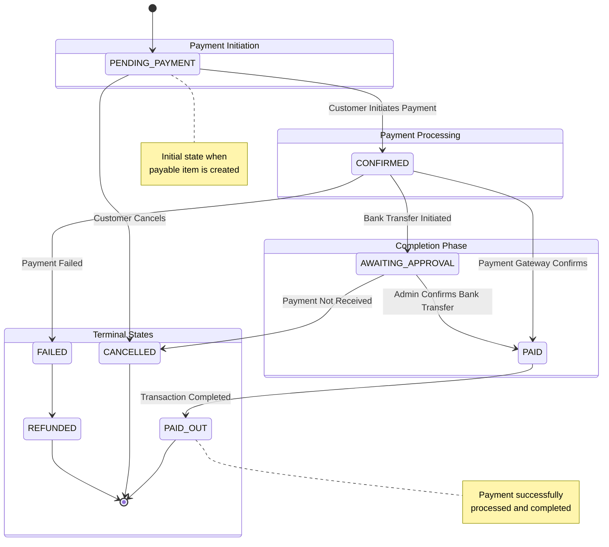
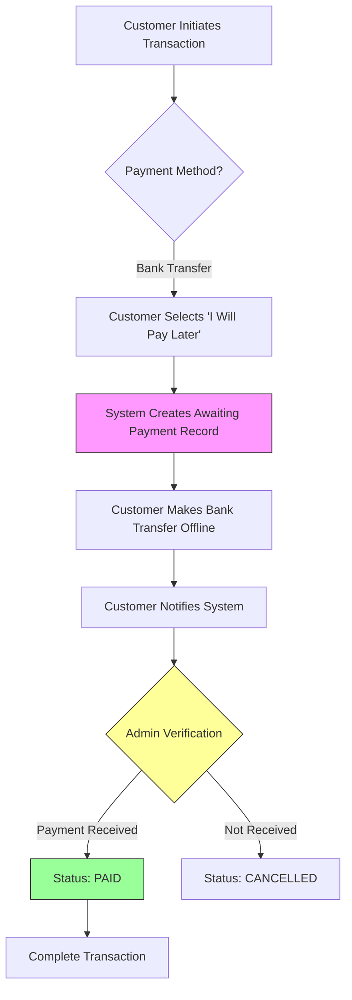

Understanding the lifecycle of a payment is crucial for integrating with the payment platform. This page details the various states a payment can traverse and the triggers for each transition.

## State Diagram

The following diagram illustrates the standard flow of a payment from initiation to completion.



## Payment States

### 1. PENDING_PAYMENT
The initial state when a payable item is created and awaiting payment.

- **Trigger**: Customer creates a transaction or wallet funding request
- **Action Required**: Customer must select payment method and initiate payment
- **Next Possible States**: `CONFIRMED`, `CANCELLED`

<Card title='Create Payable' href='/api/deposit-engine/supported-payment-methods'>
  View how to create payable items and fetch payment methods.
</Card>

### 2. CONFIRMED
Payment has been initiated but not yet verified by the payment gateway or admin.

- **Trigger**: 
  - Customer submits payment via wallet, card, or bank transfer
  - System creates payment instruction
- **Context**: Payment is being processed by the gateway or awaiting bank transfer confirmation
- **Next Possible States**: `PAID`, `AWAITING_APPROVAL`, `FAILED`

### 3. AWAITING_APPROVAL
Specific to bank transfers where customer has notified they will pay later.

- **Trigger**: 
  - Customer calls `PUT /bank-iwillpaylater-wallet/{pcn}/{payableType}`
  - Customer notifies `POST /notify-bank-transfer-payment` with option `bank_paid_now`
- **Action Required**: 
  - Customer makes offline bank transfer
  - Admin verifies payment receipt
- **Next Possible States**: `PAID`, `CANCELLED`

<CardGroup cols={2}>
  <Card title='I Will Pay Later' href='/api/deposit-engine/bank-iwillpaylater'>
    Initiate bank transfer payment
  </Card>
  <Card title='Notify Payment' href='/api/deposit-engine/notify-bank-transfer-payment'>
    Notify payment completion
  </Card>
</CardGroup>

### 4. PAID
Payment has been successfully received and verified.

- **Trigger**: 
  - Payment gateway confirms successful payment
  - Admin confirms bank transfer received
  - Wallet debit successful
- **Context**: Funds have been received and verified
- **Next Possible States**: `PAID_OUT`, `REFUNDED`

### 5. PAID_OUT
Transaction has been completed successfully (final state for remittances).

- **Trigger**: 
  - For remittances: Funds disbursed to beneficiary
  - For wallet funding: Wallet credited
  - For bill payments: Payment confirmed by biller
- **Action Required**: None - This is a terminal success state

### 6. FAILED
Payment attempt failed due to insufficient funds, gateway error, or other issues.

- **Trigger**: 
  - Insufficient wallet balance
  - Card declined
  - Payment gateway error
  - Network timeout
- **Action Required**: Customer may retry payment with different method
- **Next Possible States**: `PENDING_PAYMENT`, `REFUNDED`

### 7. CANCELLED
Payment was cancelled by customer or system.

- **Trigger**: 
  - Customer cancels before payment
  - Admin cancels awaiting payment
  - Automatic cancellation after timeout
- **Action Required**: None - This is a terminal state

### 8. REFUNDED
Payment was refunded to customer.

- **Trigger**: 
  - Transaction failed after payment received
  - Customer requested refund
  - Admin initiated refund
- **Action Required**: None - This is a terminal state

### 9. HELD
Payment is on hold pending investigation or compliance check.

- **Trigger**: 
  - Fraud detection alert
  - Compliance review required
  - Unusual transaction pattern
- **Action Required**: Compliance team review
- **Next Possible States**: `PAID`, `REFUNDED`, `CANCELLED`

### 10. SUSPENDED
Payment or account suspended temporarily.

- **Trigger**: 
  - Account verification needed
  - Suspicious activity detected
  - Administrative hold
- **Action Required**: Customer must resolve suspension reason
- **Next Possible States**: `PENDING_PAYMENT`, `CANCELLED`

## Bank Transfer Lifecycle

Bank transfers follow a specific workflow within the payment lifecycle:



### Bank Transfer States

| State | Description | Action Required |
| :--- | :--- | :--- |
| `AWAITING_BANK_TRANSFER_PAYMENT` | Customer committed to pay via bank transfer | Customer makes transfer |
| `RECEIVED_BANK_TRANSFER_PAYMENT` | Admin confirmed payment received | None |
| `COMPLETED_PAYMENT_LIFECYCLE` | Payment verified and transaction completed | None |

<Card title='Awaiting Payments' href='/api/payments/awaiting-payments'>
  View and manage bank transfer payments awaiting confirmation.
</Card>

## Payment Method Specific Flows

### Wallet Payment Flow

```
PENDING_PAYMENT → CONFIRMED → PAID → PAID_OUT
```

Wallet payments are typically instant if sufficient balance exists.

<Card title='Wallet Payments' href='/deposit-engine/wallet-payments'>
  Learn about wallet payment processing.
</Card>

### Card Payment Flow

```
PENDING_PAYMENT → CONFIRMED → PAID → PAID_OUT
             ↓
           FAILED
```

Card payments may fail due to insufficient funds or decline.

<Card title='Card Payments' href='/deposit-engine/card-payments'>
  Learn about card payment processing.
</Card>

### Bank Transfer Flow

```
PENDING_PAYMENT → AWAITING_APPROVAL → PAID → PAID_OUT
             ↓                    ↓
        CANCELLED              CANCELLED
```

Bank transfers require manual confirmation.

<Card title='Bank Transfers' href='/deposit-engine/bank-transfers'>
  Learn about bank transfer processing.
</Card>

## State Transitions & Webhooks

You can subscribe to webhook events to receive real-time updates when payment status changes.

| Event Name | Description |
| :--- | :--- |
| `payment.initiated` | Triggered when status changes to CONFIRMED |
| `payment.successful` | Triggered when payment is PAID |
| `payment.failed` | Triggered when payment FAILED |
| `payment.completed` | Triggered when status is PAID_OUT |
| `payment.refunded` | Triggered when payment is REFUNDED |
| `payment.cancelled` | Triggered when payment is CANCELLED |

<Card title='Webhooks Documentation' href='/api/webhooks'>
  Learn how to configure and handle webhook events.
</Card>

## Payment Follow-up Actions

For bank transfers, the system supports automated follow-up actions:

### Follow-up Action Types

| Action Type | Description |
| :--- | :--- |
| `AUTO_CONFIRM_TRANSACTION` | Payment received and approved for payout |
| `MARK_AS_PENDING_TRANSACTION` | Payment received but held |
| `AUTO_HOLDFUND_WALLET` | Payment received and suspended |
| `AUTO_FUND_WALLET` | Payment received and approved for funding |
| `AUTO_WITHDRAWAL_WALLET` | Approved for payout |

<Card title='Payment Actions' href='/api/deposit-engine/awaiting-payment-actions'>
  Manage awaiting payment follow-up actions.
</Card>

## Best Practices

### Error Handling

Always implement proper error handling for payment state transitions:

```javascript
try {
  const payment = await processPayment(paymentData);
  
  // Handle success
  if (payment.status === 'PAID') {
    completeTransaction();
  }
  
} catch (error) {
  // Handle specific payment errors
  if (error.code === 'INSUFFICIENT_FUNDS') {
    notifyCustomer('Please add funds to your wallet');
  } else if (error.code === 'GATEWAY_ERROR') {
    suggestAlternativePaymentMethod();
  }
}
```

### Status Monitoring

Implement polling or webhooks to monitor payment status:

```javascript
// Polling approach
const checkPaymentStatus = async (paymentId) => {
  const maxAttempts = 10;
  let attempts = 0;
  
  while (attempts < maxAttempts) {
    const status = await getPaymentStatus(paymentId);
    
    if (status === 'PAID' || status === 'FAILED') {
      return status;
    }
    
    await sleep(3000); // Wait 3 seconds
    attempts++;
  }
  
  throw new Error('Payment status timeout');
};
```

### User Experience

- Show clear payment status to users
- Provide estimated completion times
- Offer alternative payment methods if first attempt fails
- Send email/SMS notifications for status changes