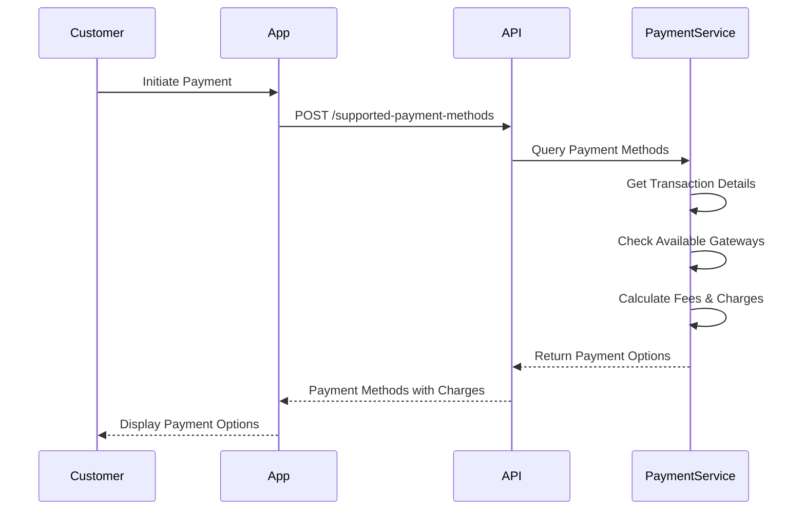
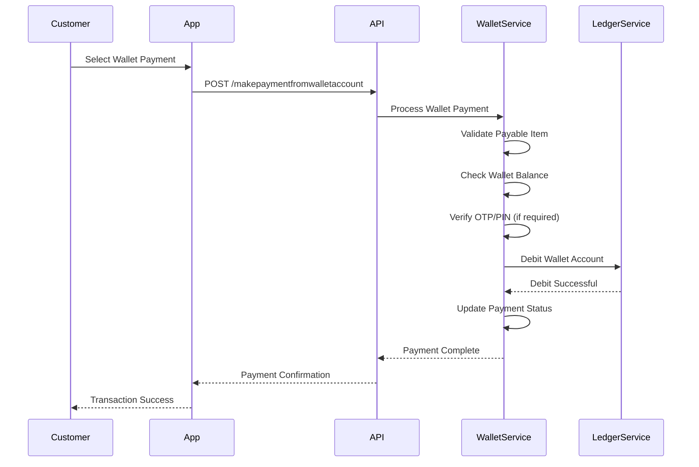
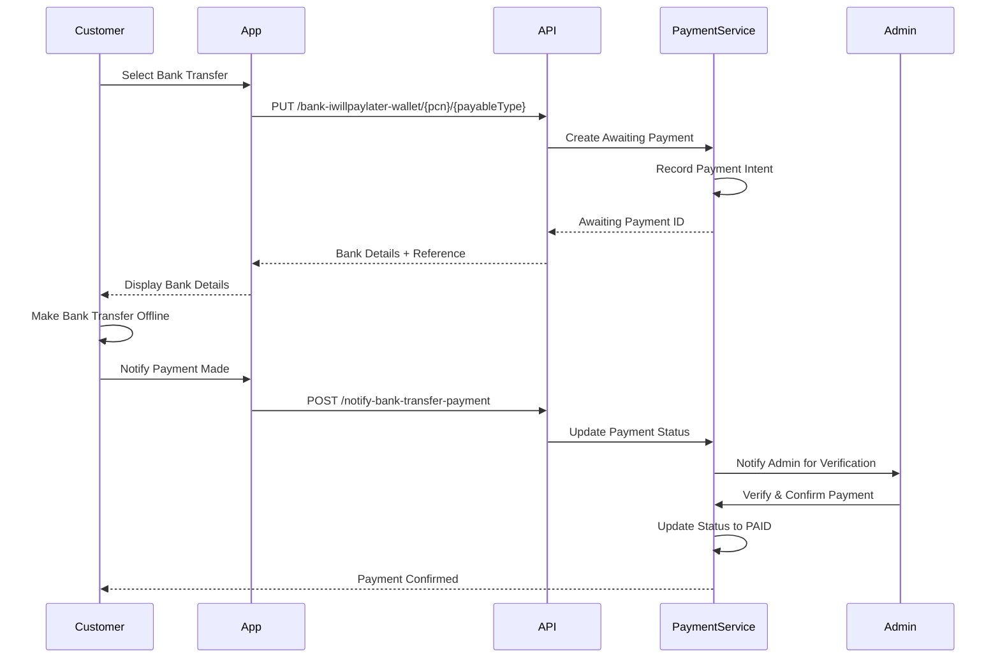
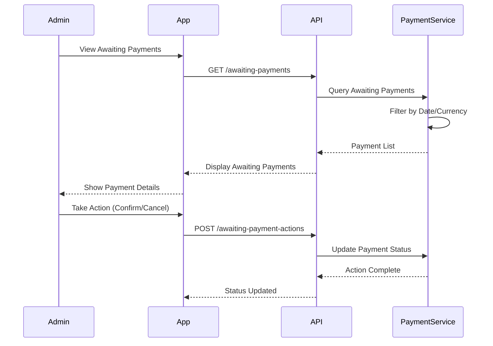
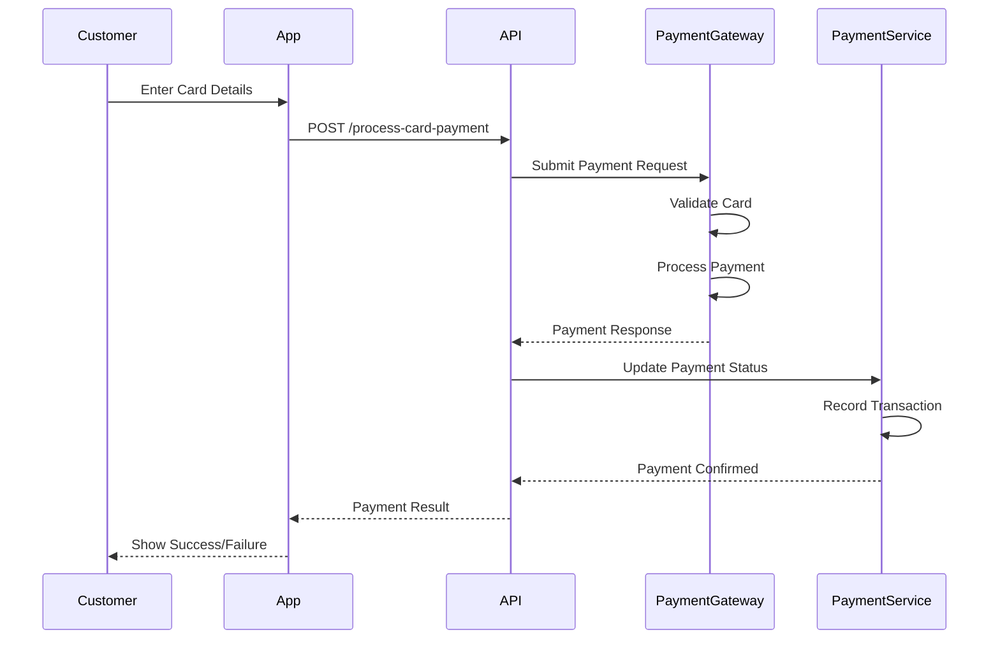
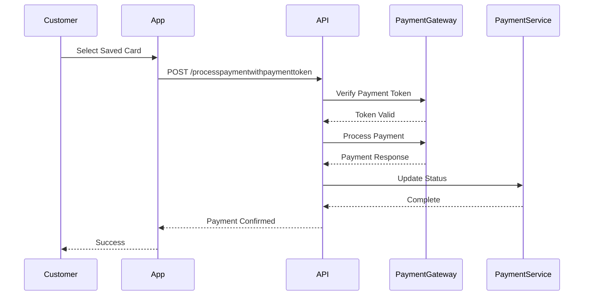
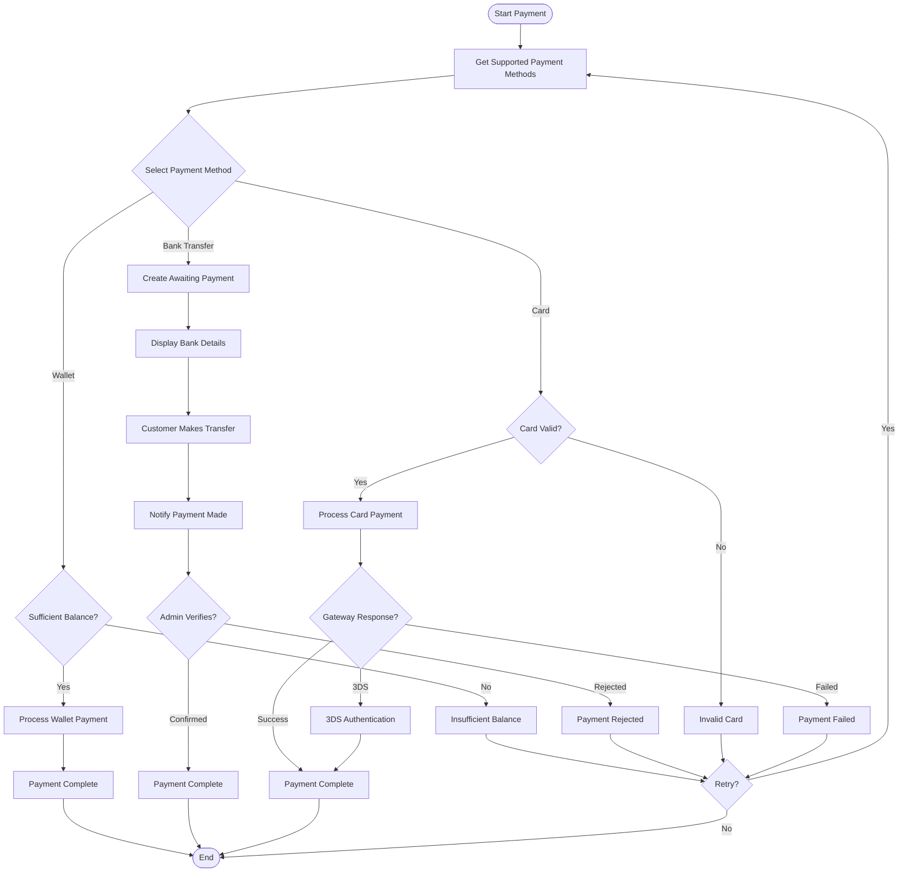

This guide details the complete payment processing flow, from payment method selection to transaction completion.

<Note>
  The flow covers **Payment Method Selection**, **Wallet Payments**, **Bank Transfers**, and **Card Payments**.
</Note>

## Phase 1: Payment Initiation & Method Selection

### 1.1 Get Supported Payment Methods

Before processing any payment, retrieve available payment methods for the transaction.



<CardGroup cols={2}>
  <Card title='Supported Payment Methods' href='/api/deposit-engine/supported-payment-methods'>
    Get available payment methods and charges
  </Card>
  <Card title='Payment Method Charges' href='/api/deposit-engine/payment-methods-charges'>
    Calculate payment method charges
  </Card>
</CardGroup>

#### Payment Method Selection Steps

<Steps>
  <Step title="Request Payment Methods">
    Customer provides transaction details (PCN, amount, currency, payable type).
  </Step>

  <Step title='Retrieve Available Methods'>
    System returns available payment methods based on:
    - **Country**: Customer's country and currency
    - **Amount**: Transaction amount and applicable limits
    - **Gateway**: Available payment gateway integrations
    - **Payable Type**: Type of transaction (TRANSACTION, WALLET, BILL, etc.)
  </Step>

  <Step title='Calculate Charges'>
    System calculates for each method:
    - **Principal Amount**: Base transaction amount
    - **Fee**: Transaction fee
    - **Tax**: Applicable taxes
    - **Exchange Rate**: For currency conversions
    - **Total Checkout Amount**: Complete amount customer will pay
  </Step>

  <Step title='Display Options'>
    Customer reviews payment options with transparent pricing and selects preferred method.
  </Step>
</Steps>

## Phase 2: Wallet Payments

### 2.1 Pay from Wallet Account

Process payments directly from customer's wallet balance.



<CardGroup cols={2}>
  <Card title='Wallet Payment' href='/api/deposit-engine/make-payment-from-wallet'>
    Process payment from wallet
  </Card>
  <Card title='Wallet Details' href='/deposit-engine/wallet-payments'>
    Learn about wallet payments
  </Card>
</CardGroup>

#### Wallet Payment Steps

<Steps>
  <Step title="Initiate Wallet Payment">
    Customer provides:
    - **Payable ID**: Transaction identifier
    - **Payable Type**: Type of payment
    - **Account Number**: Wallet account (optional)
    - **Password**: Customer password
    - **OTP/PIN**: One-time password or PIN (if enabled)
  </Step>

  <Step title='Validate Payment'>
    System validates:
    - Payable item exists and is pending
    - Customer authentication
    - Strong customer authentication (if enabled)
    - Transaction PIN (if required)
  </Step>

  <Step title='Check Balance'>
    System verifies:
    - Sufficient wallet balance
    - Account is active
    - No holds or restrictions
  </Step>

  <Step title='Process Payment'>
    System executes:
    - Debits wallet account
    - Updates payable status to PAID
    - Records transaction in ledger
    - Triggers payment completion workflow
  </Step>

  <Step title='Confirmation'>
    Customer receives confirmation with updated wallet balance.
  </Step>
</Steps>

## Phase 3: Bank Transfer Payments

### 3.1 Bank Transfer ("I Will Pay Later")

Handle offline bank transfer payments with manual confirmation.



<CardGroup cols={2}>
  <Card title='I Will Pay Later' href='/api/deposit-engine/bank-iwillpaylater'>
    Notify intent to pay via bank transfer
  </Card>
  <Card title='Notify Payment' href='/api/deposit-engine/notify-bank-transfer-payment'>
    Confirm bank transfer completed
  </Card>
  <Card title='Bank Transfer Details' href='/deposit-engine/bank-transfers'>
    Learn about bank transfer workflow
  </Card>
</CardGroup>

#### Bank Transfer Steps

<Steps>
  <Step title="Initiate Bank Transfer">
    Customer selects "I Will Pay Later" option, providing PCN and payable type.
  </Step>

  <Step title='Create Awaiting Payment'>
    System creates awaiting payment record with:
    - **Status**: AWAITING_BANK_TRANSFER_PAYMENT
    - **Payment Reference**: Unique reference for bank transfer
    - **Bank Details**: Organization's bank account details
    - **Amount**: Total amount to transfer
  </Step>

  <Step title='Customer Makes Transfer'>
    Customer completes bank transfer offline using provided:
    - Bank account number
    - Payment reference
    - Exact amount
  </Step>

  <Step title='Notify Payment Completion'>
    Customer notifies system via one of three options:
    - **bank_paid_now**: Payment already made
    - **bank_pay_later**: Will pay and notify later
    - **mistake**: Accidentally selected this method
  </Step>

  <Step title='Admin Verification'>
    Admin reviews bank statement and verifies:
    - Payment received
    - Correct amount
    - Correct reference
    - Updates status to PAID
  </Step>

  <Step title='Complete Transaction'>
    System completes the transaction and processes the payable item.
  </Step>
</Steps>

### 3.2 View Awaiting Payments

Admins can view and manage payments awaiting confirmation.



<CardGroup cols={2}>
  <Card title='Awaiting Payments' href='/api/deposit-engine/awaiting-payments'>
    View payments awaiting confirmation
  </Card>
  <Card title='Payment Actions' href='/api/deposit-engine/awaiting-payment-actions'>
    Manage awaiting payments
  </Card>
</CardGroup>

## Phase 4: Card Payments

### 4.1 Process Card Payment

Process payments using credit or debit cards through payment gateways.



<CardGroup cols={2}>
  <Card title='Process Card Payment' href='/api/deposit-engine/process-card-payment'>
    Process credit/debit card payment
  </Card>
  <Card title='Card Payment Details' href='/deposit-engine/card-payments'>
    Learn about card payment processing
  </Card>
</CardGroup>

#### Card Payment Steps

<Steps>
  <Step title="Enter Card Details">
    Customer provides:
    - **Card Number (PAN)**: Primary account number
    - **Expiry Date**: Card expiration (MM/yyyy)
    - **Security Code**: CVV/CVC
    - **Amount**: Payment amount
    - **Currency**: Transaction currency
  </Step>

  <Step title='Process Payment'>
    System submits to payment gateway (e.g., SecureTrading):
    - Validates card details
    - Checks available balance
    - Performs fraud checks
    - Processes authorization
  </Step>

  <Step title='Gateway Response'>
    Payment gateway returns:
    - **Transaction Reference**: Gateway transaction ID
    - **Status**: Success, failed, or requires 3DS
    - **Auth Code**: Authorization code
    - **Error Details**: If payment failed
  </Step>

  <Step title='Update Payment Status'>
    System updates payable item status based on gateway response:
    - **Success**: Status → PAID
    - **Failed**: Status → FAILED
    - **3DS Required**: Redirect for authentication
  </Step>

  <Step title='Confirmation'>
    Customer receives payment confirmation or error details.
  </Step>
</Steps>

### 4.2 Process with Payment Token

For returning customers, process payments using saved payment tokens.



<Card title='Token Payment' href='/api/deposit-engine/process-payment-with-token'>
  Process payment with saved token
</Card>

## Complete Payment Flow



## Key Concepts

### Payment Methods

The system supports multiple payment methods:
- **E_WALLET**: Instant payment from wallet balance
- **BANK_TRANSFER**: Offline bank transfer with confirmation
- **ONLINE_CARD_PAYMENT**: Credit/debit card via gateway
- **ONLINE_BANK_TRANSFER**: Direct online banking
- **MOBILE_MONEY**: Mobile money payments
- **CRYPTO_CURRENCY**: Cryptocurrency payments

### Payable Types

Different transaction types that can be paid:
- **TRANSACTION**: Money transfer/remittance
- **WALLET**: Wallet funding
- **WALLET_CUSTOMER**: Personal wallet payment
- **BILL**: Bill payment
- **MERCHANT**: Product purchase
- **VOUCHER**: Voucher purchase

### Payment Status Flow

```
PENDING_PAYMENT → CONFIRMED → PAID → PAID_OUT
```

For bank transfers:
```
PENDING_PAYMENT → AWAITING_APPROVAL → PAID → PAID_OUT
```

### Charges & Fees

Every payment includes:
- **Principal Amount**: Base transaction amount
- **Fee**: Service/transaction fee
- **Tax**: Applicable taxes (VAT, etc.)
- **Payment Method Fee**: Gateway/method specific fee
- **Exchange Rate Fee**: For currency conversions
- **Total Checkout Amount**: Complete amount charged

### Security Features

- **Strong Customer Authentication (SCA)**: OTP verification for sensitive transactions
- **Transaction PIN**: Additional PIN verification
- **Payment Token**: Secure tokenization for saved cards
- **3D Secure**: Card authentication for online payments
- **Idempotency**: Prevent duplicate payment processing

<Card title='Learn More' href='/api/deposit-engine/supported-payment-methods'>
  Explore all payment API endpoints and integration options.
</Card>