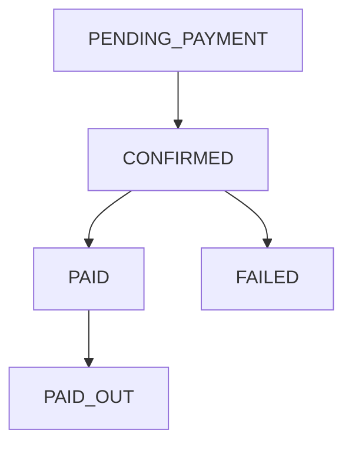
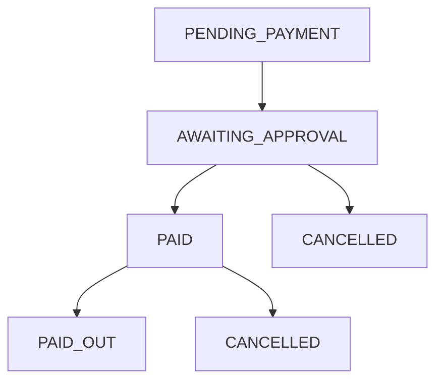

This guide details the **step-by-step overview of how a payment is processed** in the Deposit Engine. It includes all supported payment methods: **Wallet, Card, and Bank Transfer**.

---

## Overview

The payment process consists of four main phases:

1. **Payment Method Selection** – Customer selects their preferred method (Wallet, Card, Bank Transfer) based on amount, currency, and availability.
2. **Payment Initiation** – System creates a payable item and prepares for processing.
3. **Payment Processing** – Payment is executed via the chosen method, with real-time verification where applicable.
4. **Payment Confirmation** – Payment status is updated and customer is notified.

<Info>
  This flow applies to all payment types and ensures compliance, tracking, and status consistency.
</Info>

---

## Visual Flow

```mermaid
flowchart TD
    A[Customer Initiates Payment] --> B{Select Payment Method}
    B -->|Wallet| C[Wallet Balance Check]
    B -->|Card| D[Card Validation & Payment Gateway]
    B -->|Bank Transfer| E[Customer Selects 'I Will Pay Later']
    
    C --> F{Sufficient Balance?}
    F -->|Yes| G[Debit Wallet & Confirm Payment]
    F -->|No| H[Payment Failed / Retry]
    
    D --> I[Authorize Card Payment via Gateway]
    I -->|Success| J[Confirm Payment]
    I -->|Failure| H
    
    E --> K[System Creates Awaiting Payment Record]
    K --> L[Customer Makes Bank Transfer Offline]
    L --> M[Notify System of Payment]
    M --> N{Admin Verification}
    N -->|Confirmed| J
    N -->|Not Received| H

    J --> O[Update Payment Status: PAID]
    O --> P[Payment Completed / PAID_OUT]
    H --> Q[Payment Failed / CANCELLED]
````

---

## Step-by-Step Flow

### 1. Customer Initiates Payment

* Customer selects items or service to pay for.
* System generates a **Payable Item**.
* Payment enters `PENDING_PAYMENT` state.

<Card title='Learn More' href='/api/deposit-engine/supported-payment-methods'>
  See how to create payable items.
</Card>

---

### 2. Select Payment Method

* Customer chooses from available methods:

  * **Wallet**
  * **Card**
  * **Bank Transfer**
* Availability depends on **currency, country, and transaction type**.

<CardGroup cols={3}>
  <Card title='Wallet Payment' href='/deposit-engine/wallet-payments'>
    Instant payment using wallet balance.
  </Card>
  <Card title='Card Payment' href='/deposit-engine/card-payments'>
    Authorize payment via card gateway.
  </Card>
  <Card title='Bank Transfer' href='/deposit-engine/bank-transfers'>
    Notify system of offline bank transfer payment.
  </Card>
</CardGroup>

---

### 3. Payment Processing

#### Wallet

1. System checks wallet balance.
2. If sufficient:

   * Wallet debited
   * Payment status updated to `PAID`
3. If insufficient:

   * Payment fails
   * Customer notified

#### Card

1. Card details sent to **payment gateway**.
2. Gateway authorizes payment.
3. If approved:

   * Transaction marked `PAID`
4. If declined:

   * Transaction marked `FAILED`

#### Bank Transfer

1. Customer selects "I will pay later".
2. System creates `AWAITING_APPROVAL` record.
3. Customer completes bank transfer offline.
4. Customer notifies system via `POST /notify-bank-transfer-payment`.
5. Admin verifies payment.
6. Transaction marked `PAID` if verified, else `CANCELLED`.

---

### 4. Payment Confirmation

* Payment status updated in system (`PAID`, `PAID_OUT`, `FAILED`, `CANCELLED`).
* Notifications sent to customer via email/SMS.
* Ledger updated for accounting and reconciliation.

<Card title='Payment Lifecycle' href='/deposit-engine/payment-lifecycle'>
  Track state transitions for all payment types.
</Card>

---

## Payment Method Flowcharts

### Wallet Payment

```mermaid
flowchart TD
    PENDING_PAYMENT --> CONFIRMED --> PAID --> PAID_OUT
    CONFIRMED --> FAILED
```

### Card Payment



### Bank Transfer



---

## Integration Notes

* Wallet payments are **instant** if balance is sufficient.
* Card payments depend on **gateway approval** and may fail.
* Bank transfers require **manual confirmation by admin**.
* All payments are logged and traceable via `PCN` or transaction ID.

---

## Next Steps

<CardGroup cols={2}>
  <Card title='Payment Lifecycle' href='/deposit-engine/payment-lifecycle'>
    Understand state transitions for all payment methods.
  </Card>
  <Card title='Supported Payment Methods' href='/api/deposit-engine/supported-payment-methods'>
    Explore API endpoints to fetch available methods.
  </Card>
  <Card title='Wallet Payments' href='/deposit-engine/wallet-payments'>
    Learn wallet-specific flow details.
  </Card>
  <Card title='Card Payments' href='/deposit-engine/card-payments'>
    Learn card-specific flow details.
  </Card>
  <Card title='Bank Transfers' href='/deposit-engine/bank-transfers'>
    Learn bank transfer workflow.
  </Card>
</CardGroup>
```