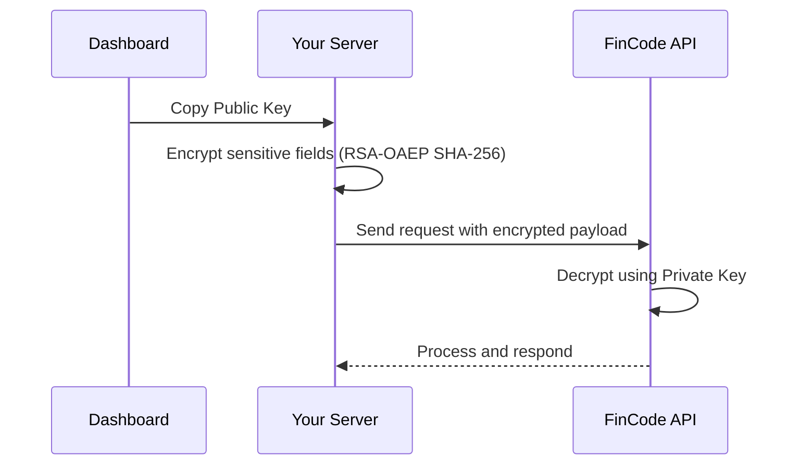

FinCode provides two complementary security mechanisms for integration:

1. **Encryption Keys** - Public/private key pairs for encrypting sensitive data in API payloads
2. **API Tokens** - Long-lived authentication tokens for server-to-server communication

Both are managed from your dashboard and available immediately upon onboarding.

## Encryption Keys

### Overview

When integrating with FinCode, you may need to send sensitive information such as passwords, PINs, or other secrets. To protect this data during transmission, we provide RSA public key encryption.

<Info>
  Your public and private key pair is automatically generated when your organization is onboarded and is always available on the settings area of your dashboard.
</Info>

### How It Works



### Key Management

<CardGroup cols={2}>
  <Card title="Access Keys" icon="key">
    Your encryption keys are available on your dashboard under
    
    **Settings → API Connections → Encryption Keys**.
  </Card>
  <Card title="Key Rotation" icon="rotate">
    You can rotate your key pair at any time from the dashboard.
    
    After rotation, the previous keys are immediately invalidated.
  </Card>
</CardGroup>

### When to Use Encryption

Encrypt any sensitive fields before including them in your API request payload:

| Field Type | Examples | Encryption Required |
|------------|----------|---------------------|
| Passwords | `currentPassword`, `newPassword` | ✅ Yes |
| PINs | `transactionPin`, `userPin` | ✅ Yes |
| Security Answers | `securityAnswer` | ✅ Yes |
| Regular Data | `email`, `firstName`, `amount` | ❌ No |

### Implementation

The encryption uses **RSA with OAEP padding (SHA-256)**. Here's a quick reference:

1. Obtain your RSA public key from the dashboard (Base64 encoded)
2. Decode the Base64 key into an RSA PublicKey object
3. Initialize the cipher with `RSA/ECB/OAEPWithSHA-256AndMGF1Padding`
4. Encrypt the plaintext and Base64-encode the result
5. Send the encrypted value in your API request

<Tabs>
  <Tab title="Java">
    ```java
    public static String encryptPayload(String payload, String publicKeyBase64) {
        try {
            byte[] keyBytes = Base64.getDecoder().decode(publicKeyBase64);
            X509EncodedKeySpec keySpec = new X509EncodedKeySpec(keyBytes);
            PublicKey publicKey = KeyFactory.getInstance("RSA").generatePublic(keySpec);

            Cipher cipher = Cipher.getInstance("RSA/ECB/OAEPWithSHA-256AndMGF1Padding");
            cipher.init(Cipher.ENCRYPT_MODE, publicKey);

            byte[] encryptedBytes = cipher.doFinal(payload.getBytes(StandardCharsets.UTF_8));

            return Base64.getEncoder().encodeToString(encryptedBytes);
        } catch (Exception e) {
            throw new IllegalStateException("RSA encryption failed", e);
        }
    }
    ```
  </Tab>

  <Tab title="JavaScript">
    ```javascript
    const crypto = require('crypto');

    function encryptPayload(payload, publicKeyBase64) {
      // Convert Base64 to PEM format
      const publicKeyPem = `-----BEGIN PUBLIC KEY-----\n${publicKeyBase64}\n-----END PUBLIC KEY-----`;

      const encrypted = crypto.publicEncrypt(
        {
          key: publicKeyPem,
          padding: crypto.constants.RSA_PKCS1_OAEP_PADDING,
          oaepHash: 'sha256',
        },
        Buffer.from(payload, 'utf8')
      );

      return encrypted.toString('base64');
    }
    ```
  </Tab>

  <Tab title="Python">
    ```python
    from cryptography.hazmat.primitives import serialization, hashes
    from cryptography.hazmat.primitives.asymmetric import padding
    import base64

    def encrypt_payload(payload: str, public_key_base64: str) -> str:
        # Decode the Base64 public key
        key_bytes = base64.b64decode(public_key_base64)
        public_key = serialization.load_der_public_key(key_bytes)

        # Encrypt with OAEP padding
        encrypted = public_key.encrypt(
            payload.encode('utf-8'),
            padding.OAEP(
                mgf=padding.MGF1(algorithm=hashes.SHA256()),
                algorithm=hashes.SHA256(),
                label=None
            )
        )

        return base64.b64encode(encrypted).decode('utf-8')
    ```
  </Tab>

  <Tab title="C#">
    ```csharp
    using System;
    using System.Security.Cryptography;
    using System.Text;

    public static string EncryptPayload(string payload, string publicKeyBase64)
    {
        byte[] keyBytes = Convert.FromBase64String(publicKeyBase64);

        using (RSA rsa = RSA.Create())
        {
            rsa.ImportSubjectPublicKeyInfo(keyBytes, out _);

            byte[] encryptedBytes = rsa.Encrypt(
                Encoding.UTF8.GetBytes(payload),
                RSAEncryptionPadding.OaepSHA256
            );

            return Convert.ToBase64String(encryptedBytes);
        }
    }
    ```
  </Tab>
</Tabs>

You can see the payload encryption guide [here](/integration/payload-encryption-guide) or download it below.

<Card title="Download Full Encryption Guide" icon="download" href="/downloads/Payload_Encryption_Guide.docx">
  Download our comprehensive encryption guide with detailed code sample and best practices.
</Card>

<Warning>
  **Important Security Notes:**
  - Never share your private key—only use the public key for encryption
  - Ensure payload size does not exceed RSA key limits
  - Only encrypt sensitive fields, not entire request bodies
</Warning>

---

## API Tokens

### Overview

For server-to-server integrations, FinCode provides long-lived API tokens that allow you to authenticate without going through the login flow. These tokens are generated from your dashboard and can be used directly in API requests.

<Info>
  API tokens are different from the JWT access tokens received from the login endpoint. They provide a simpler authentication method for backend services.
</Info>

### Token vs JWT Authentication

| Feature | API Token | JWT (Login) |
|---------|-----------|-------------|
| Obtained from | Dashboard | Login endpoint |
| Expiry options | 24 hours, 1 month, 3 months, 6 months, 1 year | 1 hour (with refresh) |
| Use case | Server-to-server, scheduled jobs, integrations | User sessions, real-time apps |
| Rotation | Manual from dashboard | Automatic via refresh token |
| Multiple tokens | ✅ Yes (different services) | ❌ No |

### Token Management

<Steps>
  <Step title="Create a Token">
    Navigate to **Settings → API Connections → API Tokens** on your dashboard. Click **Create New Token** and select your desired expiry period.
  </Step>
  <Step title="Set Expiry">
    Choose from the available expiry options:
    - **24 Hours** – For temporary or testing purposes
    - **1 Month** – Short-term integrations
    - **3 Months** – Standard integrations
    - **6 Months** – Extended integrations
    - **1 Year** – Long-term production services
  </Step>
  <Step title="Cashier Email & Password">
    Enter cashier email and password. You'd need this for generating any token.
  </Step>
  <Step title="Copy and Store">
    Copy the generated token immediately. For security, the full token is only shown once.
  </Step>
  <Step title="Use in Requests">
    Include the token in the `X-Auth-Token` header of your API requests.
  </Step>
</Steps>

### Token Operations

<CardGroup cols={3}>
  <Card title="Create" icon="plus">
    Create multiple tokens for different services or environments (dev, staging, production).
  </Card>
  <Card title="Rotate" icon="rotate">
    Generate a new token to replace an existing one without service interruption.
  </Card>
  <Card title="Invalidate" icon="ban">
    Immediately revoke or delete a token if compromised or no longer needed.
  </Card>
</CardGroup>

### Using API Tokens

Include your API token in the `X-Auth-Token` header:

```bash
curl -X GET "https://{domain}.fincode.software/api/v6/services/your-endpoint" \
  -H "Content-Type: application/json" \
  -H "X-Auth-Token: your-api-token-here" \
  -H "platform: fincode" \
  -H "uuid: 200"
```

### Best Practices

<AccordionGroup>
  <Accordion title="Use Environment Variables" icon="code">
    Never hardcode API tokens in your source code. Store them in environment variables or a secrets manager.

    ```javascript
    // ✅ Good
    const token = process.env.FINCODE_API_TOKEN;

    // ❌ Bad
    const token = "fc_live_abc123...";
    ```
  </Accordion>

  <Accordion title="Use Different Tokens per Service" icon="layer-group">
    Create separate tokens for each service or environment. This limits the blast radius if a token is compromised.

    - `FINCODE_TOKEN_PROD` – Production services
    - `FINCODE_TOKEN_STAGING` – Staging environment
    - `FINCODE_TOKEN_CRON` – Scheduled jobs
  </Accordion>

  <Accordion title="Monitor Token Usage" icon="chart-line">
    Regularly review which tokens are active and when they were last used. Revoke unused or dormant tokens.
  </Accordion>

  <Accordion title="Plan for Rotation" icon="calendar">
    Set reminders before tokens expire. Implement graceful rotation to avoid service interruptions.
  </Accordion>
</AccordionGroup>

## Summary

| Feature | Encryption Keys | API Tokens |
|---------|-----------------|------------|
| Purpose | Protect sensitive payload data | Authenticate API requests |
| Location | Dashboard → API Connections → Encryption Keys | Dashboard → API Connections → API Tokens |
| Rotation | Available anytime | Available anytime |
| When to use | Sending passwords, PINs, secrets | Server-to-server calls, webhooks, etc |

---

## Next Steps

<CardGroup cols={2}>
  <Card title='Authentication' icon='key' href='/authentication'>
    Learn about user authentication and JWT tokens
  </Card>
  <Card title='Security' icon='shield-check' href='/overview/security'>
    Deep dive into FinCode's security architecture
  </Card>
  <Card title='Testing' icon='flask' href='/integration/testing'>
    Test your integration in the sandbox environment
  </Card>
  <Card title='Go Live' icon='rocket' href='/integration/go-live'>
    Complete your integration checklist
  </Card>
</CardGroup>