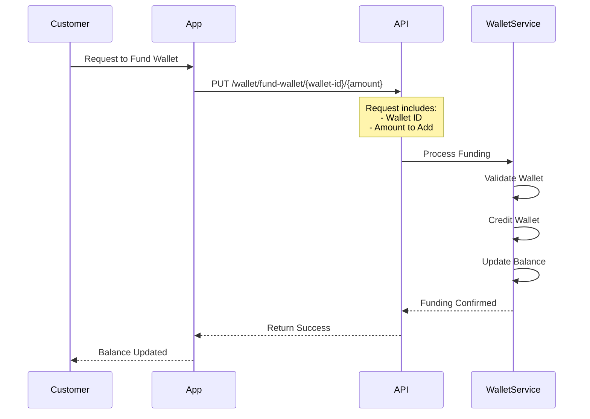
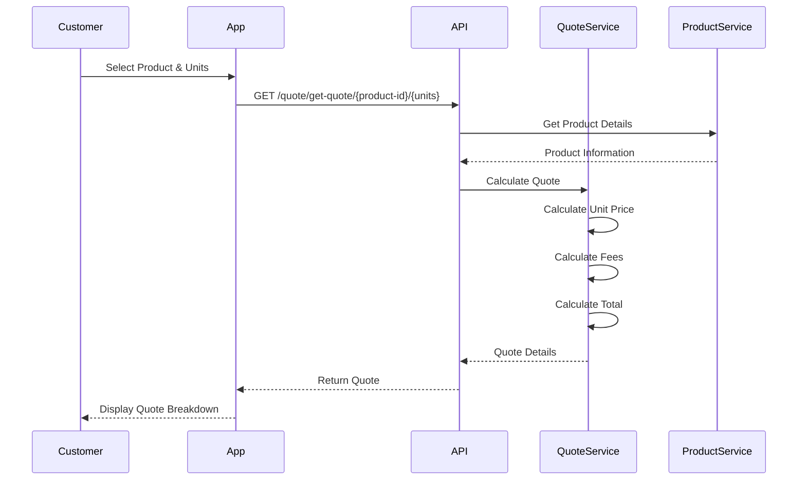
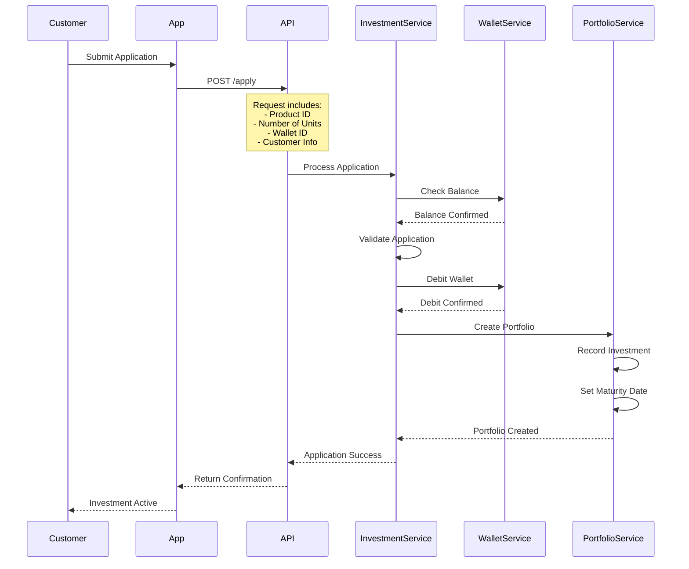
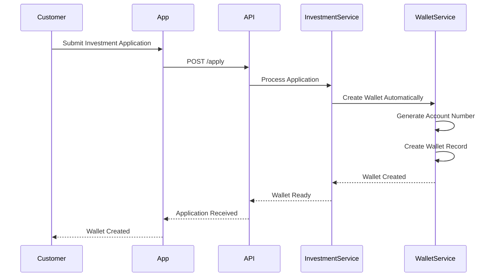
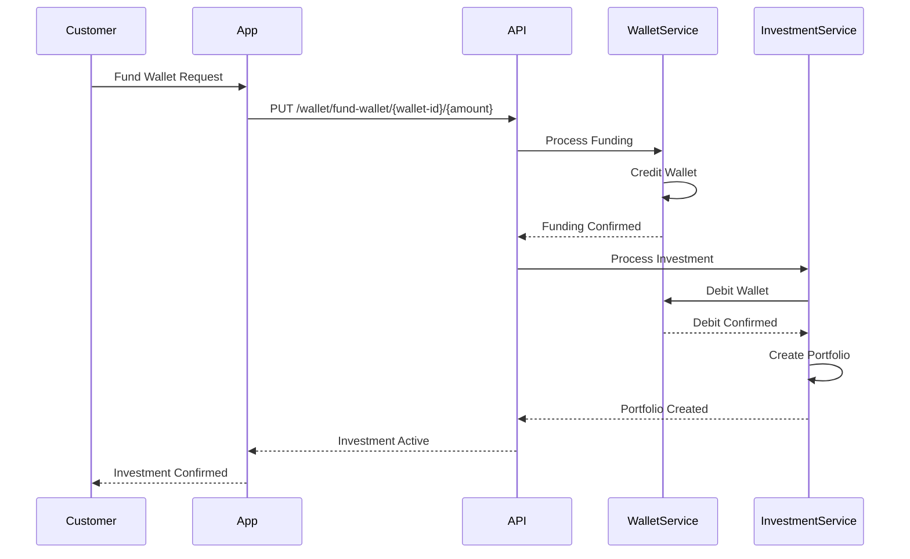
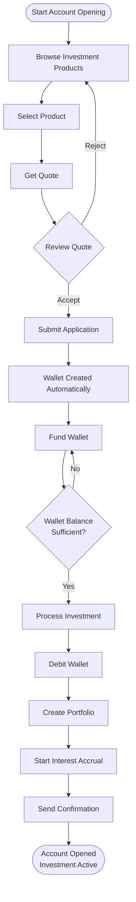

This guide provides a detailed, step-by-step walkthrough of the investment account opening process, from product selection to your first investment.

<Note>
  The account opening process includes **Product Selection**, **Quote Generation**, **Investment Application**, **Wallet Creation**, and **Funding**.
</Note>

## Overview

Opening an investment account involves selecting a product, getting a quote, submitting your investment application. The system automatically creates a wallet for you, which you then fund to complete the investment. This guide walks you through each step.

## Step 1: Browse Investment Products

### Why Fund the Wallet?

Before making investments, you need to add funds to your wallet. The investment amount (including fees) will be deducted from your wallet balance when you submit an investment application.

### Funding Process



<Card title='Fund Wallet API' href='/api/investment/fund-wallet'>
  View the complete API documentation for funding wallets.
</Card>

### Funding Steps

<Steps>
  <Step title="Select Wallet">
    Choose the wallet you want to fund. If you have multiple wallets, select the one in the currency you plan to invest in.
  </Step>

  <Step title='Specify Amount'>
    Enter the amount you want to add to the wallet. This should be sufficient to cover your planned investment plus any applicable fees.
  </Step>

  <Step title='Process Funding'>
    The system credits your wallet with the specified amount. The balance is updated immediately.
  </Step>

  <Step title='Verify Balance'>
    Confirm that your wallet balance has been updated correctly before proceeding to make an investment.
  </Step>
</Steps>

### Funding Request Example

```bash
PUT /api/v1/user/wallet/fund-wallet/{wallet-id}/{amount}

# Example:
PUT /api/v1/user/wallet/fund-wallet/123e4567-e89b-12d3-a456-426614174000/100000
```

<Warning>
  Ensure your wallet has sufficient balance before submitting an investment application. Applications with insufficient funds will be rejected.
</Warning>

### Understanding Investment Products

Investment products define the terms and conditions for different types of investments:

- **Fixed Investments**: Corporate bonds with fixed terms and returns
- **Dynamic Investments**: Mutual funds with variable returns
- **Risk Profiles**: Conservative, Moderate, and Aggressive options
- **APY (Annual Percentage Yield)**: The interest rate for the investment
- **Maturity Terms**: Investment periods with maturity dates

### Product Selection Considerations

When selecting an investment product, consider:

- **Risk Tolerance**: Choose products that match your risk profile
- **Investment Amount**: Ensure the product accepts your desired investment amount
- **Maturity Period**: Consider how long you want to invest
- **APY**: Compare interest rates across different products
- **Currency**: Ensure the product matches your wallet currency

<Info>
  Product availability and terms may vary. Always review product details and terms before making an investment decision.
</Info>

## Step 2: Get Investment Quote

### What is a Quote?

A quote provides a detailed breakdown of the costs and amounts for purchasing a specific number of units of an investment product. It includes:

- **Unit Price**: Price per unit of the investment
- **Number of Units**: Quantity you want to purchase
- **Fees**: Applicable fees for the investment
- **Total Amount**: Total cost including fees
- **Investing Amount**: Net amount to be invested

### Quote Request Process



<Card title='Get Quote API' href='/api/investment/get-quote'>
  View the complete API documentation for getting quotes.
</Card>

### Quote Request Example

```bash
GET /api/v1/user/quote/get-quote/{product-id}/{number-of-units-to-purchase}

# Example:
GET /api/v1/user/quote/get-quote/11d936b5-f6db-45d6-b35e-2ce24791997f/100
```

### Quote Response Example

```json
{
  "status": "SUCCESS",
  "data": {
    "productId": "11d936b5-f6db-45d6-b35e-2ce24791997f",
    "numberOfUnits": 100,
    "unitPrice": 1000.00,
    "fees": 50.00,
    "totalAmount": 100050.00,
    "investingAmount": 100000.00
  }
}
```

### Reviewing the Quote

Before proceeding, review:

- **Total Amount**: Ensure you have sufficient wallet balance
- **Fees**: Understand what fees are being charged
- **Investing Amount**: Confirm the net amount to be invested
- **Unit Price**: Verify the price per unit

<Tip>
  Quotes are calculated in real-time. Prices may change, so submit your investment application promptly after receiving a quote.
</Tip>

## Step 3: Submit Investment Application

### Application Submission

Once you've reviewed the quote and confirmed your wallet has sufficient balance, you can submit your investment application.

### Application Process



<Card title='Create Investment Application API' href='/api/investment/create-investment-application'>
  View the complete API documentation for creating investment applications.
</Card>

### Application Request

To submit an investment application, provide:

- **Investment Product ID**: The product you want to invest in
- **Number of Units to Purchase**: Quantity of units
- **User Wallet ID**: Your wallet account ID (source of funds)
- **Customer ID**: Your unique customer identifier
- **Customer Name**: Your full name

### Application Request Example

```json
{
  "investmentProductId": "11d936b5-f6db-45d6-b35e-2ce24791997f",
  "numberOfUnitsToPurchase": 100,
  "userWalletId": "123e4567-e89b-12d3-a456-426614174001",
  "customerId": "123e4567-e89b-12d3-a456-426614174002",
  "customerName": "John Doe"
}
```

### Application Validation

The system validates:

1. **Wallet Balance**: Sufficient funds in the specified wallet
2. **Product Availability**: Product is active and available
3. **Unit Quantity**: Valid number of units requested
4. **Customer Eligibility**: Customer meets product requirements

### What Happens After Submission

<Steps>
  <Step title="Wallet Creation">
    A **wallet account** is automatically created for you in the currency of the investment product.
  </Step>

  <Step title='Fund Wallet'>
    You need to fund the wallet with the investment amount (including fees) to complete the investment.
  </Step>

  <Step title='Portfolio Creation'>
    Once the wallet is funded, a new investment portfolio is created with your investment details.
  </Step>

  <Step title='Interest Accrual Setup'>
    The system sets up automatic interest calculation and accrual based on the product's APY.
  </Step>

  <Step title='Confirmation'>
    You receive confirmation with your portfolio ID and investment details.
  </Step>
</Steps>

### Application Response Example

```json
{
  "status": "SUCCESS",
  "data": {
    "investmentApplicationId": "a1b2c3d4-e5f6-7890-1234-567890abcdef",
    "portfolioId": "b2c3d4e5-f6a7-8901-2345-678901bcdefg",
    "numberOfUnits": 100,
    "investmentAmount": 100000.00,
    "status": "ACTIVE"
  }
}
```

<Info>
  Once your application is processed, your investment is active and interest begins accruing immediately based on the product's APY.
</Info>

## Step 4: Wallet Creation & Funding

### Automatic Wallet Creation

When you submit an investment application, a wallet account is automatically created for you.



<Info>
  The wallet is automatically created in the currency of the investment product. No action is required from you for wallet creation.
</Info>

### Fund Your Wallet

After the wallet is created, you need to fund it to cover the investment amount.



<Card title='Fund Wallet API' href='/api/investment/fund-wallet'>
  View the complete API documentation for funding wallets.
</Card>

### Funding Steps

<Steps>
  <Step title="Wallet Created">
    Your wallet is automatically created when you submit the investment application.
  </Step>

  <Step title='Fund Wallet'>
    Add funds to your wallet to cover the investment amount (including fees).
  </Step>

  <Step title='Investment Processed'>
    Once the wallet is funded, the investment is processed and your portfolio is created.
  </Step>
</Steps>

## Complete Account Opening Flow



## Next Steps After Account Opening

Once your investment account is opened and your first investment is active:

<CardGroup cols={2}>
  <Card title='View Portfolios' href='/api/investment/list-portfolios'>
    View all your investment portfolios
  </Card>
  <Card title='Track Performance' href='/investment/portfolio-management'>
    Monitor your investment performance
  </Card>
  <Card title='View Dashboard' href='/api/investment/get-total-investments'>
    See your total investments and interest
  </Card>
  <Card title='Learn More' href='/investment/process-flow'>
    Understand the complete investment process
  </Card>
</CardGroup>

<Card title='View Process Flow' href='/investment/process-flow'>
  See the complete investment process flow with detailed diagrams.
</Card>

<Card title='View Trading Flow' href='/investment/trading-flow'>
  Understand the trading and execution flow.
</Card>

