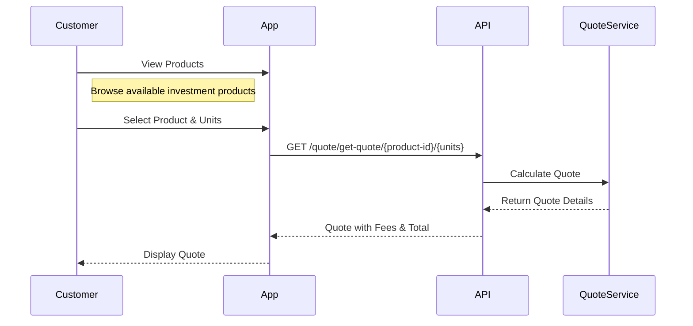
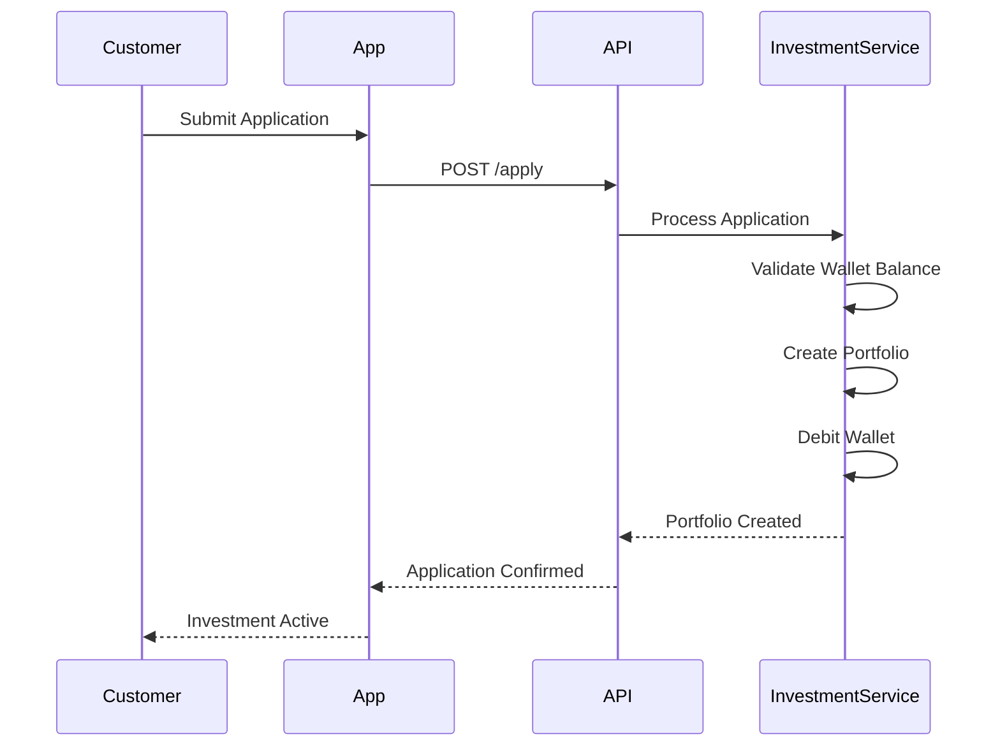
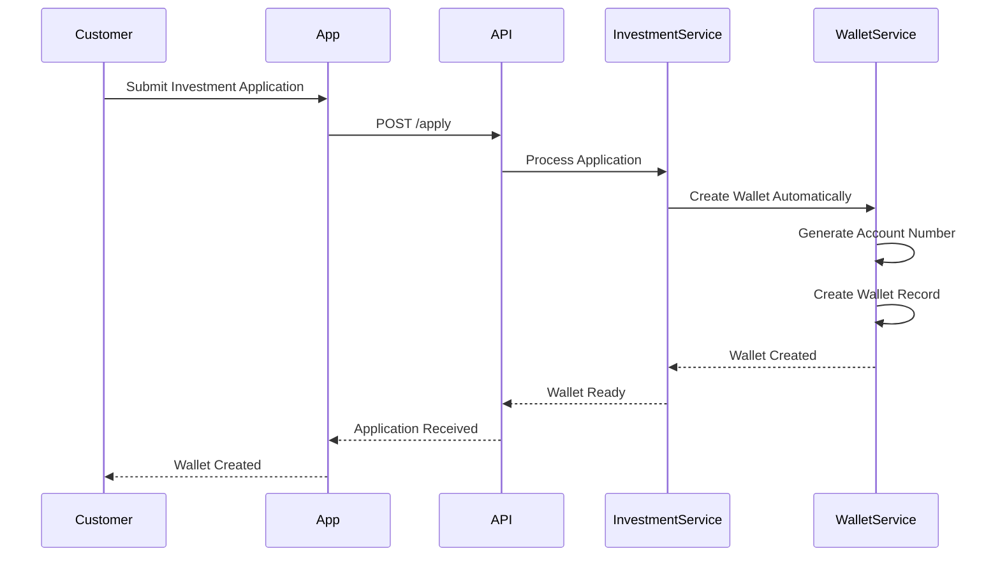
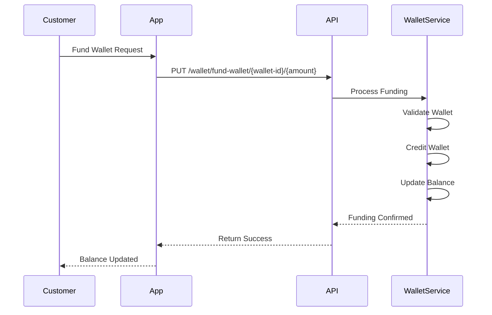
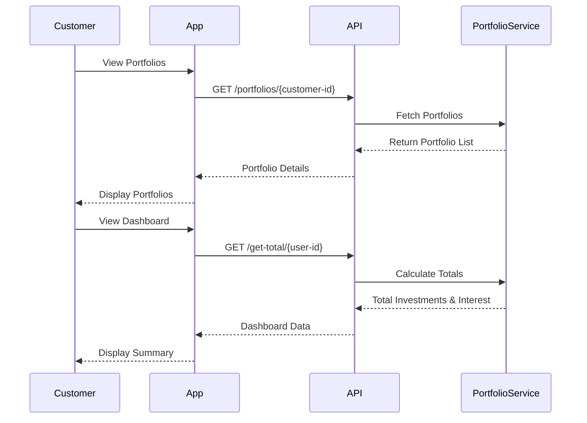
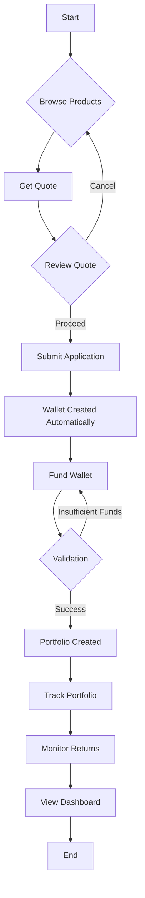

This guide details the complete customer journey for investment management, from product selection to portfolio management and returns.

<Note>
  The flow covers **Product Selection**, **Quote**, **Investment Application**, **Wallet Creation**, **Funding**, and **Portfolio Management**.
</Note>

## Phase 1: Product Selection & Quote

### 3.1 Browse Products & Get Quote

Customers explore available investment products and get quotes for specific unit purchases.

<CardGroup cols={2}>
  <Card title='Get Quote' href='/api/investment/get-quote'>
    Get investment quote for units
  </Card>
</CardGroup>

#### Quote Process Steps

<Steps>
  <Step title="Select Product">
    Customer browses and selects an investment product (Fixed Deposit, Mutual Fund, etc.).
  </Step>

  <Step title='Specify Units'>
    Customer specifies the number of units they want to purchase.
  </Step>

  <Step title='Get Quote'>
    System calculates and returns:
    - **Total Amount** (including fees)
    - **Fees Breakdown**
    - **Investing Amount**
    - **Per Unit Price**
  </Step>

  <Step title='Review Quote'>
    Customer reviews the quote and decides whether to proceed with the investment.
  </Step>
</Steps>

## Phase 2: Investment Application

### 4.1 Submit Investment Application

Customers submit investment applications with product and unit details.

<CardGroup cols={2}>
  <Card title='Create Investment' href='/api/investment/create-investment-application'>
    Submit investment application
  </Card>
</CardGroup>

#### Application Steps

<Steps>
  <Step title="Provide Investment Details">
    Customer provides:
    - **Investment Product ID**
    - **Number of Units to Purchase**
    - **Customer ID**
    - **Customer Name**
    - **Wallet ID** (source of funds)
  </Step>

  <Step title='Validate & Process'>
    System validates:
    - Wallet has sufficient balance
    - Product is available
    - Customer is eligible
  </Step>

  <Step title='Create Portfolio'>
    System creates investment portfolio and:
    - Debits wallet with investment amount
    - Creates portfolio record
    - Sets up interest accrual
    - Records investment details
  </Step>

  <Step title='Confirmation'>
    Customer receives confirmation with portfolio ID and investment details.
  </Step>
</Steps>

## Phase 3: Wallet Creation & Funding

### 3.1 Automatic Wallet Creation

When an investment application is submitted, a wallet account is automatically created for the customer.

<Info>
  The wallet is automatically created in the currency of the investment product. No customer action is required for wallet creation.
</Info>

### 3.2 Fund Wallet

After the wallet is created, customers fund it to cover the investment amount.

<CardGroup cols={2}>
  <Card title='Fund Wallet' href='/api/investment/fund-wallet'>
    Add funds to investment wallet
  </Card>
</CardGroup>

#### Funding Steps

<Steps>
  <Step title="Wallet Available">
    Wallet is automatically created when investment application is submitted.
  </Step>

  <Step title='Fund Wallet'>
    Customer adds funds to the wallet to cover the investment amount (including fees).
  </Step>

  <Step title='Process Investment'>
    Once wallet is funded, the investment is processed and portfolio is created.
  </Step>
</Steps>

## Phase 4: Portfolio Management

### 5.1 View Portfolios & Track Performance

Customers can view all their investment portfolios and track performance.

<CardGroup cols={2}>
  <Card title='List Portfolios' href='/api/investment/list-portfolios'>
    View all investment portfolios
  </Card>
  <Card title='Get Total Investments' href='/api/investment/get-total-investments'>
    View dashboard summary
  </Card>
</CardGroup>

#### Portfolio Management Steps

<Steps>
  <Step title="View Portfolios">
    Customer can view all their investment portfolios with details:
    - **Investment Amount**
    - **Total Payable**
    - **APY (Annual Percentage Yield)**
    - **Product Information**
    - **Request Date & Due Date**
    - **Maturity Information**
  </Step>

  <Step title='Track Performance'>
    Customer can view:
    - **Total Investments** across all products
    - **Total Interest Accrued**
    - **Individual Portfolio Performance**
    - **Maturity Dates**
  </Step>

  <Step title='Monitor Returns'>
    System automatically:
    - Calculates and accrues interest
    - Updates portfolio balances
    - Tracks maturity dates
    - Provides performance metrics
  </Step>
</Steps>

## Complete Investment Flow

## Key Concepts

### Investment Products

- **Fixed Investments**: Corporate bonds with fixed terms and returns
- **Dynamic Investments**: Mutual funds with variable returns
- **Risk Profiles**: Conservative, Moderate, and Aggressive options
- **Unit-Based**: Investments made in units with per-unit pricing

### Interest Accrual

- **APY-Based**: Interest calculated using Annual Percentage Yield
- **Automatic**: Interest accrues automatically based on product terms
- **Real-Time**: Interest tracked and updated in real-time
- **Currency-Specific**: Interest tracked per currency

### Portfolio Tracking

- **Multiple Portfolios**: Customers can have multiple investment portfolios
- **Performance Metrics**: Track investments, returns, and maturity
- **Dashboard View**: Consolidated view of all investments
- **Real-Time Updates**: Portfolio data updated automatically

<Card title='Learn More' href='/investment/portfolio-management'>
  Explore detailed portfolio management features.
</Card>

<Card title='View API Reference' href='/api/investment/create-investment-application'>
  See all available investment API endpoints.
</Card>

