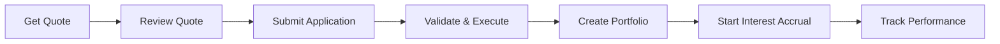
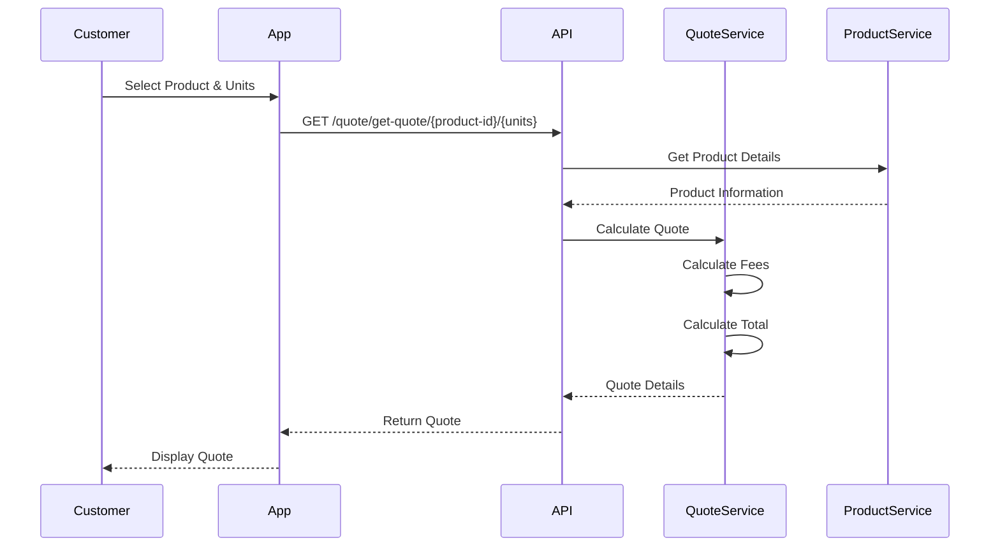
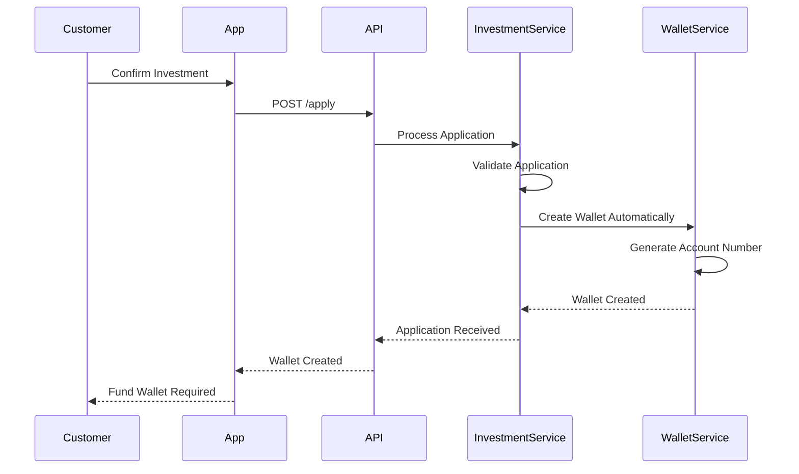
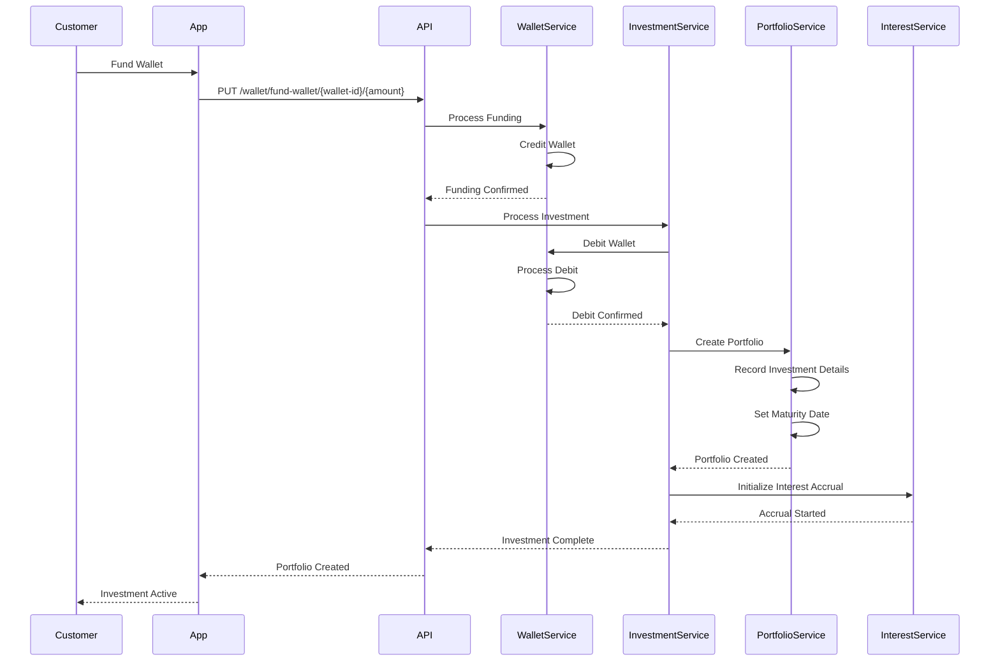
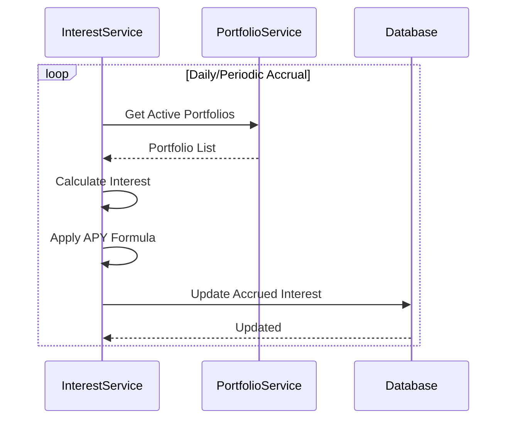
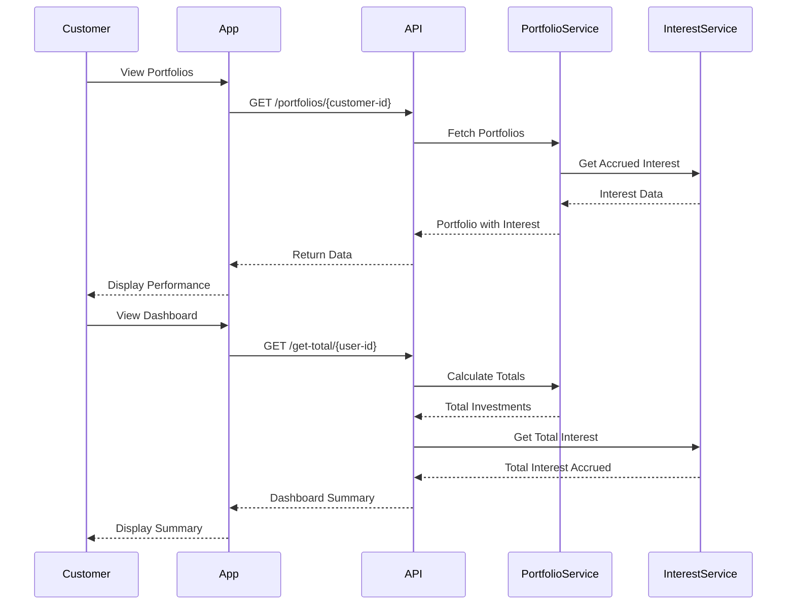
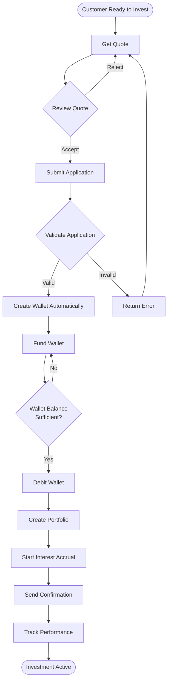

This guide details the trading and investment execution flow, from quote generation to portfolio creation and interest accrual.

<Note>
  The trading flow covers **Quote Generation**, **Application Submission**, **Execution**, **Portfolio Creation**, and **Interest Accrual**.
</Note>

## Trading Flow Overview

The investment trading flow enables customers to execute investments seamlessly through a quote-based system that provides transparency and real-time pricing.

## Phase 1: Quote Generation

### 1.1 Request Investment Quote

Customers request quotes for specific investment products and unit quantities.

<Card title='Get Quote' href='/api/investment/get-quote'>
  Get real-time investment quote
</Card>

### Quote Components

The quote includes:

- **Product Information**: Product name, type, and details
- **Unit Price**: Price per unit of the investment
- **Number of Units**: Quantity requested
- **Fees**: Applicable fees for the investment
- **Total Amount**: Total cost including fees
- **Investing Amount**: Net amount to be invested

<Info>
  Quotes are calculated in real-time based on current product pricing and fee structures. Quote validity may vary by product.
</Info>

## Phase 2: Application Submission

### 2.1 Submit Investment Application

After reviewing the quote, customers submit their investment application.

<Card title='Create Investment Application' href='/api/investment/create-investment-application'>
  Submit investment application
</Card>

### Application Validation

The system validates:

1. **Product Availability**: Product is active and available
2. **Unit Quantity**: Valid number of units requested
3. **Customer Eligibility**: Customer meets product requirements
4. **Quote Accuracy**: Application matches recent quote

<Info>
  After validation, a wallet is automatically created for the customer. The customer then needs to fund the wallet to complete the investment.
</Info>

<Warning>
  If wallet balance is insufficient, the application will be rejected. Ensure the wallet is funded before submitting the application.
</Warning>

## Phase 3: Wallet Funding & Execution

### 3.1 Fund Wallet

After the wallet is automatically created, the customer funds it to complete the investment.

### Execution Steps

<Steps>
  <Step title="Wallet Created">
    A wallet account is automatically created when the investment application is submitted.
  </Step>

  <Step title='Fund Wallet'>
    Customer funds the wallet with the investment amount (including fees).
  </Step>

  <Step title="Debit Wallet">
    System debits the investment amount (including fees) from the customer's wallet.
  </Step>

  <Step title='Create Portfolio Record'>
    System creates a portfolio entry with:
    - Investment amount
    - Number of units
    - Product details
    - APY (Annual Percentage Yield)
    - Request date
    - Maturity date
    - Total payable
  </Step>

  <Step title='Initialize Interest Accrual'>
    System sets up automatic interest calculation and accrual based on product APY.
  </Step>

  <Step title='Confirmation'>
    Customer receives confirmation with portfolio ID and investment details.
  </Step>
</Steps>

## Phase 4: Interest Accrual

### 4.1 Automatic Interest Calculation

The system automatically calculates and accrues interest based on product terms.

### Interest Calculation

Interest accrual follows these principles:

- **APY-Based**: Uses Annual Percentage Yield for calculation
- **Automatic**: Accrues automatically based on product terms
- **Periodic**: Calculated at defined intervals (daily, monthly, etc.)
- **Compounding**: May compound based on product configuration
- **Currency-Specific**: Tracked per currency

<Info>
  Interest accrual is automatic and requires no customer action. Customers can view accrued interest through the dashboard or portfolio details.
</Info>

## Phase 5: Performance Tracking

### 5.1 Monitor Investment Performance

Customers can track their investment performance through portfolios and dashboard.

<CardGroup cols={2}>
  <Card title='List Portfolios' href='/api/investment/list-portfolios'>
    View investment portfolios
  </Card>
  <Card title='Get Total Investments' href='/api/investment/get-total-investments'>
    View dashboard summary
  </Card>
</CardGroup>

### Performance Metrics

Customers can track:

- **Investment Amount**: Original amount invested
- **Accrued Interest**: Total interest earned to date
- **Total Payable**: Total amount including principal and interest
- **APY**: Annual Percentage Yield of the investment
- **Maturity Date**: When the investment matures
- **Performance**: Return on investment percentage

## Complete Trading Flow Diagram

## Key Trading Concepts

### Quote Validity

- Quotes are calculated in real-time
- Quote prices may change based on market conditions
- Customers should submit applications promptly after receiving quotes
- System validates quote accuracy during application processing

### Execution Timing

- Applications are processed immediately upon submission
- Portfolio creation happens synchronously
- Interest accrual begins immediately after portfolio creation
- No manual approval required for standard investments

### Fee Structure

- Fees are included in the quote
- Fees are deducted from wallet along with investment amount
- Fee structure varies by product type
- Total amount includes all applicable fees

<Card title='Learn More' href='/investment/portfolio-management'>
  Explore portfolio management and tracking features.
</Card>

<Card title='View Process Flow' href='/investment/process-flow'>
  See the complete investment process flow.
</Card>

