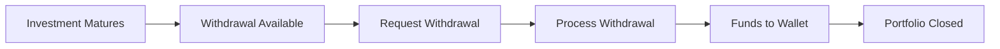
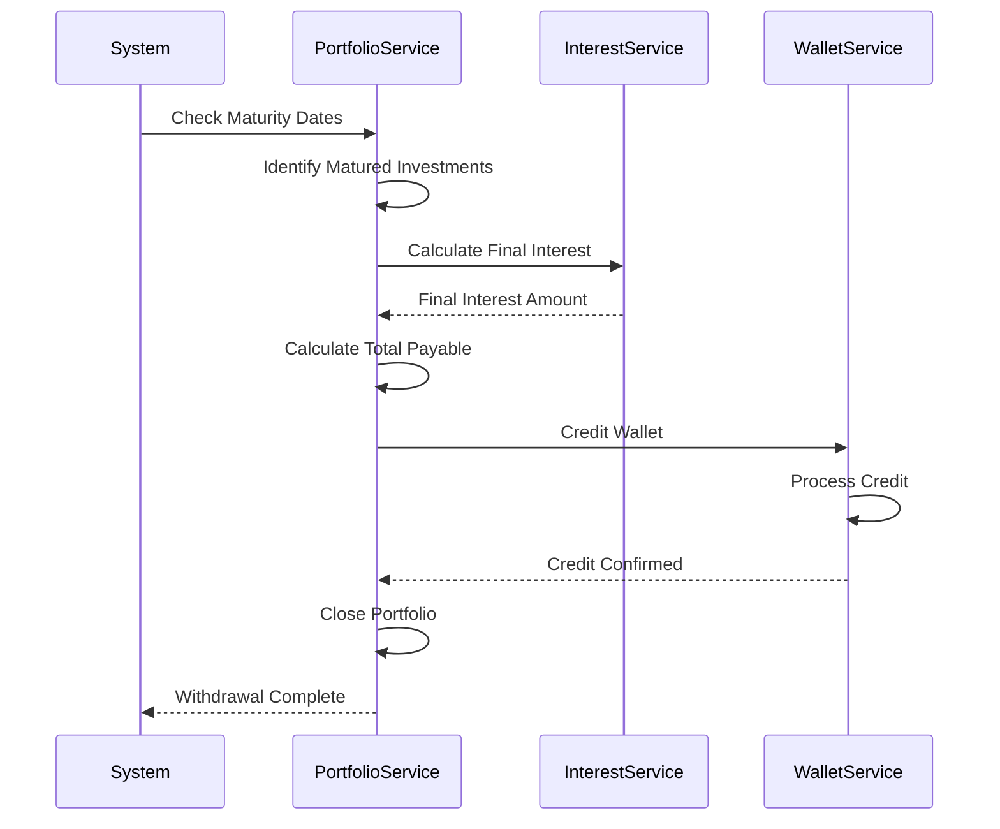
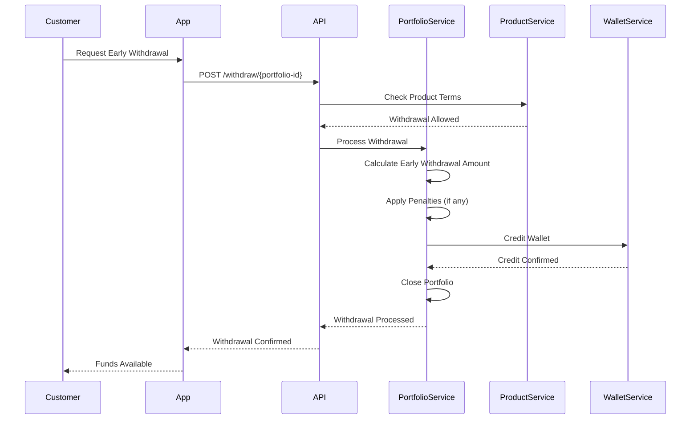
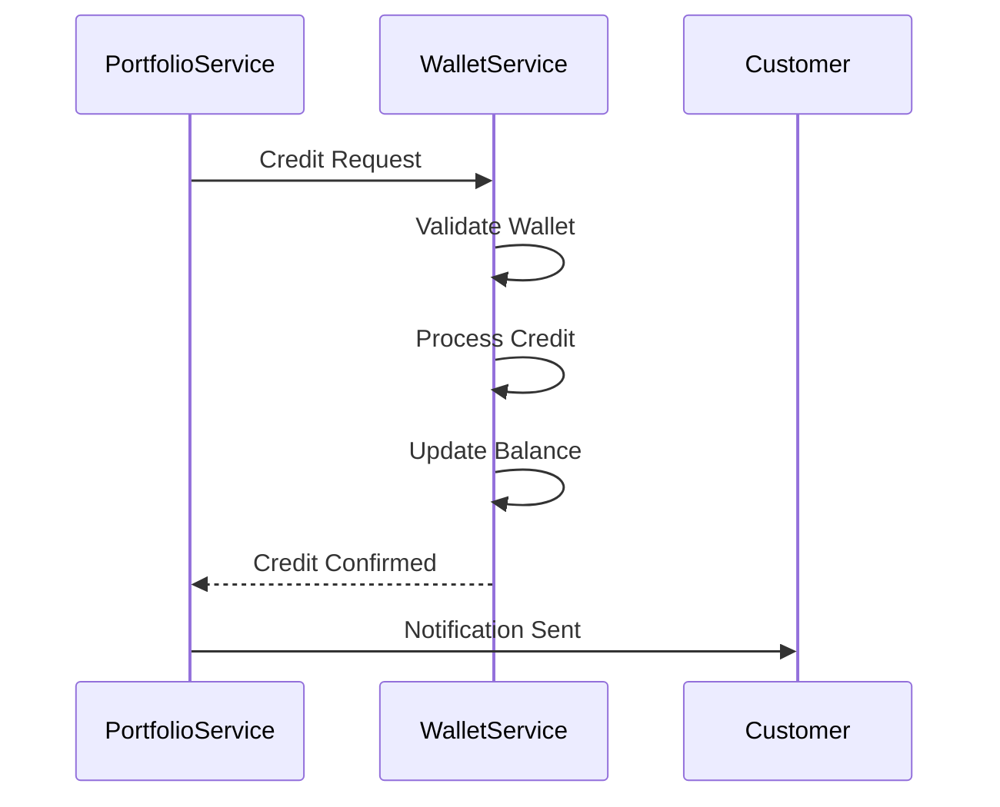
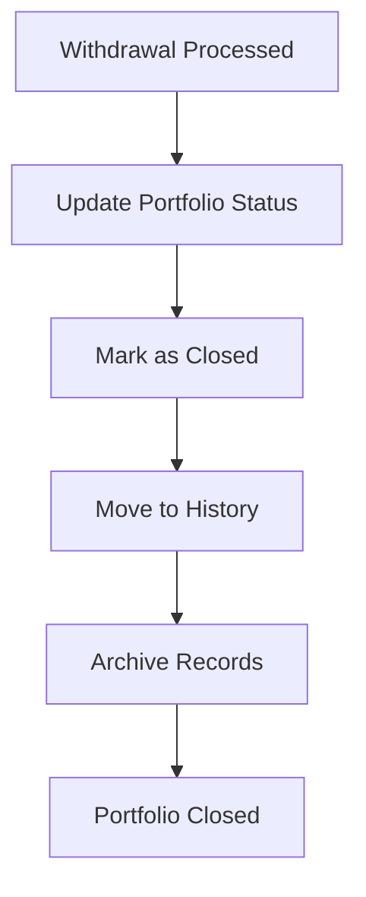
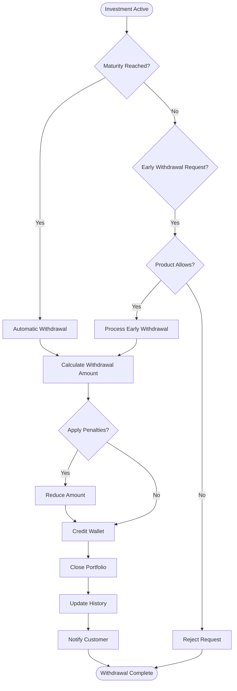

This guide details the process for withdrawing funds from investment portfolios, including maturity withdrawals and early withdrawal options.

<Note>
  The withdrawal process covers **Maturity Withdrawals**, **Early Withdrawals**, **Fund Transfer**, and **Portfolio Closure**.
</Note>

## Withdrawal Overview

Investment withdrawals allow customers to access their invested funds and accrued interest. The process varies based on investment type, maturity status, and product terms.

## Phase 1: Maturity Withdrawal

### 1.1 Automatic Maturity Processing

When an investment reaches maturity, funds become available for withdrawal.

### Maturity Withdrawal Steps

<Steps>
  <Step title="Maturity Detection">
    System automatically detects when investments reach their maturity date.
  </Step>

  <Step title='Calculate Final Amount'>
    System calculates:
    - **Principal Amount**: Original investment
    - **Accrued Interest**: Total interest earned
    - **Total Payable**: Principal + Interest
  </Step>

  <Step title='Credit Wallet'>
    System automatically credits the customer's wallet with the total payable amount.
  </Step>

  <Step title='Close Portfolio'>
    Portfolio is marked as closed and moved to investment history.
  </Step>
</Steps>

<Info>
  For fixed-term investments, funds are automatically credited to the wallet upon maturity. No customer action is required.
</Info>

## Phase 2: Early Withdrawal

### 2.1 Request Early Withdrawal

Some investment products may allow early withdrawal before maturity, subject to terms and conditions.

<Warning>
  Early withdrawals may be subject to penalties or reduced interest rates depending on the product terms. Always review product terms before requesting early withdrawal.
</Warning>

### Early Withdrawal Considerations

- **Product Terms**: Check if early withdrawal is allowed
- **Penalties**: May incur penalties or forfeit interest
- **Processing Time**: May take longer than maturity withdrawals
- **Partial Withdrawal**: Some products may allow partial withdrawals

## Phase 3: Withdrawal to Wallet

### 3.1 Fund Transfer Process

Withdrawn funds are credited to the customer's investment wallet.

### Wallet Credit Details

- **Automatic Credit**: Funds are automatically credited to the investment wallet
- **Balance Update**: Wallet balance is updated immediately
- **Transaction Record**: Withdrawal transaction is recorded
- **Notification**: Customer receives confirmation notification

<Info>
  Withdrawn funds are credited to the same wallet used for the investment. Customers can then transfer funds from the wallet to their bank account if needed.
</Info>

## Phase 4: Portfolio Closure

### 4.1 Close Investment Portfolio

After withdrawal, the portfolio is closed and moved to investment history.

### Portfolio Closure Steps

<Steps>
  <Step title="Update Status">
    Portfolio status is updated to "CLOSED" or "WITHDRAWN".
  </Step>

  <Step title='Record Final Amount'>
    System records:
    - Final withdrawal amount
    - Total interest earned
    - Investment duration
    - Withdrawal date
  </Step>

  <Step title='Move to History'>
    Portfolio is moved to investment history for record-keeping.
  </Step>

  <Step title='Update Dashboard'>
    Customer dashboard is updated to reflect closed portfolio.
  </Step>
</Steps>

## Withdrawal Types

### Automatic Maturity Withdrawal

- **Trigger**: Investment reaches maturity date
- **Process**: Automatic, no customer action required
- **Timing**: Processed on maturity date
- **Amount**: Full principal + accrued interest

### Manual Early Withdrawal

- **Trigger**: Customer request before maturity
- **Process**: Requires customer action via API
- **Timing**: Processed upon request
- **Amount**: May be reduced by penalties

### Partial Withdrawal

- **Availability**: Depends on product terms
- **Process**: Customer specifies withdrawal amount
- **Portfolio**: Remains active with reduced balance
- **Interest**: Continues to accrue on remaining balance

## Withdrawal Flow Diagram

## Key Concepts

### Maturity Date

- **Fixed Term**: Investments have defined maturity dates
- **Automatic Processing**: Matured investments are processed automatically
- **No Action Required**: Customers don't need to request maturity withdrawals
- **Full Amount**: Full principal and interest are paid at maturity

### Early Withdrawal Terms

- **Product-Specific**: Terms vary by investment product
- **Penalties**: May include penalties or reduced interest
- **Processing**: May require manual review
- **Availability**: Not all products allow early withdrawal

### Withdrawal Amount Calculation

- **Principal**: Original investment amount
- **Accrued Interest**: Interest earned to date
- **Penalties**: Deducted for early withdrawals (if applicable)
- **Total Payable**: Final amount credited to wallet

<Card title='Learn More' href='/investment/portfolio-management'>
  Explore portfolio management and tracking.
</Card>

<Card title='View Process Flow' href='/investment/process-flow'>
  See the complete investment process flow.
</Card>

