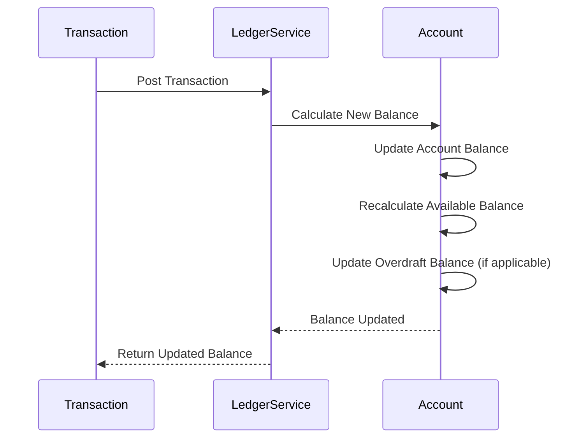
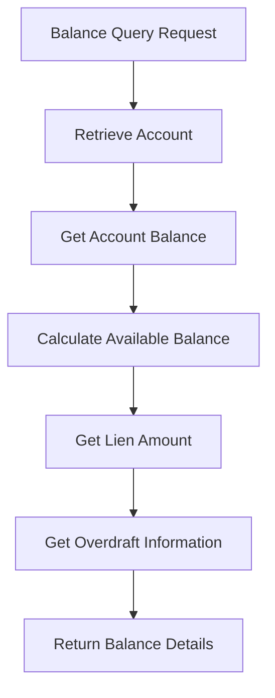

Balance management is a critical aspect of the Ledger Engine, ensuring accurate tracking of account balances, available funds, and account status.

## Overview

The Ledger Engine maintains multiple balance types for each account to provide accurate financial information:

- **Account Balance**: Total balance including all transactions
- **Available Balance**: Funds available for new transactions
- **Lien Amount**: Funds frozen or held
- **Overdraft Balance**: Amount of overdraft currently used

## Balance Types

### Account Balance

The **account balance** represents the total balance of the account, including all debits and credits.

```
Account Balance = Sum of all Credits - Sum of all Debits
```

This is the primary balance that reflects the true financial position of the account.

### Available Balance

The **available balance** is the amount that can be used for new transactions. It excludes:

- **Lien Amount**: Funds placed on lien (frozen)
- **Holds**: Temporary holds on funds
- **Pending Debits**: Debits that are pending but not yet finalized

```
Available Balance = Account Balance - Lien Amount - Holds - Pending Debits
```

<Info>
  Available balance is what you should check before allowing new transactions to ensure sufficient funds.
</Info>

### Lien Amount

A **lien** is a legal claim or hold on funds in an account, making them unavailable for transactions.

- Funds on lien cannot be debited
- Lien can be placed by administrators
- Lien can be released when conditions are met

### Overdraft Balance

**Overdraft** allows accounts to have a negative balance up to a specified limit.

- **Overdraft Limit**: Maximum negative balance allowed
- **Used Overdraft**: Current amount of overdraft being used
- **Available Overdraft**: Remaining overdraft capacity

```
Available Overdraft = Overdraft Limit - Used Overdraft Amount
```

## Balance Calculation Flow

### Real-Time Updates

Balances are updated in real-time with every transaction:



### Balance Query Process

When querying account balance:



<Card title='Account Balance API' href='/api/ledger/account-balance'>
  View the complete API documentation for balance queries.
</Card>

## Balance Components

### Account Balance Response

When querying an account balance, you receive:

- **accountBalance**: Total account balance
- **availableBalance**: Available funds for transactions
- **totalLienAmount**: Total amount on lien
- **overDraftLimit**: Maximum overdraft allowed
- **newOverDraftBalance**: Current overdraft used
- **accountStatus**: Current account status
- **currencyCode**: Account currency

## Balance Updates

### After Debit Transaction

When money is debited from an account:

```
Previous Account Balance: 10,000 NGN
Debit Amount: 2,000 NGN
New Account Balance: 8,000 NGN
New Available Balance: 8,000 NGN (if no liens)
```

### After Credit Transaction

When money is credited to an account:

```
Previous Account Balance: 8,000 NGN
Credit Amount: 5,000 NGN
New Account Balance: 13,000 NGN
New Available Balance: 13,000 NGN (if no liens)
```

### With Lien

When a lien is placed on funds:

```
Account Balance: 10,000 NGN
Lien Amount: 3,000 NGN
Available Balance: 7,000 NGN (10,000 - 3,000)
```

### With Overdraft

When account uses overdraft:

```
Account Balance: -2,000 NGN (negative)
Overdraft Limit: 5,000 NGN
Used Overdraft: 2,000 NGN
Available Overdraft: 3,000 NGN (5,000 - 2,000)
Available Balance: -2,000 NGN (can go more negative up to limit)
```

## Balance Validation

### Before Transaction

Before processing a debit transaction, the system validates:

1. **Account Status**: Account must be ACTIVATED
2. **Available Balance**: Must be sufficient (or overdraft available)
3. **Lien Check**: Account must not be fully on lien
4. **Currency Match**: Transaction currency must match account currency

### Insufficient Balance Handling

When balance is insufficient:

- Transaction is rejected
- No balance changes occur
- Error returned: `INSUFFICIENT_FUNDS`

<Warning>
  Always check available balance before attempting debit transactions. Account balance alone is not sufficient - you must check available balance.
</Warning>

## Balance Tracking

### Transaction History

Every transaction records balance changes:

- **previousAccountBalance**: Balance before transaction
- **newBalance**: Balance after transaction
- **transactionAmount**: Amount of the transaction

<Card title='Ledger History API' href='/api/ledger/ledger-history'>
  View transaction history to track balance changes.
</Card>

### Balance Reconciliation

To reconcile account balances:

1. **Get Current Balance**: Query account balance
2. **Get Transaction History**: Retrieve all transactions
3. **Calculate Expected Balance**: Sum all credits and debits
4. **Compare**: Current balance should match calculated balance

## Multi-Currency Balances

Each account maintains balances in a specific currency:

- **Currency-Specific**: Each currency has its own balance
- **No Cross-Currency**: Cannot debit NGN and credit USD in same transaction
- **Separate Accounts**: Different currencies require separate accounts

## Best Practices

### 1. Always Check Available Balance

Before debiting, always check available balance, not just account balance.

### 2. Handle Negative Balances

If overdraft is allowed, handle negative balances appropriately.

### 3. Monitor Lien Amounts

Be aware of lien amounts that reduce available balance.

### 4. Track Balance Changes

Use transaction history to track how balances change over time.

### 5. Reconcile Regularly

Periodically reconcile balances with transaction history.

<Card title='Account Balance API' href='/api/ledger/account-balance'>
  Query account balances with the API.
</Card>

<Card title='View Process Flow' href='/ledger/process-flow'>
  Understand the complete balance query flow.
</Card>

