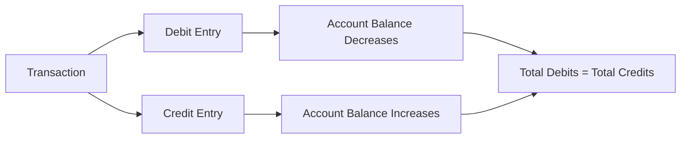
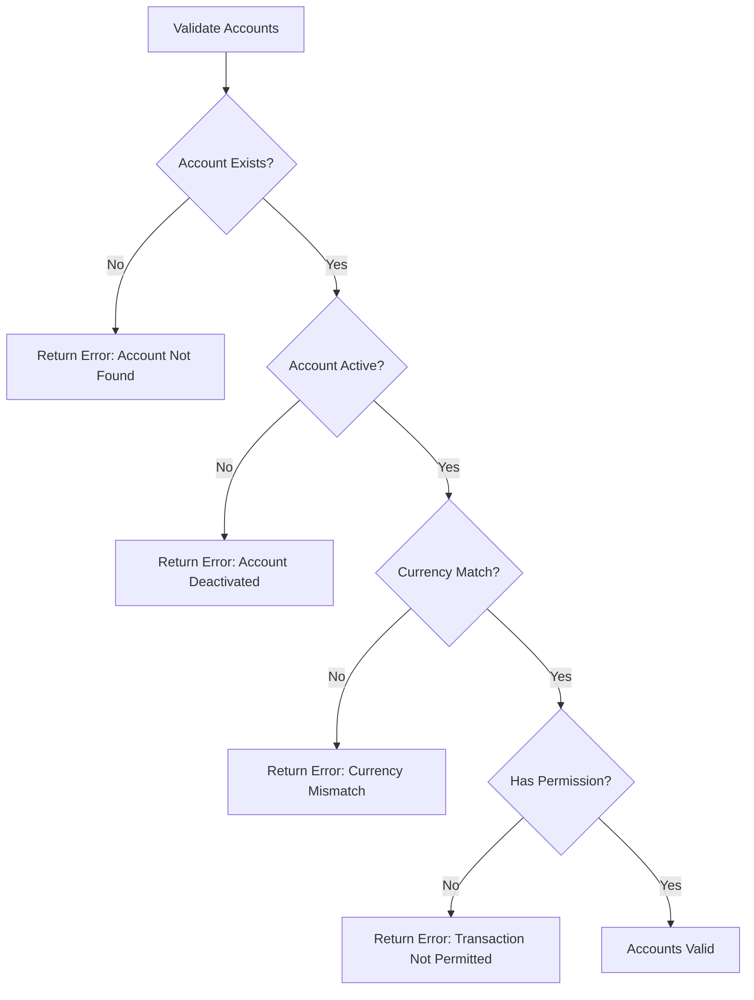
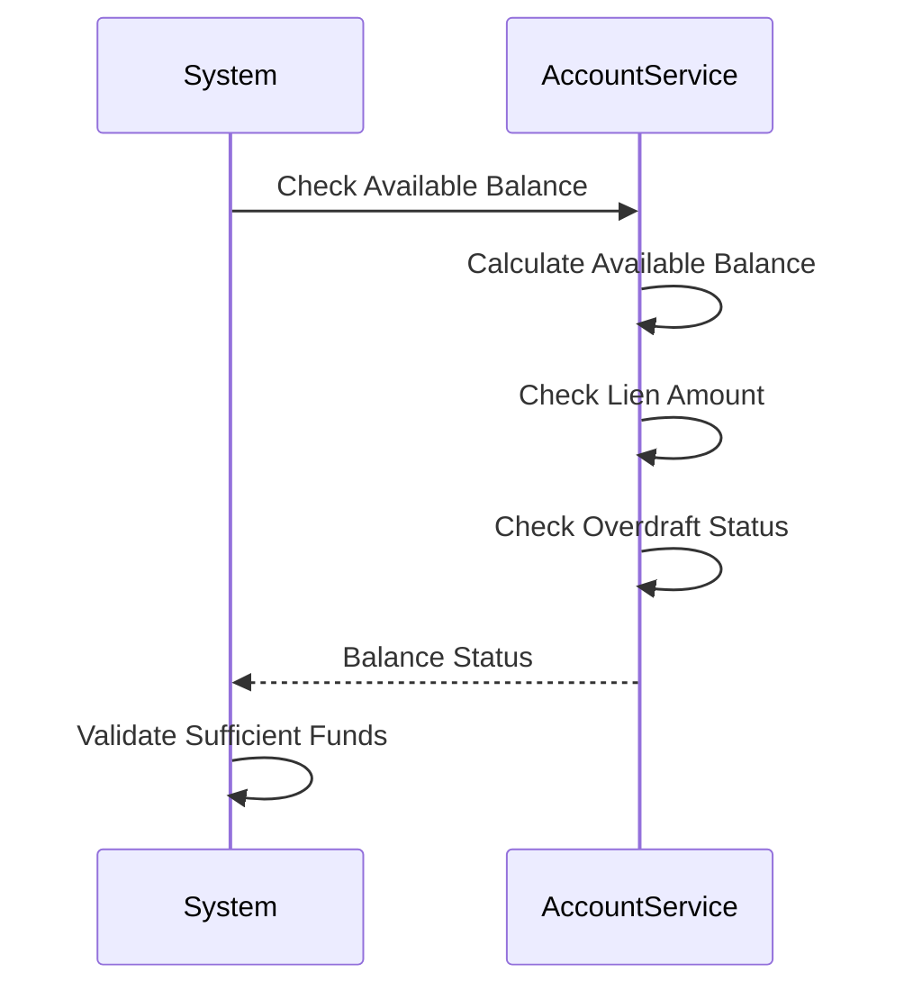
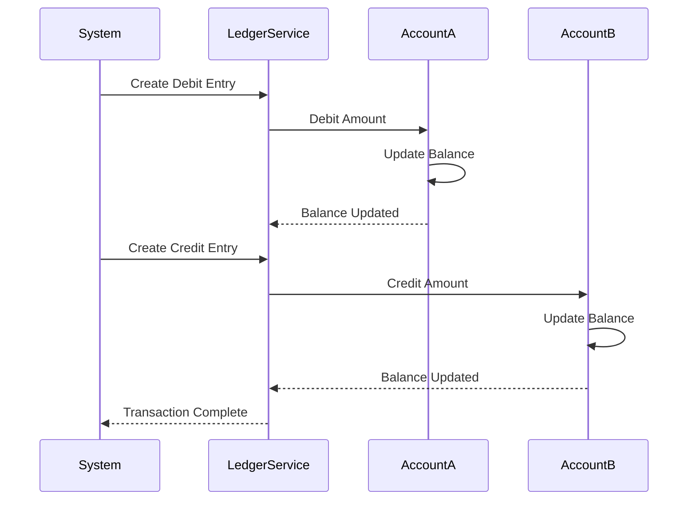

Double-entry posting is the core mechanism of the Ledger Engine, ensuring every financial transaction is recorded accurately with both debit and credit entries.

## Overview

Double-entry bookkeeping is a fundamental accounting principle where every transaction affects at least two accounts:
- **Debit Entry**: Records money leaving an account
- **Credit Entry**: Records money entering an account
- **Balance**: Total debits must equal total credits

<Info>
  This ensures the accounting equation always balances: Assets = Liabilities + Equity
</Info>

## How Double-Entry Works

### Basic Principle

Every transaction creates two equal and opposite entries:

### Example: Transfer Between Accounts

When transferring 1000 NGN from Account A to Account B:

1. **Debit Account A**: 1000 NGN (money leaving)
2. **Credit Account B**: 1000 NGN (money entering)

Both entries are recorded simultaneously, ensuring the books always balance.

## Transaction Posting Flow

### Step 1: Prepare Transaction

Before posting, you need:

- **Primary Account**: The main account involved
- **Counterparty Account(s)**: One or more accounts to credit/debit
- **Amount**: Transaction amount
- **Direction**: Whether to debit or credit the primary account
- **Currency**: Transaction currency (must match account currencies)
- **Idempotency Key**: Unique key to prevent duplicates

### Step 2: Validate Accounts

The system validates:

<Card title='Post to Account API' href='/api/ledger/post-account'>
  View the complete API documentation for posting transactions.
</Card>

### Step 3: Lock Accounts

To prevent concurrent modifications:

- System locks all accounts involved in the transaction
- Uses pessimistic locking to ensure data integrity
- Locks are released after transaction completion

### Step 4: Check Balance

For debit transactions, the system checks:

- **Available Balance**: Sufficient funds available
- **Lien Amount**: Account is not frozen
- **Overdraft**: If overdraft is allowed and within limits

### Step 5: Create Ledger Entries

The system creates ledger entries:

1. **Debit Entry**:
   - Records money leaving the primary account
   - Updates account balance (decreases)
   - Records transaction details

2. **Credit Entry**:
   - Records money entering counterparty account(s)
   - Updates account balance (increases)
   - Records transaction details

### Step 6: Update Balances

Account balances are updated atomically:

- **Primary Account**: Balance decreased (for debits) or increased (for credits)
- **Counterparty Account(s)**: Balance increased (for credits) or decreased (for debits)
- **Available Balance**: Recalculated excluding liens and holds

### Step 7: Record Transaction

The transaction is recorded in the ledger with:

- Transaction ID
- Account IDs
- Amount and currency
- Previous and new balances
- Execution date
- Correlation IDs (internal and external)
- Idempotency key
- Payment reference

## Transaction Directions

### Debit Primary, Credit Counterparty

Use this when money flows **from** the primary account **to** counterparty accounts.

**Example**: Customer pays 5000 NGN from their wallet to a merchant account.

- Debit: Customer Wallet (5000 NGN)
- Credit: Merchant Account (5000 NGN)

### Credit Primary, Debit Counterparty

Use this when money flows **to** the primary account **from** counterparty accounts.

**Example**: Customer receives 10000 NGN from a loan disbursement.

- Credit: Customer Wallet (10000 NGN)
- Debit: Loan Disbursement Account (10000 NGN)

## Multiple Counterparties

A single transaction can involve multiple counterparty accounts:

**Example**: Split payment to multiple recipients

- Debit: Primary Account (15000 NGN)
- Credit: Counterparty A (5000 NGN)
- Credit: Counterparty B (5000 NGN)
- Credit: Counterparty C (5000 NGN)

Total debits (15000) = Total credits (15000)

## Idempotency

Every transaction requires an idempotency key:

- **Prevents Duplicates**: Same key cannot be used twice
- **Idempotent Requests**: Re-submitting with same key returns original result
- **Transaction Tracking**: Key links all related ledger entries

<Warning>
  Always use unique idempotency keys for each transaction. Reusing a key will return the original transaction result, not create a new one.
</Warning>

## Error Handling

### Insufficient Funds

If available balance is insufficient:

- Transaction is rejected
- No ledger entries are created
- Account balances remain unchanged
- Error response: `INSUFFICIENT_FUNDS`

### Account Not Found

If account doesn't exist:

- Transaction is rejected
- Error response: `ACCOUNT_NOT_FOUND`

### Account Deactivated

If account is not active:

- Transaction is rejected
- Error response: `ACCOUNT_DEACTIVATED`

### Transaction Not Permitted

If account permissions don't allow the transaction:

- Transaction is rejected
- Error response: `TRANSACTION_NOT_PERMITTED`

## Transaction States

After posting, transactions have the following states:

- **PAID**: Transaction successful, balances updated
- **FAILED**: Transaction failed, no changes made
- **PENDING**: Transaction being processed (rare for ledger operations)

## Best Practices

### 1. Always Use Idempotency Keys

Generate unique idempotency keys for each transaction to prevent duplicates.

### 2. Validate Before Posting

Check account balances and status before attempting to post transactions.

### 3. Handle Errors Gracefully

Implement proper error handling for all possible failure scenarios.

### 4. Track Correlation IDs

Use correlation IDs to track related transactions across systems.

### 5. Verify Balances

After posting, verify account balances to ensure transaction was successful.

<Card title='Post to Account API' href='/api/ledger/post-account'>
  See the complete API documentation with examples.
</Card>

<Card title='View Process Flow' href='/ledger/process-flow'>
  Understand the complete ledger process flow.
</Card>

