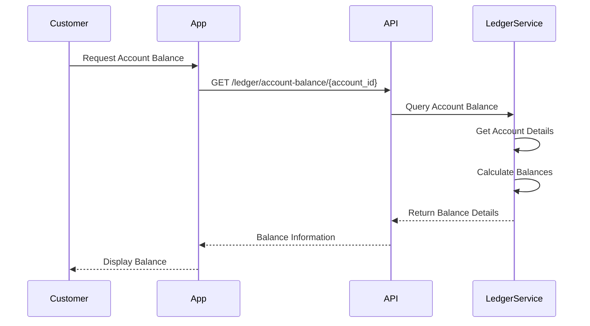
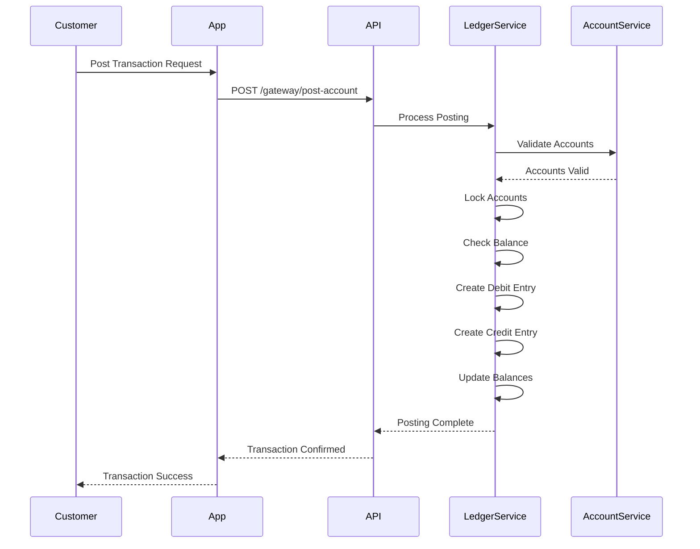
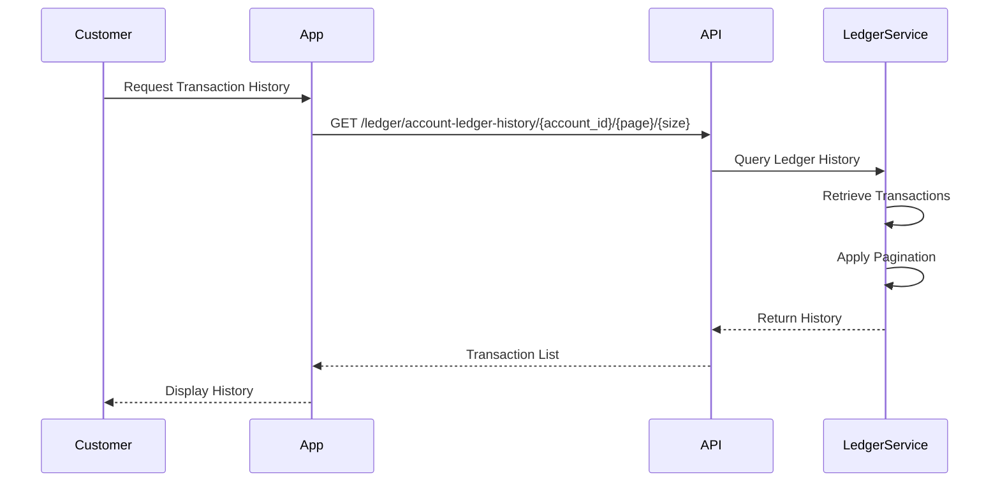
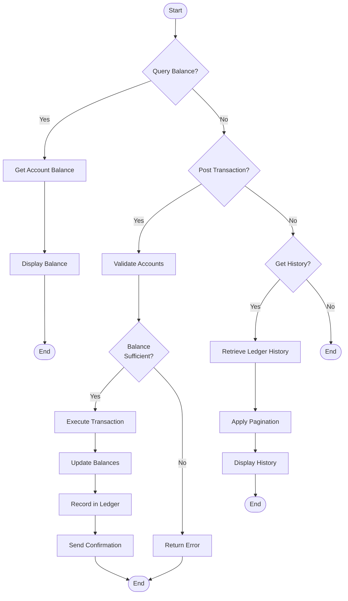

This guide details the complete flow for ledger operations, from account balance queries to transaction posting and history retrieval.

<Note>
  The flow covers **Account Balance Queries**, **Transaction Posting**, and **Ledger History Retrieval**.
</Note>

## Phase 1: Account Balance Query

### 1.1 Get Account Balance

Customers can query their account balance to get real-time balance information.

<CardGroup cols={2}>
  <Card title='Account Balance' href='/api/ledger/account-balance'>
    Get account balance and details
  </Card>
</CardGroup>

#### Balance Query Steps

<Steps>
  <Step title="Request Balance">
    Customer requests balance for a specific account using the account ID.
  </Step>

  <Step title='Retrieve Account'>
    System retrieves account details including:
    - **Available Balance**: Funds available for transactions
    - **Account Balance**: Total account balance
    - **Account Status**: Current account status
    - **Currency**: Account currency
    - **Account Information**: Account number, name, and owner details
  </Step>

  <Step title='Return Balance'>
    System returns comprehensive balance information including overdraft limits and lien amounts if applicable.
  </Step>
</Steps>

## Phase 2: Transaction Posting

### 2.1 Post to Account

Customers can execute double-entry transactions by posting debits and credits to accounts.

<CardGroup cols={2}>
  <Card title='Post to Account' href='/api/ledger/post-account'>
    Execute double-entry transaction
  </Card>
</CardGroup>

#### Posting Steps

<Steps>
  <Step title="Prepare Transaction">
    Customer prepares transaction details:
    - **Primary Account**: Source or destination account
    - **Counterparty Accounts**: Accounts to credit or debit
    - **Amount**: Transaction amount
    - **Direction**: Debit or credit direction
    - **Narration**: Transaction description
  </Step>

  <Step title='Validate Accounts'>
    System validates:
    - Account existence
    - Account status (must be ACTIVATED)
    - Account permissions
    - Currency matching
  </Step>

  <Step title='Check Balance'>
    For debit transactions, system checks:
    - Available balance is sufficient
    - Account is not on lien (if applicable)
    - Overdraft limits (if applicable)
  </Step>

  <Step title='Execute Transaction'>
    System executes double-entry posting:
    - Creates debit entry in primary account
    - Creates credit entry in counterparty account(s)
    - Updates account balances
    - Records transaction in ledger
  </Step>

  <Step title='Confirmation'>
    Customer receives confirmation with transaction details and updated balances.
  </Step>
</Steps>

## Phase 3: Transaction History

### 3.1 Retrieve Ledger History

Customers can retrieve complete transaction history for their accounts.

<CardGroup cols={2}>
  <Card title='Ledger History' href='/api/ledger/ledger-history'>
    View account transaction history
  </Card>
  <Card title='History by Interaction ID' href='/api/ledger/ledger-history-interaction-id'>
    View transactions by interaction ID
  </Card>
  <Card title='History by Idempotency Key' href='/api/ledger/ledger-history-idempotency-key'>
    View transactions by idempotency key
  </Card>
</CardGroup>

#### History Retrieval Steps

<Steps>
  <Step title="Request History">
    Customer requests transaction history for an account with pagination parameters.
  </Step>

  <Step title='Retrieve Transactions'>
    System retrieves ledger entries including:
    - Transaction amount and type
    - Previous and new balances
    - Execution date
    - Payment reference
    - Correlation IDs
  </Step>

  <Step title='Apply Pagination'>
    System applies pagination and returns the requested page of transactions.
  </Step>

  <Step title='Display History'>
    Customer views complete transaction history with all details.
  </Step>
</Steps>

## Complete Ledger Flow

## Key Concepts

### Double-Entry Posting

Every transaction creates two entries:
- **Debit Entry**: Money leaving an account
- **Credit Entry**: Money entering an account
- Both entries must balance (total debits = total credits)

### Account Balances

- **Account Balance**: Total balance including all transactions
- **Available Balance**: Balance available for new transactions (excludes liens and holds)
- **Overdraft Balance**: Amount of overdraft currently used (if applicable)
- **Lien Amount**: Amount placed on lien (frozen/unavailable)

### Transaction Types

- **DEBIT**: Money leaving the account
- **CREDIT**: Money entering the account
- **TRANSFER**: Money moving between accounts (debit one, credit another)

### Idempotency

- Every transaction requires an idempotency key
- Duplicate requests with the same idempotency key return the original transaction
- Prevents accidental duplicate processing

<Card title='Learn More' href='/api/ledger/account-balance'>
  See all available ledger API endpoints.
</Card>

