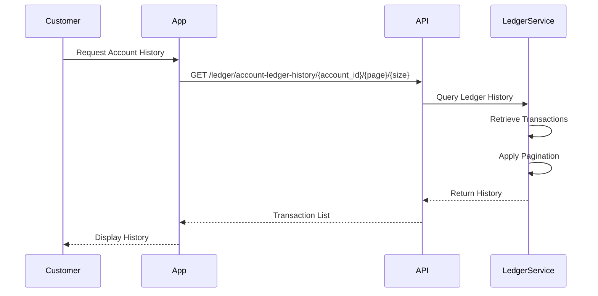
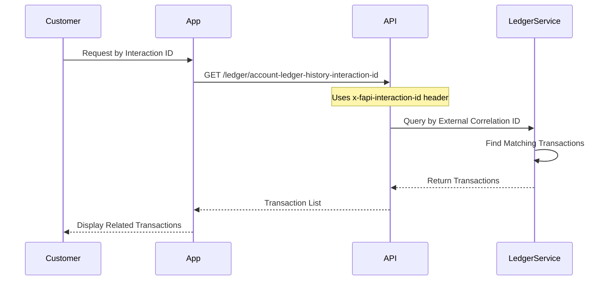
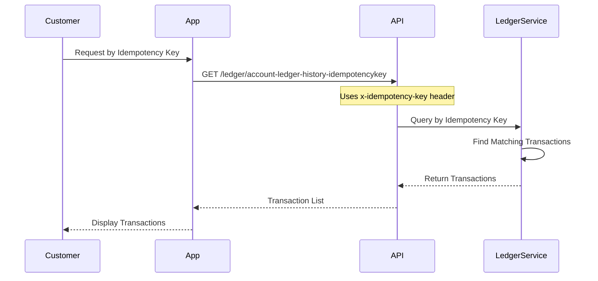

Transaction history provides a complete audit trail of all account movements, enabling reconciliation, reporting, and compliance.

## Overview

The Ledger Engine maintains a complete, immutable record of all transactions:

- **Complete Audit Trail**: Every transaction is recorded permanently
- **Immutable Records**: Ledger entries cannot be modified or deleted
- **Detailed Information**: Each entry includes amounts, dates, references, and correlation IDs
- **Multiple Query Options**: Retrieve history by account, interaction ID, or idempotency key

<Info>
  All ledger entries are immutable. Once recorded, they cannot be changed, ensuring data integrity and audit compliance.
</Info>

## Ledger Entry Structure

Each ledger entry contains:

### Transaction Details

- **Transaction ID**: Unique identifier for the entry
- **Transaction Amount**: Amount of the transaction
- **Currency Code**: Transaction currency
- **Ledger Type**: DEBIT or CREDIT
- **Status**: Transaction status (PAID, FAILED, etc.)

### Balance Information

- **Previous Account Balance**: Balance before this transaction
- **New Balance**: Balance after this transaction
- **Account ID**: Account involved in the transaction

### Tracking Information

- **Idempotency Key**: Unique key used for the transaction
- **External Correlation ID**: External system correlation ID (interaction ID)
- **Internal Correlation ID**: Internal system correlation ID
- **Posting Group ID**: Groups related transactions together

### Metadata

- **Execution Date**: When the transaction was executed
- **Payment Reference**: Payment or transaction reference
- **Depositor Full Name**: Name of the person/entity initiating transaction
- **Action Performed By User**: User who performed the action

## Querying Transaction History

### By Account

Retrieve all transactions for a specific account with pagination:

<Card title='Ledger History API' href='/api/ledger/ledger-history'>
  View the complete API documentation for account history.
</Card>

### By Interaction ID

Retrieve all transactions related to a specific interaction or session:

<Card title='History by Interaction ID API' href='/api/ledger/ledger-history-interaction-id'>
  View the complete API documentation.
</Card>

### By Idempotency Key

Retrieve all transactions processed with a specific idempotency key:

<Card title='History by Idempotency Key API' href='/api/ledger/ledger-history-idempotency-key'>
  View the complete API documentation.
</Card>

## Transaction History Use Cases

### 1. Account Statement

Generate account statements by retrieving all transactions for an account:

- Filter by date range (if supported)
- Paginate through large transaction lists
- Display in chronological order

### 2. Transaction Reconciliation

Reconcile transactions by:

- Matching external system transactions with ledger entries
- Using correlation IDs to link related transactions
- Verifying balances match expected values

### 3. Audit Trail

Maintain audit trail for compliance:

- Track all account movements
- Identify who performed each transaction
- Verify transaction integrity

### 4. Dispute Resolution

Resolve disputes by:

- Retrieving transaction details
- Verifying transaction amounts and dates
- Checking correlation IDs and references

## Pagination

Transaction history supports pagination for large datasets:

- **Page Number**: Which page to retrieve
- **Page Size**: Number of items per page
- **Total Count**: Total number of transactions (if available)

<Info>
  Use pagination to efficiently retrieve large transaction histories without loading all records at once.
</Info>

## Transaction Filtering

### By Date Range

While not directly supported by all endpoints, you can:

- Retrieve paginated history
- Filter results client-side by execution date
- Use interaction ID or idempotency key for specific transactions

### By Transaction Type

Filter by ledger type:

- **DEBIT**: Money leaving the account
- **CREDIT**: Money entering the account

### By Status

Filter by transaction status:

- **PAID**: Successful transactions
- **FAILED**: Failed transactions
- **PENDING**: Pending transactions

## Balance Verification

### Verify Current Balance

Use transaction history to verify current balance:

1. Get current account balance
2. Retrieve all transactions
3. Calculate expected balance: `Initial Balance + Sum(Credits) - Sum(Debits)`
4. Compare with current balance

### Identify Discrepancies

If balances don't match:

- Review transaction history for missing entries
- Check for failed transactions that weren't recorded
- Verify all transactions were properly posted

## Correlation IDs

### External Correlation ID (Interaction ID)

Links transactions to external systems or sessions:

- Use same interaction ID for related transactions
- Track all transactions in a single session
- Reconcile with external system records

### Internal Correlation ID

Internal system tracking:

- Links related transactions within the system
- Groups transactions that are part of the same operation
- Used for internal reconciliation

### Posting Group ID

Groups transactions posted together:

- Multiple transactions can share a posting group ID
- Useful for batch operations
- Helps identify related debit/credit pairs

## Best Practices

### 1. Use Pagination

Always use pagination when retrieving large transaction histories.

### 2. Track Correlation IDs

Store correlation IDs to enable transaction tracking and reconciliation.

### 3. Regular Reconciliation

Periodically reconcile balances with transaction history.

### 4. Monitor Transaction Status

Track transaction status to identify failed or pending transactions.

### 5. Archive Old Transactions

For compliance, archive old transaction history as needed.

<Card title='Ledger History API' href='/api/ledger/ledger-history'>
  View all transaction history endpoints.
</Card>

<Card title='View Process Flow' href='/ledger/process-flow'>
  Understand how transaction history fits into the complete flow.
</Card>

