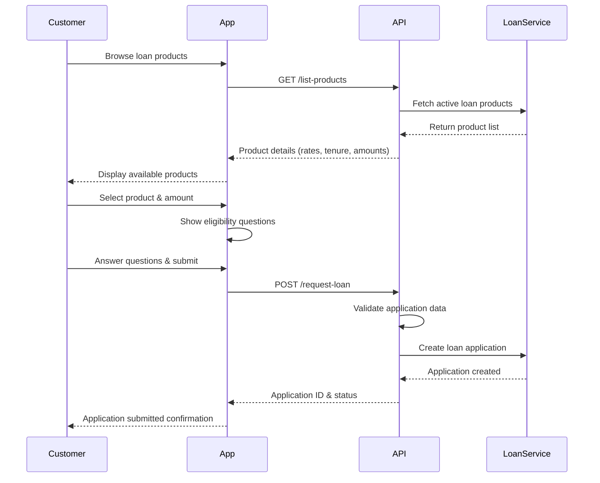
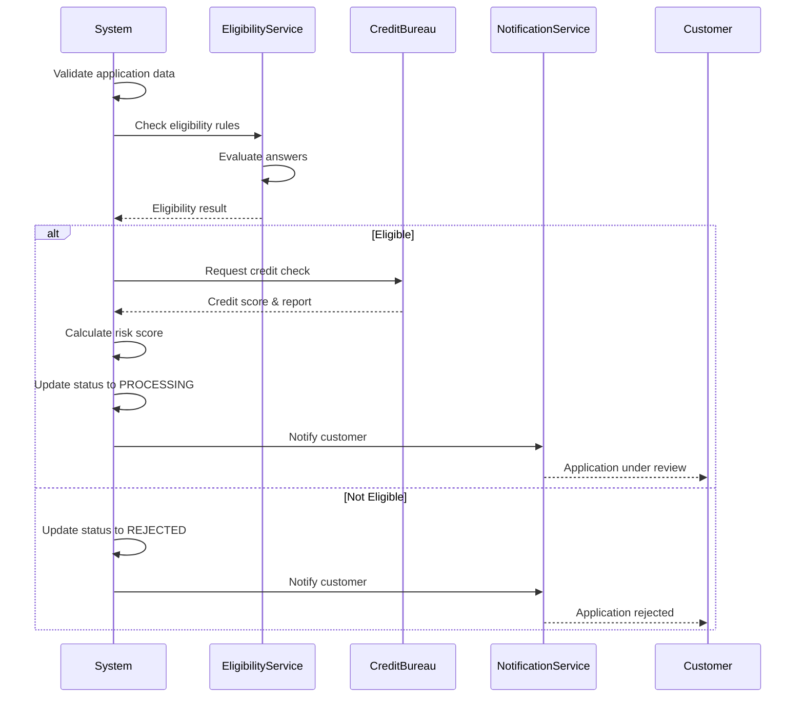
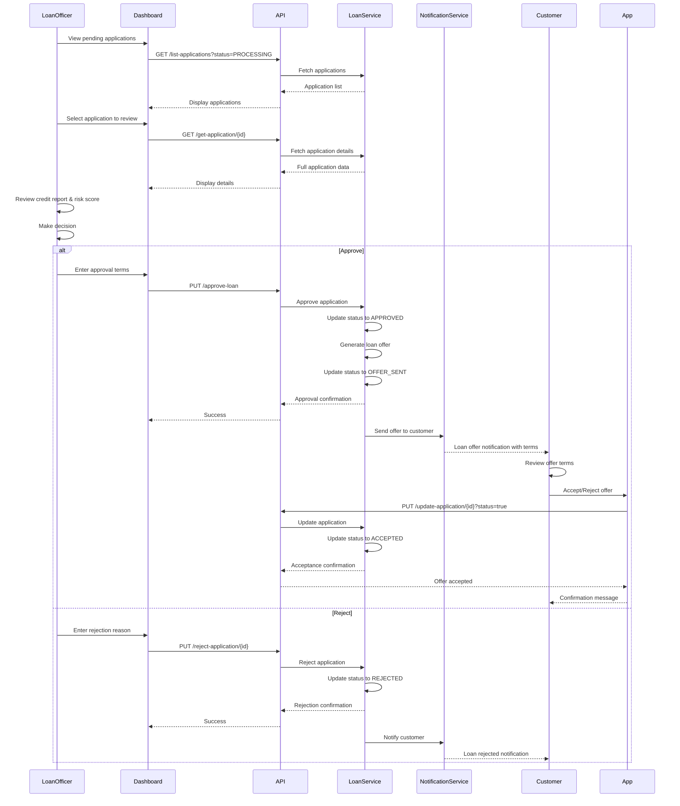
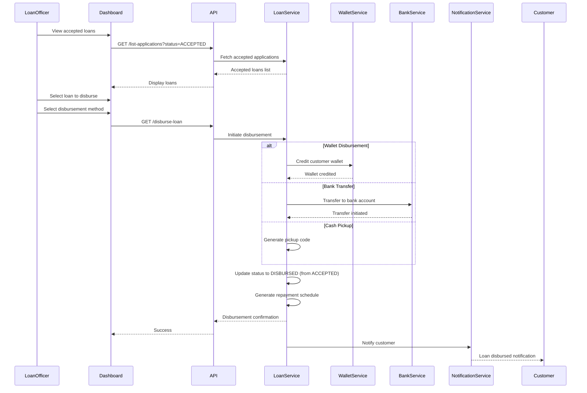
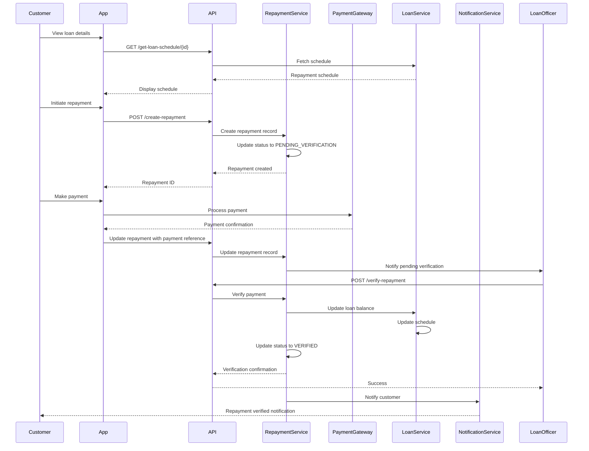
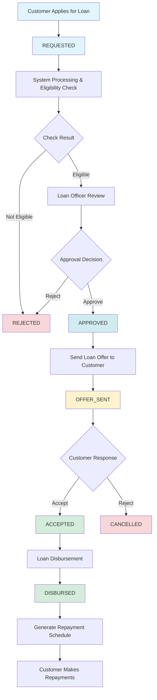

This guide provides comprehensive visual diagrams and step-by-step explanations of the complete loan application flow, from customer application through loan disbursement and repayment.

<Note>
  The complete journey has **5 main phases**: Application, Processing, Underwriting, Disbursement, and Repayment.
</Note>

### Phase 1: Loan Application

#### 1.1 Customer Initiates Loan Application

The customer starts the loan application process by selecting a loan product and providing required information.

<Card title='API Endpoint' href='/api/lending/loan-request'>
  Go to loan request endpoint.
</Card>

#### Customer Experience Flow

<Steps>
  <Step title="Browse Products">
    Customer views available loan products with interest rates, tenure options, and amount limits
  </Step>

  <Step title='Select Product'>
    Customer selects a loan product and enters requested loan amount
  </Step>

  <Step title='Answer Eligibility Questions'>
    Customer answers product-specific eligibility questions
  </Step>

  <Step title='Submit Application'>
    Customer reviews and submits the loan application
  </Step>

  <Step title="Receive Confirmation">
    Customer receives confirmation with application ID and next steps
  </Step>
</Steps>

### Phase 2: Application Processing

#### 2.1 System Processing & Eligibility Check

The system automatically processes the application, validates data, and performs eligibility checks.

<Card title='API Endpoint' href='/api/lending/get-application'>
  Check application status and details.
</Card>

#### Processing Steps

<Steps>
  <Step title="Data Validation">
    System validates all application data for completeness and accuracy
  </Step>

  <Step title='Eligibility Check'>
    System evaluates eligibility based on product rules and customer answers
  </Step>

  <Step title='Credit Assessment'>
    System performs credit bureau check and calculates risk score
  </Step>

  <Step title='Status Update'>
    Application status updated to PROCESSING or REJECTED based on initial checks
  </Step>

  <Step title="Customer Notification">
    Customer receives notification about application status
  </Step>
</Steps>

### Phase 3: Underwriting & Approval

#### 3.1 Loan Officer Review

Loan officers review applications, assess risk, and make approval decisions.

<Card title='API Endpoints' href='/api/lending/approve-loan'>
  Approve or reject loan applications.
</Card>

#### Underwriting Steps

<Steps>
  <Step title="Application Review">
    Loan officer reviews application details, credit report, and risk assessment
  </Step>

  <Step title='Risk Assessment'>
    Loan officer evaluates creditworthiness and repayment capacity
  </Step>

  <Step title='Decision Making'>
    Loan officer makes approval or rejection decision
  </Step>

  <Step title='Set Loan Terms'>
    If approved, loan officer sets final terms (amount, interest rate, tenure)
  </Step>

  <Step title='Send Offer'>
    System generates loan offer and sends it to customer with terms
  </Step>

  <Step title='Customer Accepts Offer'>
    Customer reviews and accepts the loan offer
  </Step>

  <Step title="Customer Notification">
    Customer receives notification about approval, offer, or rejection
  </Step>
</Steps>

### Phase 4: Loan Disbursement

#### 4.1 Disburse Accepted Loan

Once the customer accepts the loan offer, the loan is disbursed to the customer's chosen method.

<Card title='API Endpoint' href='/api/lending/disburse-loan'>
  Disburse approved loans.
</Card>

#### Disbursement Steps

<Steps>
  <Step title="Select Loan">
    Loan officer selects an approved loan for disbursement
  </Step>

  <Step title='Choose Disbursement Method'>
    Loan officer selects disbursement method (wallet, bank, cash)
  </Step>

  <Step title='Initiate Disbursement'>
    System processes the disbursement based on selected method
  </Step>

  <Step title='Generate Schedule'>
    System automatically generates repayment schedule
  </Step>

  <Step title="Customer Notification">
    Customer receives notification with disbursement details and repayment schedule
  </Step>
</Steps>

### Phase 5: Repayment & Collection

#### 5.1 Customer Makes Repayment

Customers make repayments according to the schedule, and the system tracks and verifies payments.

<Card title='API Endpoints' href='/api/lending/create-repayment'>
  Create repayments and view schedules.
</Card>

#### Repayment Steps

<Steps>
  <Step title="View Schedule">
    Customer views repayment schedule with due dates and amounts
  </Step>

  <Step title='Initiate Repayment'>
    Customer initiates repayment and provides payment details
  </Step>

  <Step title='Make Payment'>
    Customer makes payment via selected method (wallet, bank transfer, etc.)
  </Step>

  <Step title='Verification'>
    Loan officer verifies payment and updates loan balance
  </Step>

  <Step title="Schedule Update">
    System updates repayment schedule and remaining balance
  </Step>
</Steps>

### Complete Flow Diagram

The complete loan lifecycle from application to repayment completion:

### Key Status Transitions

<AccordionGroup>
  <Accordion title="Application Statuses" icon="list">
    - **REQUESTED**: Initial application submitted by customer
    - **APPROVED**: Application approved by loan officer
    - **OFFER_SENT**: Loan offer sent to customer with terms
    - **ACCEPTED**: Customer accepted the loan offer
    - **DISBURSED**: Funds have been disbursed to customer
    - **REJECTED**: Application rejected during review
    - **CANCELLED**: Application cancelled by customer or system
  </Accordion>

  <Accordion title="Repayment Statuses" icon="money-bill">
    - **PENDING_VERIFICATION**: Payment made, awaiting verification
    - **VERIFIED**: Payment verified and applied to loan
    - **REJECTED**: Payment verification failed
    - **OVERDUE**: Payment past due date
  </Accordion>
</AccordionGroup>

## Next Steps

<CardGroup cols={2}>
  <Card title='Loan Lifecycle' icon='timeline' href='/lending/loan-lifecycle'>
    Understand detailed state transitions and lifecycle management
  </Card>

  <Card title='Underwriting' icon='user-check' href='/lending/underwriting'>
    Learn about the underwriting process and decision making
  </Card>

  <Card title='Repayment' icon='money-bill' href='/lending/repayment'>
    Explore repayment processes and collection management
  </Card>

  <Card title='API Reference' icon='code' href='/api/lending/loan-request'>
    Start integrating with our lending APIs
  </Card>
</CardGroup>

