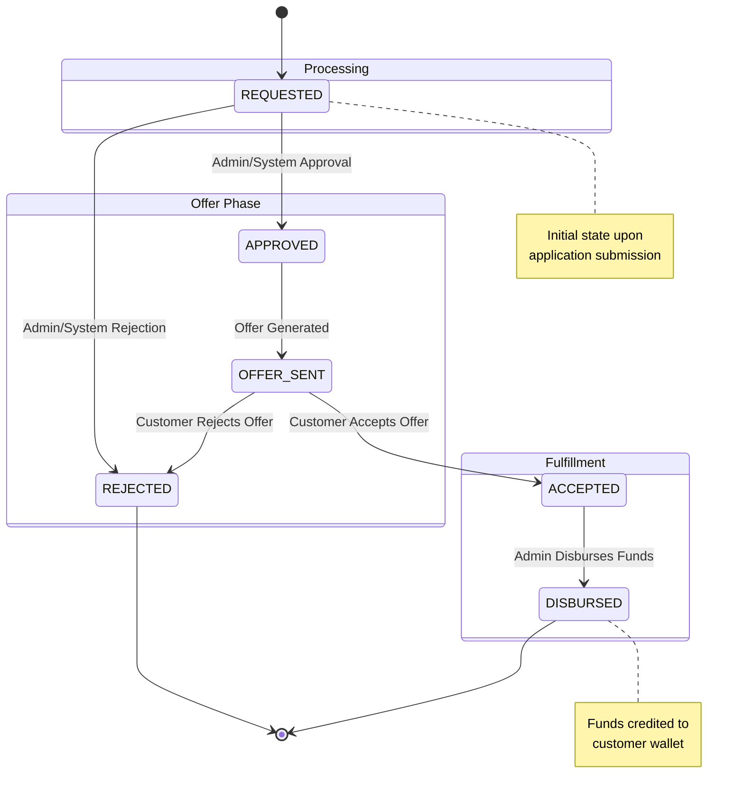

Understanding the lifecycle of a loan application is crucial for integrating with the lending platform. This page details the various states a loan application can traverse and the triggers for each transition.

## State Diagram

The following diagram illustrates the standard flow of a loan application from creation to disbursement.

## Loan States

### 1. REQUESTED
The initial state when a customer submits a loan application.
- **Trigger**: Customer calls `POST /request-loan`.
- **Action Required**: Underwriting review (manual or automated).
- **Next Possible States**: `APPROVED`, `REJECTED`.

### 2. APPROVED
The application has passed underwriting checks and has been approved by a loan officer or the system.
- **Trigger**: Admin approves the application via the dashboard or API.
- **Context**: Loan terms (Amount, Rate, Tenure) are finalized in this state.
- **Next Possible States**: `OFFER_SENT`.

### 3. OFFER_SENT
A formal loan offer has been generated and presented to the customer.
- **Trigger**: System generates the offer after approval.
- **Action Required**: Customer must review and accept/reject the offer.
- **Next Possible States**: `ACCEPTED`, `REJECTED`.

### 4. ACCEPTED
The customer has accepted the loan offer and agreed to the terms and conditions.
- **Trigger**: Customer calls `PUT /accept-loan-offer/{id}/accept` and `PUT /accept-terms-and-conditions/{id}`.
- **Action Required**: Admin disbursement.
- **Next Possible States**: `DISBURSED`.

### 5. REJECTED
The application was rejected by the system/admin, or the offer was rejected by the customer.
- **Trigger**: 
    - Admin/System rejects application (Credit risk, eligibility failure).
    - Customer calls `PUT /accept-loan-offer/{id}/reject`.
- **Action Required**: None. This is a terminal state.

### 6. DISBURSED
The loan funds have been successfully credited to the customer's wallet.
- **Trigger**: Admin triggers disbursement.
- **Context**: A wallet account is created, and the loan amount is credited. Repayment schedule is active.
- **Next Possible States**: `COMPLETED` (after full repayment), `DEFAULTED` (if repayment fails).

## State Transitions & Webhooks

You can subscribe to webhook events to receive real-time updates when a loan application changes state.

| Event Name | Description |
| :--- | :--- |
| `loan.application.approved` | Triggered when status changes to APPROVED. |
| `loan.offer.accepted` | Triggered when customer accepts the offer. |
| `loan.disbursed` | Triggered when funds are disbursed. |
| `loan.application.rejected` | Triggered when application is rejected. |

<Card title='Webhooks Documentation' href='/api/webhooks'>
  Learn how to configure and handle webhook events.
</Card>
