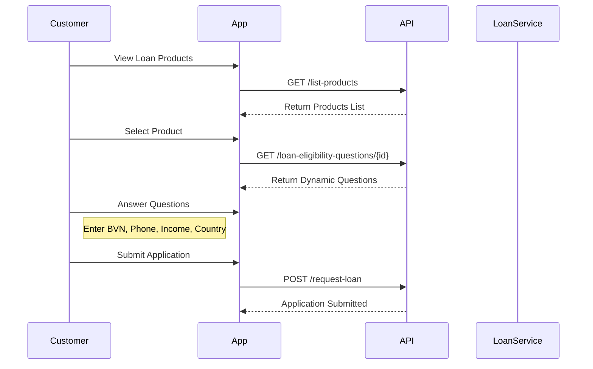
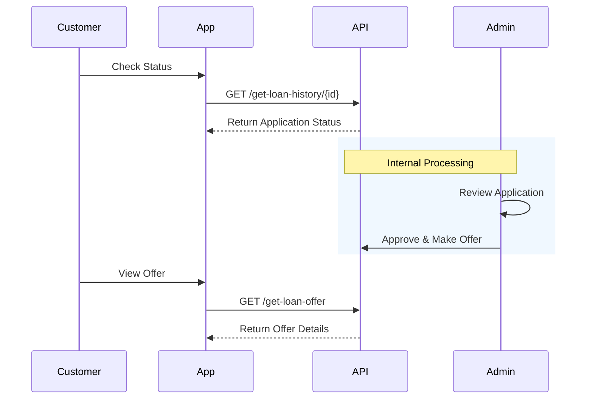
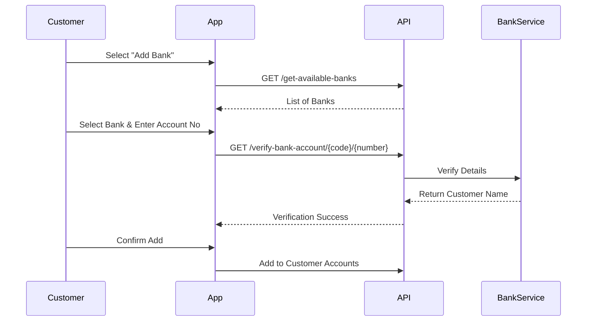

This guide details the complete customer journey for digital lending, from application to disbursement and withdrawal.

<Note>
  The flow covers **Application**, **Offer**, **Acceptance**, **Disbursement**, **Withdrawal**, and **Repayment**.
</Note>

### Phase 1: Loan Application

#### 1.1 Product Selection & Eligibility

The customer starts by viewing available loan products and answering eligibility questions.

<CardGroup cols={2}>
  <Card title='List Products' href='/api/lending/list-products'>
    View available loan products
  </Card>
  <Card title='Get Questions' href='/api/lending/loan-eligibility-questions'>
    View dynamic eligibility questions
  </Card>
</CardGroup>

#### Application Steps

<Steps>
  <Step title="Select Product">
    Customer views the list of available loan products and selects one.
  </Step>

  <Step title='Check Eligibility'>
    System returns dynamic eligibility questions based on the selected product.
  </Step>

  <Step title='Submit Details'>
    Customer provides answers along with key details:
    - **Employment Status**
    - **BVN**
    - **Phone Number**
    - **Monthly Income**
    - **Country**
  </Step>
</Steps>

### Phase 2: Processing & Offer

#### 2.1 Status & Offer Generation

After submission, the application undergoes review (manual or automated).

<CardGroup cols={2}>
  <Card title='Check History' href='/api/lending/get-loan-history'>
    View loan history
  </Card>
  <Card title='Get Offer' href='/api/lending/get-loan-offer'>
    View loan offer
  </Card>
</CardGroup>

### Phase 3: Acceptance

#### 3.1 Accept or Reject Offer

The customer reviews the loan offer and terms.

<Steps>
  <Step title="Review Offer">
    Customer sees the approved amount (which may be less than or equal to requested).
  </Step>
  
  <Step title="Accept/Reject">
    Customer proceeds to accept or reject the loan offer.
  </Step>

  <Step title="Terms Agreement">
    If accepting, customer accepts the specific loan terms.
  </Step>
</Steps>

<CardGroup cols={3}>
  <Card title='Accept Offer' href='/api/lending/accept-loan-offer'>
    Accept loan offer
  </Card>
  <Card title='Reject Offer' href='/api/lending/reject-loan-offer'>
    Reject loan offer
  </Card>
  <Card title='Accept Terms' href='/api/lending/accept-loan-terms'>
    Accept loan terms
  </Card>
</CardGroup>

### Phase 4: Disbursement & Wallet

#### 4.1 Wallet Creation

Once the loan is disbursed by the admin:
1. A **wallet account** is automatically created for the customer.
2. The loan amount is credited to this wallet.
3. The customer can view their total approved loans.

<Card title='Get Total Loan' href='/api/lending/get-total-loan'>
  View total approved loans
</Card>

### Phase 5: Withdrawal

#### 5.1 Add Bank Account

To withdraw funds, the customer must first add a valid bank account.

<CardGroup cols={2}>
  <Card title='Get Banks' href='/api/lending/get-available-banks'>
    View available banks
  </Card>
  <Card title='Verify Account' href='/api/lending/verify-bank-account'>
    Verify bank account
  </Card>
</CardGroup>

#### 5.2 Withdraw Funds

The customer transfers funds from their wallet to their bank account.

<Note>
  A processing fee (e.g., 10 Naira) is applied to withdrawals.
</Note>

1. **Select Source**: Choose the DISBURSED loan/wallet.
2. **Select Destination**: Choose a saved customer bank account.
3. **Enter Details**: Input amount and optional narration.
4. **Confirm**: Send funds.

<Card title='List Bank Accounts' href='/api/lending/list-customer-bank-accounts'>
  View customer bank accounts
</Card>

#### 5.3 Track Transfers

Customers can view the history and status of their transfers.

<CardGroup cols={2}>
  <Card title='Transfer History' href='/api/lending/transfer-history'>
    View transfer history
  </Card>
  <Card title='Manage Loans' href='/api/lending/manage-loans'>
    Manage loans
  </Card>
</CardGroup>

### Phase 6: Repayment (Coming Soon)

<Note>
  Repayment features including payoff and automated collections are currently under development.
</Note>