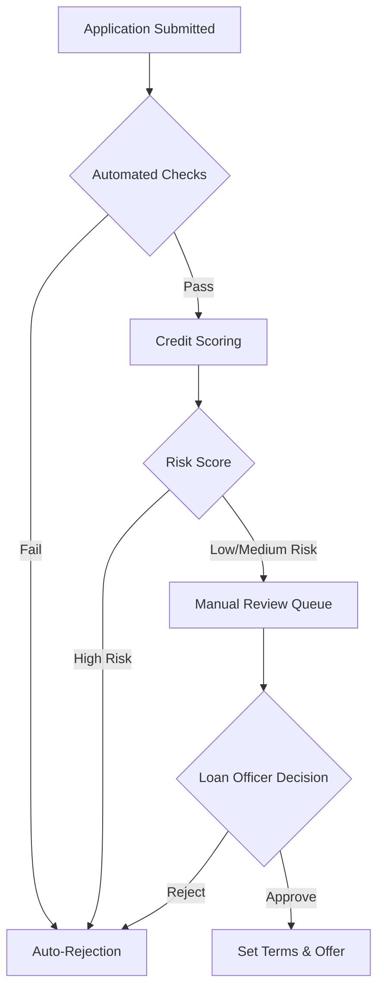

The underwriting process is the core of the lending platform, determining the creditworthiness of applicants and structuring loan offers. Our system supports a hybrid approach combining automated checks with manual review capabilities.

## Underwriting Workflow

## 1. Automated Checks

Immediately upon submission, the system performs a series of validation checks:

### Eligibility Rules
- **Age Verification**: Checks if the applicant meets the minimum/maximum age requirements.
- **Location**: Verifies if the applicant is in a supported region/country.
- **Employment Status**: Filters allowed employment types (e.g., Salaried, Self-Employed).

### KYC Verification
- **Identity Check**: Validates BVN (Bank Verification Number) against the national database.
- **Blacklist Check**: Screens the applicant against internal and external blacklists (AML/CFT).

<Card title='Eligibility API' href='/api/lending/loan-eligibility-questions'>
  View how dynamic eligibility questions are retrieved.
</Card>

## 2. Credit Scoring

For applications that pass initial checks, the system calculates a credit score using multiple data points:

- **Bureau Data**: Credit history, existing debts, and repayment behavior from credit bureaus.
- **Platform Data**: Transaction history, wallet balance, and previous loan performance on our platform.
- **Alternative Data**: Income estimation based on bank statement analysis (if integrated).

The result is a **Risk Score** (e.g., 0-100) that categorizes the applicant:
- **Green (Low Risk)**: High likelihood of approval.
- **Amber (Medium Risk)**: Requires careful manual review.
- **Red (High Risk)**: Recommended for rejection.

## 3. Manual Review

Loan officers use the Admin Dashboard to review applications in the queue.

### Review Actions
1.  **Verify Documents**: Review uploaded ID cards, payslips, or bank statements.
2.  **Analyze Risk**: View the calculated Risk Score and detailed credit report.
3.  **Decision Making**:
    - **Approve**: The officer can approve the loan.
    - **Reject**: The officer can reject the loan with a specific reason code.

### Setting Loan Terms
Upon approval, the loan officer determines the final terms of the offer:
- **Approved Amount**: Can be equal to or less than the requested amount.
- **Interest Rate**: Set based on the risk profile and product configuration.
- **Tenure**: Finalized repayment period.

## Decision Outcomes

### Approval
If approved, the application moves to the `APPROVED` state. The system generates a loan offer containing the finalized terms, which is then made available to the customer.

<Card title='Get Loan Offer' href='/api/lending/get-loan-offer'>
  See how customers retrieve their approved offer.
</Card>

### Rejection
If rejected, the application moves to the `REJECTED` state. The customer is notified, and depending on configuration, may be eligible to re-apply after a cooling-off period.
