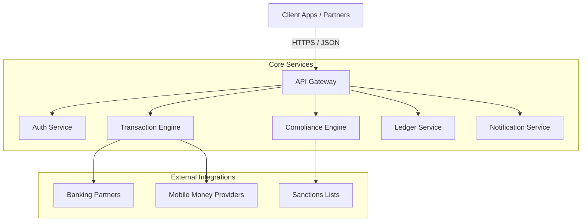

FinCode is built on a modern, cloud-native microservices architecture designed for scalability, security, and high availability. This ensures that our platform can handle high transaction volumes while maintaining strict compliance and data integrity.

## High-Level Overview

The platform exposes a unified API Gateway that routes requests to specific backend services. This decouples the client applications from the underlying service complexity.

## Core Components

### API Gateway
The entry point for all external traffic. It handles:
-   **Routing**: Directs requests to the appropriate microservice.
-   **SSL Termination**: Decrypts incoming traffic.

### Security & Authentication
Manages user identities and access control.
-   **JWT Management**: Issues and validates JSON Web Tokens.
-   **RBAC**: Enforces Role-Based Access Control policies.

### Transaction Engine
The heart of the platform, responsible for the end-to-end lifecycle of a remittance.
-   **Orchestration**: Coordinates between compliance, ledger, and payout providers.
-   **State Management**: Tracks transaction status (e.g., `WAITING_TO_PAY`, `PAID`).

### Compliance Engine
Ensures all transactions meet regulatory standards.
-   **AML/KYC**: Performs automated checks on senders and beneficiaries.
-   **Sanctions Screening**: Checks against global watchlists.

### Ledger Service
A double-entry accounting system that records every financial movement.
-   **Immutability**: Ensures financial data cannot be tampered with.
-   **Reconciliation**: Facilitates daily settlement and reconciliation.

## Integration Patterns

We support multiple integration patterns to suit different needs:

-   **REST API**: Synchronous request-response model for initiating transactions and querying data.
-   **Webhooks**: Asynchronous event notifications (e.g., `transaction.completed`) pushed to your server.
