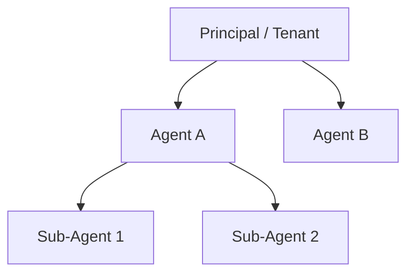

FinCode is built on a robust multi-tenant architecture designed to support complex hierarchies of financial institutions, agents, and sub-agents. This ensures that data is securely isolated while allowing for flexible configuration inheritance.

## Architecture Overview

The platform operates on a **Principal-Agent** model:

-   **Principal (Tenant)**: The top-level entity (e.g., a Money Transfer Operator or Bank) that owns the platform instance. The Principal configures global settings, compliance rules, and liquidity providers.
-   **Agent**: A business entity operating under the Principal. Agents can have their own customers, branding, and specific configurations, but they operate within the limits set by the Principal.
-   **Sub-Agent**: A further subdivision under an Agent, often used for retail locations or specific branches.

## Data Isolation

Data security and privacy are paramount in a multi-tenant environment.

-   **Logical Isolation**: All data (customers, transactions, beneficiaries) is logically isolated by a unique `tenantId` (often referred to as `agents` or `platform` context in APIs).
-   **Access Control**: Users are assigned roles within a specific tenant context. An admin for "Agent A" cannot access data belonging to "Agent B".
-   **Request Context**: Every API request requires context in the request url (like `https://${domain}.fincode.software`) to ensure the operation is performed against the correct tenant partition.

## Configuration Inheritance

To simplify management, the platform uses a hierarchical configuration system.

### Inheritance Rules
1.  **Global Defaults**: The Principal sets global defaults for fees, exchange rate margins, and transaction limits.
2.  **Agent Overrides**: Agents can be configured to inherit these defaults or have specific overrides applied to them.
3.  **Specific Rules**: If an Agent has a specific rule (e.g., a lower fee for a marketing campaign), it takes precedence over the global default.

## White-Labeling

The platform supports extensive white-labeling to ensure a consistent brand experience for each tenant.

-   **Branding**: Logos, color schemes, and fonts can be customized per Agent.
-   **Communication**: Email templates and SMS notifications can be branded to appear as if they are coming directly from the Agent.
-   **URLs**: Agents can operate on their own subdomains (e.g., `agent-a.remitjunction.com`).
