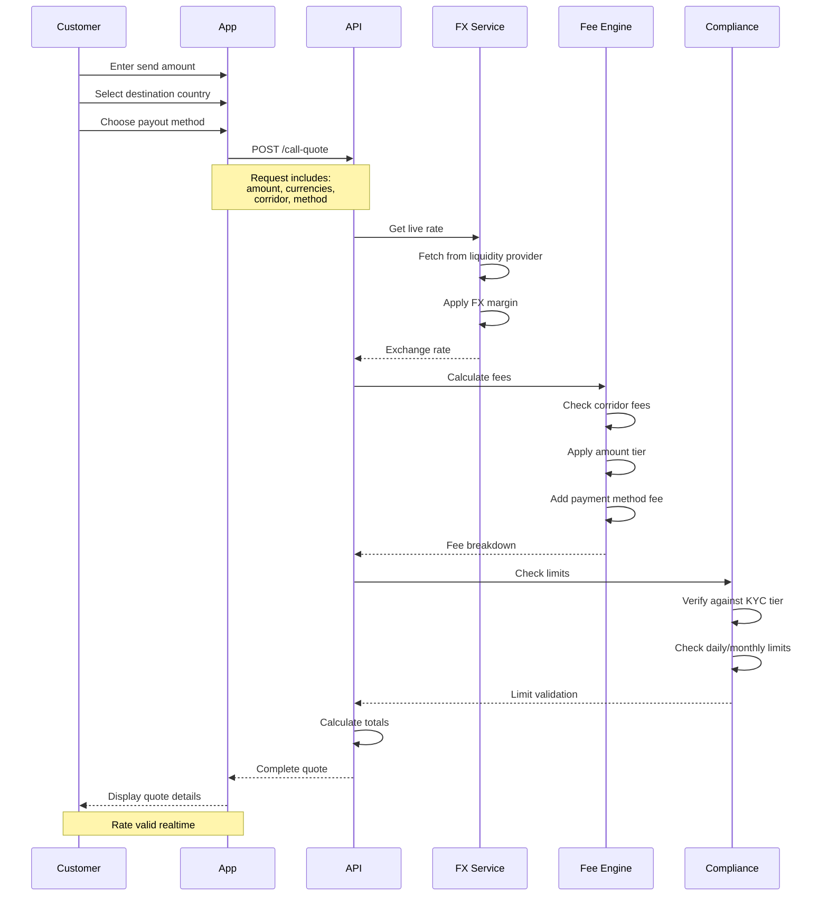

Exchange rate management is critical to remittance transactions. FinCode provides real-time exchange rates with transparent pricing, and competitive margins to ensure customers know exactly what they're paying and what beneficiaries will receive.

### Complete Quote Process

**API Endpoint**: [Call Quote](/api/transactions/call-quote)

### Payment Method Fees

<CardGroup cols={2}>
  <Card title="Open Banking" icon="building-columns">
    Recommended for larger amounts
  </Card>
  
  <Card title="Debit Card" icon="credit-card">
    Instant processing
  </Card>
  
  <Card title="Credit Card" icon="credit-card">
    For rewards/cashback
  </Card>
  
  <Card title="Bank Transfer" icon="money-bill-transfer">
    Best for regular transfers
  </Card>
</CardGroup>

## Related Documentation

<CardGroup cols={3}>
  <Card title="Process Flows" icon="diagram-project" href="/remittance/process-flows">
    See FX in complete transaction flow
  </Card>
  
  <Card title="Settlement" icon="building-columns" href="/remittance/settlement">
    How funds are delivered after conversion
  </Card>
  
  <Card title="Corridors" icon="globe" href="/remittance/corridors">
    Rates and fees by corridor
  </Card>
  
  <Card title="API Reference" icon="code" href="/api/transactions/call-quote">
    Complete API documentation
  </Card>
  
  <Card title="Transaction Lifecycle" icon="timeline" href="/remittance/transaction-lifecycle">
    Understand transaction states
  </Card>
  
  <Card title="Compliance" icon="shield-check" href="/remittance/compliance">
    KYC and transaction limits
  </Card>
</CardGroup>