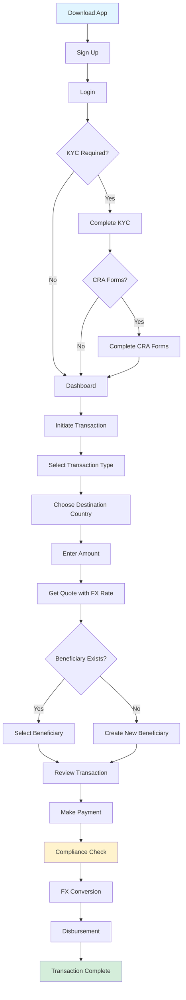

Welcome to the remittance platform documentation. This guide will help you understand how our international money transfer system works and how to integrate it into your application.

### What is Remittance?

Our remittance platform enables **fast, secure, and compliant international money transfers**. Users can send money across borders to beneficiaries via:

- **Bank transfers** - Direct deposits to bank accounts
- **Mobile money** - Instant transfers to mobile wallets
- **Cash pickup** - Beneficiary collects cash at agent locations

### Key Features

<CardGroup cols={2}>
  <Card title='Multi-Currency Support'>
  Send from GBP, USD, EUR to 50+ destination currencies at competitive exchange rates.
  </Card>

<Card title='Multiple Payout Methods'>
  Bank transfer, mobile money, and cash pickup options across more than 100+
  countries.
</Card>

<Card title='Compliance Built-In'>
  Automated KYC/AML screening, sanctions checking, and regulatory compliance
</Card>

<Card title='Real-Time FX Rates'>
  Live exchange rates with transparent fee structure, markup support and rate
  adjustments and locking.
</Card>

<Card title='Fast Settlement'>
  Most transactions complete within 1-24 hours, with instant options available
</Card>

  <Card title='API-First Design'>
    RESTful APIs with comprehensive documentation and sandbox environment
  </Card>
</CardGroup>

### How It Works

The remittance flow consists of four main phases:

<Steps>
  <Step title='User Onboarding'>
    Users register, complete KYC verification, and set up their profile with
    required compliance documentation.
  </Step>

<Step title='Transaction Initiation'>
  Users get a quote with live FX rates, select or create beneficiaries, and
  review transaction details.
</Step>

<Step title='Payment & Processing'>
  Secure payment via card or open banking, followed by automated compliance
  screening and FX conversion.
</Step>

  <Step title='Settlement & Notification'>
    Funds are disbursed to beneficiaries, and both parties receive confirmation
    notifications.
  </Step>
</Steps>

<Info>
  For detailed visual flows, see the [Process Flows](/remittance/process-flows)
  page.
</Info>

### Core Concepts

#### Transaction Lifecycle

Every transaction moves through defined states from creation to completion:

```
WAITING_TO_PAY → VERIFYING → PAID
```

Transactions can also transition to `CANCELLED`, `EXPIRED`, `FAILED_TO_DELIVER`, `PENDING_REFUND`, or `REFUNDED` based on various conditions.

<Card title='Learn More' href='/remittance/transaction-lifecycle'>
  See detailed state transitions and what triggers each status change
</Card>

#### Exchange Rates

Exchange rates are fetched in real-time and can be locked for up to **15 minutes** during the transaction process. The final rate includes:

- **Base exchange rate** - Market rate from our liquidity providers
- **FX margin** - Small markup for sustainability
- **Transfer fee** - Fixed or percentage-based fee per transaction

<Card title='Learn More' href='/remittance/fx-conversion'>
  Understand how FX rates are calculated and applied
</Card>

#### Beneficiaries

Beneficiaries are the recipients of remittance transfers. Users can:

- Save beneficiaries for future transactions
- Manage multiple beneficiaries
- Update beneficiary details
- Each beneficiary undergoes details validation

<Card title='Learn More' href='/remittance/beneficiaries'>
  Explore beneficiary management and validation
</Card>

#### Corridors

A corridor represents a **send-receive currency pair** with specific:

- Supported payout methods
- Transaction limits
- Processing times
- Fee structures
- Regulatory requirements

<Card title='Learn More' href='/remittance/corridors'>
  View all supported corridors and their specifications
</Card>

### Compliance & Security

We operate a **tiered KYC system** as well as a dynamic compliance system to balance user experience with regulatory requirements as well as custom client integrations:

#### AML/CFT Screening

Every transaction is screened against:

- **Sanctions lists** - OFAC, EU, UN consolidated lists
- **PEP databases** - Politically exposed persons screening
- **Transaction patterns** - Unusual activity detection
- **Risk scoring** - Dynamic risk assessment

<Card title='Learn More' href='/remittance/compliance'>
  Deep dive into compliance requirements and processes
</Card>

### Integration Quick Start

Before you begin:

<Steps>
  <Step title='Get API Credentials'>
    Contact our team to receive your sandbox API keys and base URL.
  </Step>

<Step title='Review API Documentation'>
  Familiarize yourself with our [API Reference](/api/introduction).
</Step>

  <Step title='Understand the Flow'>
    Read through the [Process Flows](/remittance/process-flows) to understand
    the complete user journey.
  </Step>
</Steps>

<Card title='Complete API Reference' href='/api/authentication'>
  Explore all available endpoints with request/response examples
</Card>

### Supported Payout Methods

#### Bank Transfer

Direct deposit to beneficiary's bank account via SWIFT or local rails.

- **Settlement**: 1hr-24hrs
- **Coverage**: 100+ countries
- **Best for**: Large amounts, regular recipients

#### Mobile Money

Instant transfer to mobile wallet providers like MTN, Airtel, Vodafone, and more.

- **Settlement**: Instant -1hr
- **Coverage**: Africa, Asia, Latin America
- **Best for**: Unbanked recipients, urgent transfers

#### Cash Pickup

Beneficiary collects cash at partner agent locations.

- **Settlement**: Instant availability
- **Coverage**: 200+ countries via partner networks
- **Best for**: Recipients without bank accounts or mobile wallets

<Card title='View All Methods' href='/remittance/settlement'>
  Detailed settlement options and requirements
</Card>

### Fee Structure

Our transparent fee structure includes:

- Transfer Fees
- Payment Method Fees
- FX Margin

<Card title='Complete Fee Details' href='/remittance/fees'>
  View detailed fee structure for all corridors
</Card>

## Testing & Sandbox

We provide a full-featured sandbox environment for testing:

- **Sandbox URL**: `https://{domain}.fincode.software`
- **Test credentials**: Provided upon registration
- **Mock payment gateway**: Simulate successful/failed payments
- **No real money**: All transactions are simulated

<Tip>
  Use the sandbox to test all flows, edge cases, and error handling before going
  live.
</Tip>

### Complete Transaction Journey

The diagram below shows the end-to-end flow from app download to transaction completion:



## Next Steps

<CardGroup cols={2}>
  <Card
    title='Process Flows'
    icon='diagram-project'
    href='/remittance/process-flows'
  >
    Visualize the complete transaction journey with detailed diagrams
  </Card>

<Card
  title='Transaction Lifecycle'
  icon='timeline'
  href='/remittance/transaction-lifecycle'
>
  Understand transaction states and transitions
</Card>

<Card title='View Corridors' icon='globe' href='/remittance/corridors'>
  Explore supported countries and their specifications
</Card>

  <Card title='Start Integrating' icon='rocket' href='/api/authentication'>
  Jump into the API documentation and begin building
</Card>
</CardGroup>
