This guide provides comprehensive visual diagrams and step-by-step explanations of the complete remittance flow, from user onboarding through transaction settlement.

<Note>
  The complete journey has **4 main phases**: Onboarding, Transaction
  Initiation, Payment & Processing, and Post-Transaction.
</Note>

### Phase 1: Sender Onboarding & Authentication

#### 1.1 Sender Registration

The registration process creates a new sender account with required personal information.

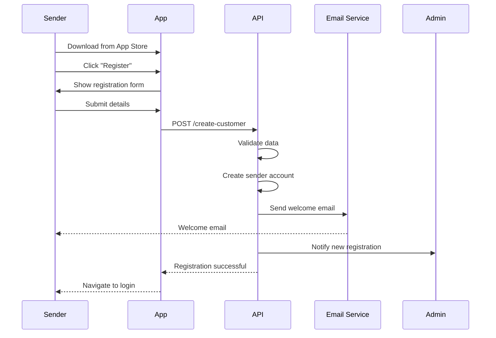

<Card title='API Endpoint' href='/api/users/create-customer'>
  Go to create customer endpoint.
</Card>

#### Sender Experience Flow

<Steps>
  <Step title="Download App">
    Sender downloads the app from PlayStore (Android) or App Store (iOS)
  </Step>

<Step title='Start Registration'>
  Sender taps "Signup" on the welcome screen
</Step>

<Step title='Fill Form'>
  Sender completes the multi-step registration form with personal details
</Step>

<Step title='Email Verification'>
  Sender receives a welcome email with account confirmation
</Step>

<Step title="Admin Notification">
  Admin dashboard receives notification about the new registration for monitoring
</Step>
</Steps>

### 1.2 Sender Login & Authentication

Secure authentication using email and password with JWT token management.

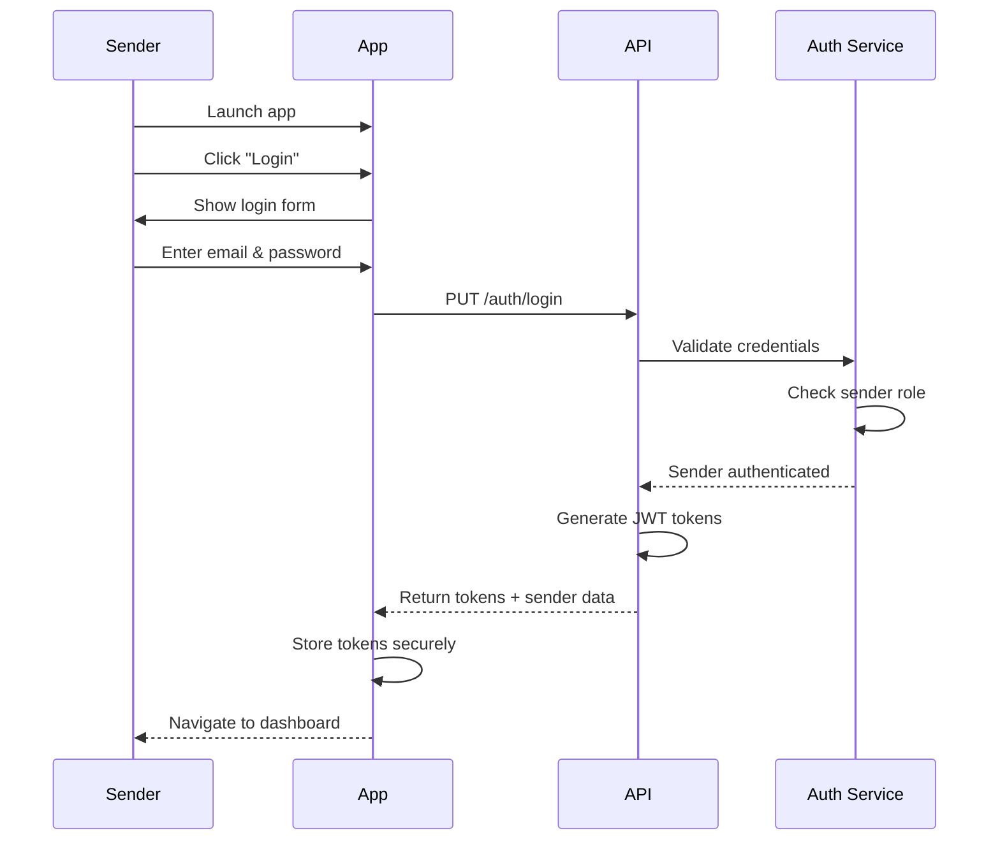

<Card title='API Endpoint' href='/api/auth/login'>
  Go to create login endpoint.
</Card>

### 1.3 KYC Verification

Know Your Customer (KYC) verification is required before sender's can make transactions.

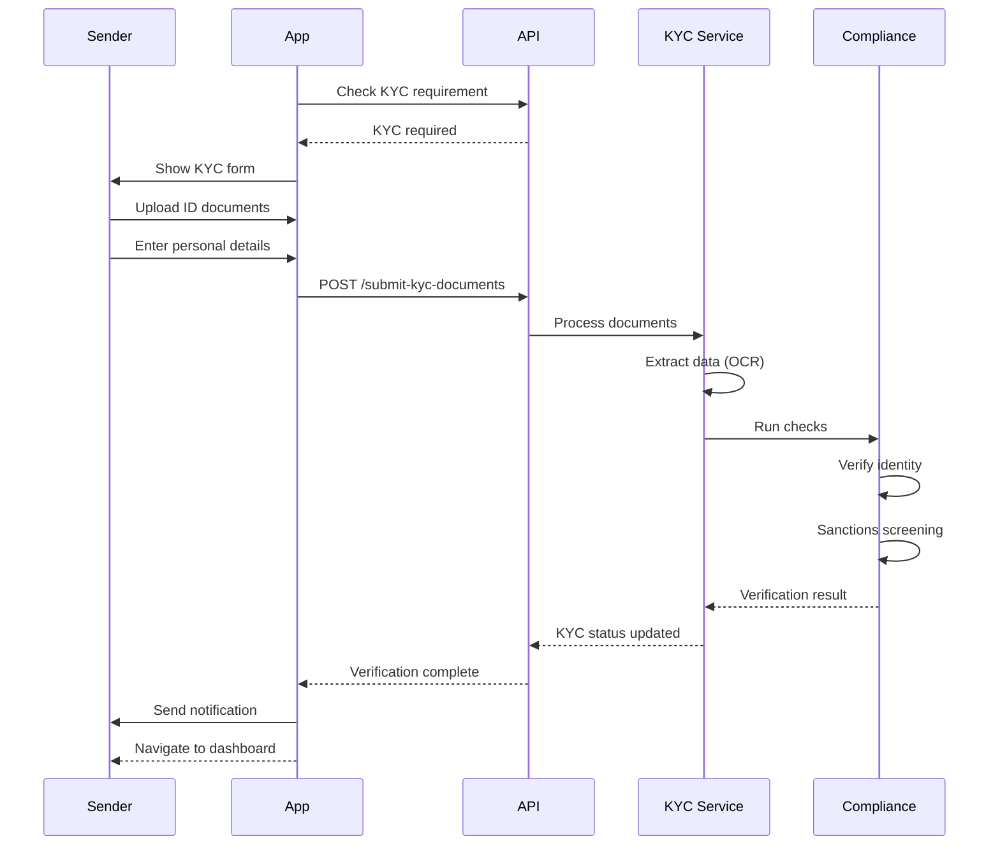

<Card title='API Endpoint' href='/api/compliance/submit-kyc-documents'>
  Go to submit kyc document endpoint.
</Card>

<Tabs>
  <Tab title="Tier 1 - Basic KYC">
    ### Required Documents
    - **Government-issued ID**: Passport, driver's license, or national ID card
    - **Selfie**: For liveness check and face matching

    ### Verification Process
    1. Automated OCR extracts data from ID document
    2. Face matching compares selfie with ID photo
    3. Basic sanctions screening against global watchlists
    4. Identity verification through third-party services

    **0-2 minutes** - Fully automated processing

    <Tip>
      Tier 1 is ideal for senders who need to send smaller amounts quickly without extensive documentation.
    </Tip>

  </Tab>

  <Tab title="Tier 2 - Enhanced KYC">
    ### Required Documents
    - **Government-issued ID**: Same as Tier 1
    - **Proof of address**: Utility bill, bank statement, or government letter (dated within 3 months)
    - **Selfie**: For liveness check

    ### Verification Process
    1. All Tier 1 verification checks
    2. Enhanced PEP (Politically Exposed Person) screening
    3. Address verification and validation
    4. Source of funds verification
    5. Employment verification (if applicable)

    **0-1 hour** - Includes manual review for certain documents

    <Tip>
      Tier 2 is required for senders who need to send larger amounts regularly.
    </Tip>

  </Tab>
</Tabs>

#### KYC Decision Flow

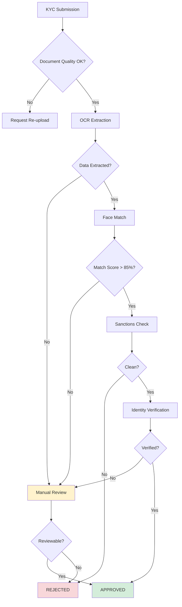

---

### 1.4 Customer Risk Assessment (CRA)

CRA forms collect additional information for regulatory compliance and risk assessment.

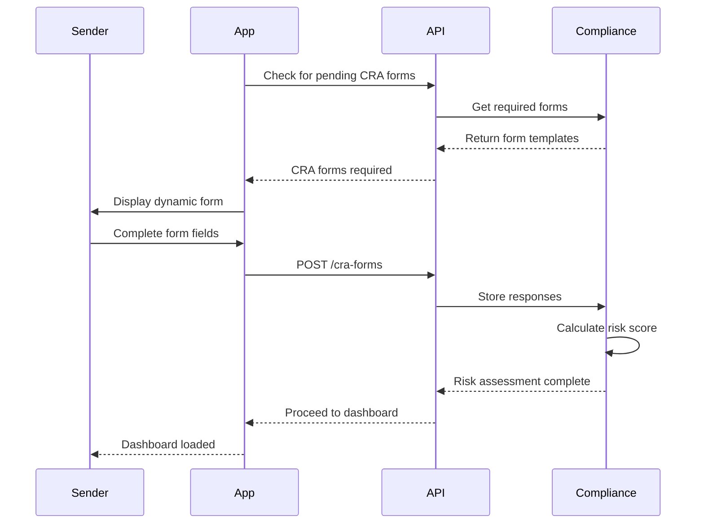

<Card title='API Endpoint' href='/api/compliance/submit-cra'>
  Go to CRA form endpoint.
</Card>

#### When CRA Forms Are Required

<CardGroup cols={2}>
  <Card title="First Transaction">
    Required when transaction amount exceeds limit set for the first time.
  </Card>

<Card title='High-Risk Corridors'>
  Transactions to countries with enhanced due diligence requirements.
</Card>

<Card title='Periodic Reviews'>
  Annual or biennial reviews for active customers.
</Card>

<Card title="Regulatory Changes">
  When new regulations require additional information.
</Card>
</CardGroup>

#### Typical CRA Questions

<AccordionGroup>
  <Accordion title="Source of Funds">
    **Question**: Where does the money you're sending come from?
    
    **Options**:
    - Employment/Salary
    - Business income
    - Savings
    - Gift
    - Inheritance
    - Investment returns
    - Other (specify)
  </Accordion>

<Accordion title='Purpose of Transfer'>
  **Question**: What is the purpose of this transfer?
  
  **Options**:
  - Family support
  - Education fees
  - Medical expenses
  - Business payment
  - Property purchase
  - Investment
  - Gift
  - Other (specify)
</Accordion>

<Accordion title='Beneficiary Relationship'>
  **Question**: What is your relationship to the beneficiary?
  
  **Options**:
  - Family member (parent, sibling, spouse, child)
  - Friend
  - Business partner
  - Employee
  - Myself
  - Other (specify)
</Accordion>

<Accordion title='Transaction Frequency'>
  **Question**: How often do you plan to send money?
  
  **Options**:
  - One-time only
  - Monthly
  - Quarterly
  - As needed
  - Weekly
</Accordion>

<Accordion title="Employment Details">
  **Question**: What is your occupation and employer?
  
  **Fields**:
  - Occupation/Job title
  - Employer name
  - Industry sector
</Accordion>
</AccordionGroup>

## Phase 2: Transaction Initiation

### 2.1 Dashboard & Send Money

The dashboard is the central hub for all remittance activities.

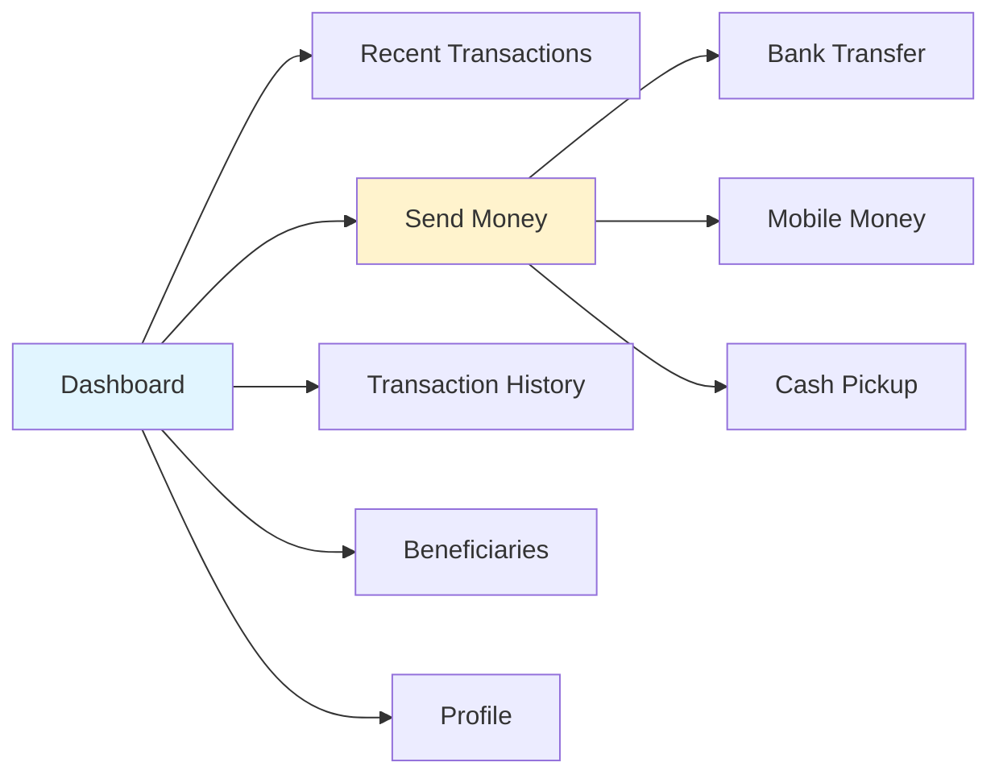

#### Dashboard Features

<CardGroup cols={3}>
  <Card title="Quick Send" icon="paper-plane">
    One-tap access to start a new transaction.
  </Card>

<Card title='Recent Activity' icon='clock'>
  Last 5 transactions with status indicators.
</Card>

<Card title='KYC Status' icon='id-badge'>
  Current verification tier and limits.
</Card>

<Card title='Saved Beneficiaries' icon='user-group'>
  Quick access to frequent recipients.
</Card>

<Card title='Transaction Limits' icon='gauge'>
  Remaining daily/monthly limits.
</Card>

<Card title="Exchange Rates" icon="chart-line">
  Live rates for popular corridors.
</Card>
</CardGroup>

### 2.2 Transaction Type Selection

Senders choose from three or more primary transaction types based on beneficiary preferences.

<Tabs>
  <Tab title="Bank Transfer">
    ### Overview
    Direct deposit into beneficiary's bank account using SWIFT or local banking rails.
    ### Sender Flow
    1. Sender selects "Bank Transfer" option
    2. Choose destination country from list
    3. Enter transfer amount
    4. Get instant quote with FX rate

    ### Required Information
    - Account number or IBAN
    - SWIFT/BIC code (for international transfers)
    - Beneficiary full name (must match bank records)
    - Dynamic form details (if required & set by the backend)

    ### Settlement Time
    **Instant**
    ### Best For
    - Large transfer amounts
    - Regular recipients with bank accounts
    - Countries with strong banking infrastructure

    **API Endpoint**: [Create Transaction](/api/transactions/create-transaction)

    <Tip>
      Bank transfers typically have the lowest fees for amounts over £500/$750.
    </Tip>

  </Tab>

  <Tab title="Mobile Money">
    ### Overview
    Instant transfer to mobile wallet providers like MTN, Airtel, Vodafone, M-Pesa, and more.

    ### Sender Flow
    1. Sender selects "Mobile Money" option
    2. Choose destination country
    3. Select mobile network provider from dropdown
    4. Enter transfer amount
    5. Get instant quote

    ### Required Information
    - Mobile phone number of beneficiary
    - Mobile network provider name
    - Beneficiary full name (if validation not supported)

    ### Settlement Time
    **Instant to 1 hour** - Fastest delivery method
    ### Best For
    - Unbanked beneficiaries
    - Urgent transfers
    - African, Asian, and Latin American corridors
    - Small to medium amounts

    ### Supported Providers
    <CardGroup cols={2}>
      <Card title="Africa">
        MTN, Airtel, Vodacom, Safaricom M-Pesa, Orange Money, Tigo
      </Card>
      <Card title="Asia">
        bKash, Nagad, GCash, PayMaya, Wave Money
      </Card>
    </CardGroup>

<Card title='API Endpoint' href='/api/transactions/create-transaction'>
  Go to create transaction endpoint.
</Card>

    <Warning>
      Mobile money has daily limits imposed by mobile network operators (typically $500-$1000 per day).
    </Warning>

  </Tab>

  <Tab title="Cash Pickup">
    ### Overview
    Beneficiary collects physical cash at partner agent locations worldwide.

    ### Sender Flow
    1. Sender selects "Cash Pickup" option
    2. Choose destination country
    3. Select pickup network partner
    4. Enter transfer amount
    5. Get instant quote

    ### Required Information
    - Beneficiary Phone number
    - Pickup unique code/secret

    ### Settlement Time
    **Instant availability** - Cash ready within minutes

    ### Best For
    - Beneficiaries without bank accounts or mobile money
    - Urgent cash needs
    - Rural areas with limited banking infrastructure
    - One-time transfers

    ### Pickup Process
    1. Sender completes transaction and receives reference number
    2. Beneficiary receives SMS with pickup code/PIN
    3. Beneficiary visits agent location with:
       - Government-issued ID
       - Pickup code/PIN
       - Sender's name
    4. Agent verifies identity and disburses cash

    ### Partner Networks
    - Ria
    - Remitly
    - MoneyGram
    - Western Union

<Card title='API Endpoint' href='/api/transactions/create-transaction'>
  Go to create transaction endpoint.
</Card>

    <Note>
      Cash pickup typically has higher fees (3-5%) but offers universal accessibility.
    </Note>

  </Tab>
</Tabs>

<Card title='API Endpoint' href='/api/transactions/transaction-types'>
  Go to transaction types endpoint.
</Card>

### 2.3 FX Quotation Flow

Real-time exchange rate quotation with rate locking mechanism.

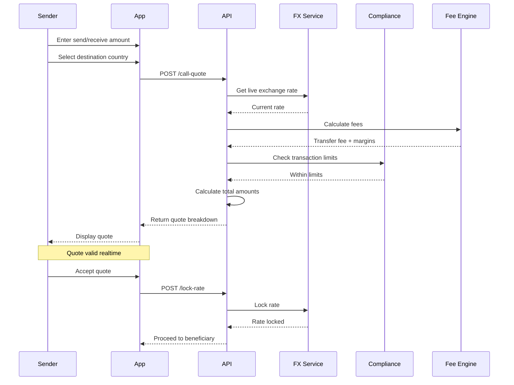

<Card title='API Endpoint' href='/api/transactions/call-quote'>
  Go to transaction types endpoint.
</Card>

### 2.4 Beneficiary Management

Senders can save and manage beneficiaries for faster repeat transactions.

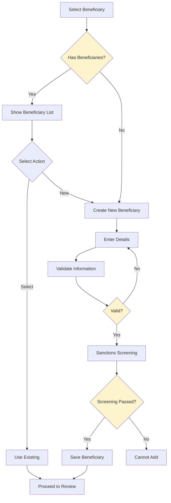

**API Endpoints**:

<Card title='API Endpoint' href='/api/transactions/beneficiary-list'>
  View all saved beneficiaries endpoint.
</Card>
<Card title='API Endpoint' href='/api/transactions/create-beneficiary'>
  Create/update beneficiary endpoint.
</Card>

#### Create New Beneficiary Flow

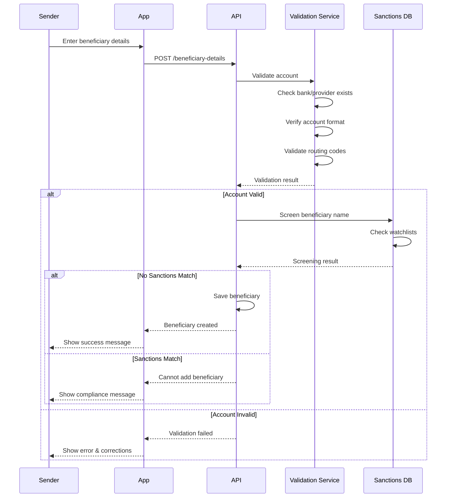

#### Beneficiary Validation Rules

<Tabs>
  <Tab title="Bank Transfer">
    ### Validation Checks
    - **Bank name**: Must exist in destination country
    - **Account number**: Format validation (e.g., 10 digits for Nigerian accounts)
    - **SWIFT/BIC code**: Valid code from SWIFT registry
    - **IBAN**: Checksum validation for IBAN countries
    - **Beneficiary name**: Minimum 3 characters, maximum 100 characters

    ### Example: UK Bank
    ```json
    {
      "beneficiaryName": "John Smith",
      "bankName": "Barclays Bank UK",
      "accountNumber": "12345678",
      "sortCode": "20-00-00",
      "country": "GB"
    }
    ```

    ### Example: Nigerian Bank
    ```json
    {
      "beneficiaryName": "Chinwe Okafor",
      "bankName": "Guaranty Trust Bank",
      "accountNumber": "0123456789",
      "country": "NG"
    }
    ```

  </Tab>

  <Tab title="Mobile Money">
    ### Validation Checks
    - **Phone number**: International format validation
    - **Provider**: Must be active in destination country
    - **Number registration**: Some providers verify if number is registered
    - **Beneficiary name**: Must match registered mobile money account

    ### Example: Kenya M-Pesa
    ```json
    {
      "beneficiaryName": "James Mwangi",
      "phoneNumber": "+254712345678",
      "provider": "Safaricom M-Pesa",
      "country": "KE"
    }
    ```

    ### Example: Ghana MTN
    ```json
    {
      "beneficiaryName": "Akua Mensah",
      "phoneNumber": "+233201234567",
      "provider": "MTN Mobile Money",
      "country": "GH"
    }
    ```

  </Tab>

  <Tab title="Cash Pickup">
    ### Validation Checks
    - **Full name**: At least first and last name
    - **Phone number**: Valid international format
    - **Pickup location**: Valid city in destination country
    - **ID requirement**: Beneficiary must have government ID

    ### Example
    ```json
    {
      "beneficiaryName": "Maria Rodriguez",
      "phoneNumber": "+521234567890",
      "pickupLocation": "Mexico City",
      "pickupNetwork": "Elektra",
      "country": "MX"
    }
    ```

    <Warning>
      For cash pickup, beneficiary name must **exactly match** their government-issued ID.
    </Warning>

  </Tab>
</Tabs>

## Phase 3: Payment & Processing

### 3.1 Transaction Review

Before payment, senders review all transaction details for accuracy.

#### Review Screen Components

<AccordionGroup>
  <Accordion title="Send Details">
    - **Send amount**: Amount sender is sending
    - **Send currency**: Source currency (GBP, USD, EUR)
    - **Exchange rate**: FX rate
    - **Rate validity**: Countdown timer (10 minutes)
  </Accordion>
<Accordion title='Fees & Total'>
    - **Transfer fee**: Platform fee
    - **Payment method fee**: Card fee if applicable
    - **Total to pay**: Final amount to be charged
    - **Fee breakdown**:
      - Transfer fee
      - Payment method fee
      - Exchange rate margin
      - Other fees (if any)
</Accordion>
<Accordion title='Receive Details'>
  - **Receive amount**: Amount beneficiary gets
  - **Receive currency**: Destination currency
  - **Delivery method**: Bank/Mobile/Cash
  - **Estimated delivery**: Time to complete
</Accordion>

  <Accordion title="Beneficiary Info">
    - **Recipient name**: Full name
    - **Delivery details**: Account/phone number
    - **Destination country**: Country flag and name
    - **Transaction type**: Visual indicator
  </Accordion>
</AccordionGroup>

### 3.2 Payment Processing

Secure payment through card or open banking with 3D Secure authentication.

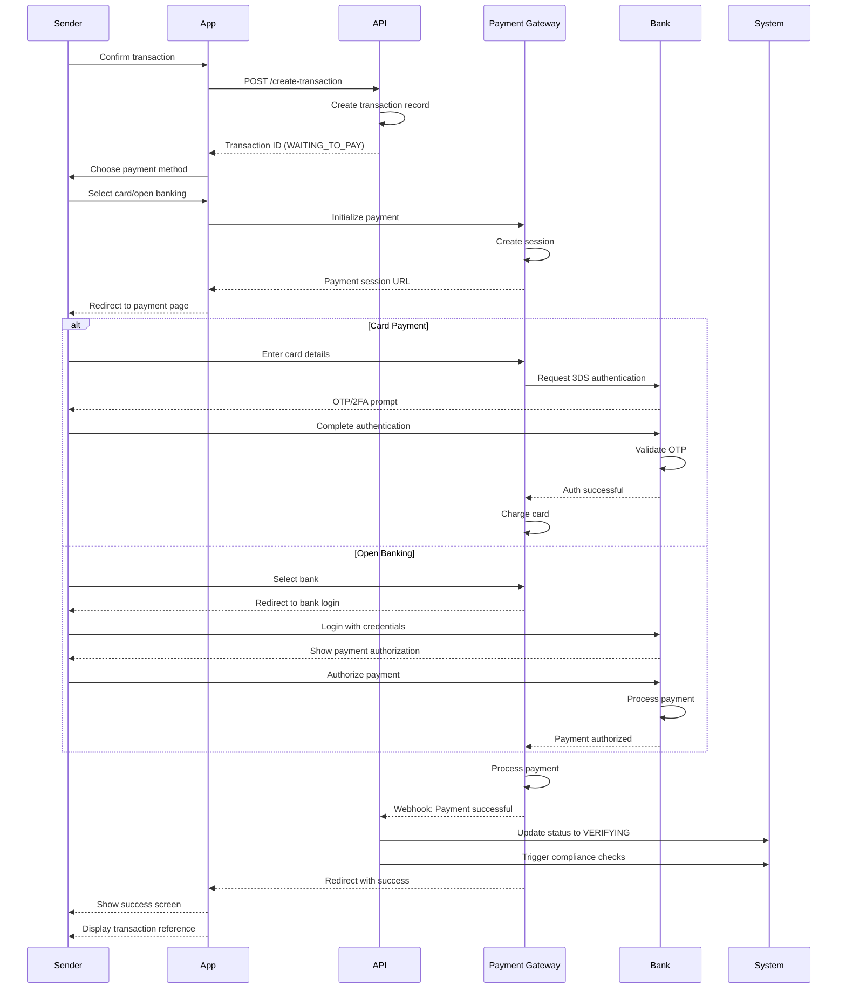

### 3.3 Compliance Screening

All transactions undergo automated compliance checks before processing.

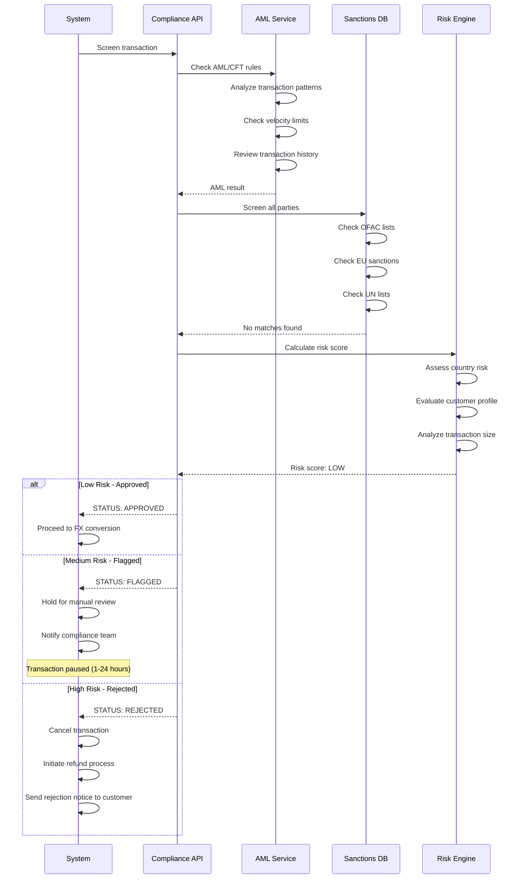

<Card title='API Endpoint' href='/api/compliance/aml-screening'>
  Go to transaction types endpoint.
</Card>

#### Screening Checks Performed

<Tabs>
  <Tab title="AML/CFT Checks">
    ### Anti-Money Laundering & Counter-Terrorism Financing

    **Transaction Pattern Analysis**:
    - Unusual transaction amounts
    - Frequency of transfers
    - Multiple small transactions (structuring)
    - Sudden changes in behavior
    - Round-number transactions

    **Velocity Checks**:
    - Daily transaction count
    - Weekly transaction volume
    - Monthly cumulative amount
    - Same-day repeat transactions

    **Historical Analysis**:
    - Customer transaction history
    - Failed transaction attempts
    - Previous flagged transactions
    - Account age vs. transaction size

    <Warning>
      Transactions showing signs of money laundering (e.g., multiple small transfers to avoid limits) are automatically flagged.
    </Warning>

  </Tab>

  <Tab title="Sanctions Screening">
    ### Global Watchlist Checks

    **Lists Checked**:
    - **OFAC** (US Office of Foreign Assets Control)
    - **EU Sanctions List**
    - **UN Consolidated List**
    - **UK HM Treasury**
    - **National sanctions lists** (per jurisdiction)

    **Entities Screened**:
    - Sender (customer)
    - Beneficiary
    - Sender's country
    - Beneficiary's country
    - Financial institutions involved

    **Matching Algorithm**:
    - Exact name matches
    - Fuzzy matching (90%+ similarity)
    - Alias and known-as names
    - Date of birth verification
    - Address matching
    <Info>
      Even partial matches (80%+) trigger manual review to prevent false positives.
    </Info>

  </Tab>

  <Tab title="PEP Screening">
    ### Politically Exposed Persons

    **Categories**:
    - **Tier 1 PEPs**: Heads of state, ministers, judges
    - **Tier 2 PEPs**: Senior government officials
    - **Tier 3 PEPs**: Close associates and family members
    - **Former PEPs**: Individuals who held positions in past 12-18 months

    **Enhanced Due Diligence**:
    - Source of wealth verification
    - Purpose of transaction scrutiny
    - Relationship to beneficiary
    - Country risk assessment
    - Additional documentation requirements

    **Databases Used**:
    - World-Check (Refinitiv)
    - Dow Jones Risk & Compliance
    - LexisNexis
    - Local PEP databases

    <Note>
      PEP transactions aren't rejected automatically but require enhanced due diligence.
    </Note>

  </Tab>

  <Tab title="Risk Scoring">
    ### Dynamic Risk Assessment

    **Risk Score Outcomes**:
    - **0-30**: Low risk → Auto-approve
    - **31-60**: Medium risk → Flag for review
    - **61-100**: High risk → Reject or enhanced review

    **Country Risk Classification**:
    - **Low**: UK, US, EU, Canada, Australia
    - **Medium**: Most Asian, Latin American countries
    - **High**: FATF blacklisted or sanctioned countries

    <Tip>
      Regular customers with consistent transaction patterns receive better risk scores over time.
    </Tip>

  </Tab>
</Tabs>

#### Compliance Decision Matrix

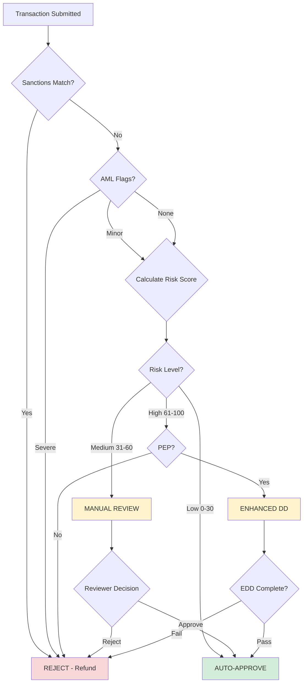

---

### 3.4 FX Conversion & Settlement

Once compliance checks pass, the system converts currency and initiates payout.

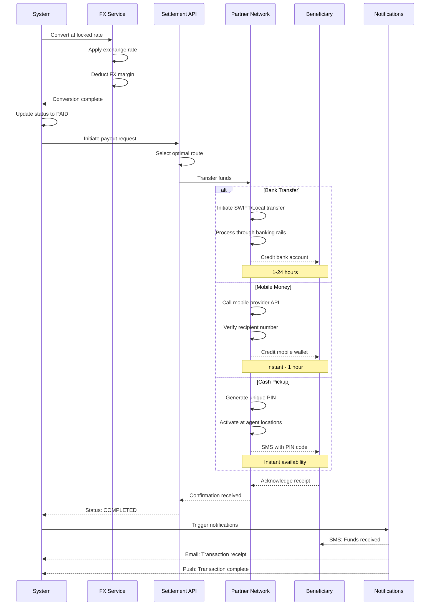

#### Settlement Times by Method

| Payout Method     | Typical Time  | Fastest | Latest   | Availability       |
| ----------------- | ------------- | ------- | -------- | ------------------ |
| **Bank Transfer** | Instant       | Instant | 30secs   | 24/7               |
| **Mobile Money**  | Instant       | Instant | 1 hour   | 24/7               |
| **Cash Pickup**   | Instant       | Instant | N/A      | Agent hours        |

## Phase 4: Post-Transaction

### 4.1 Status Tracking

Transactions move through defined states from creation to completion.

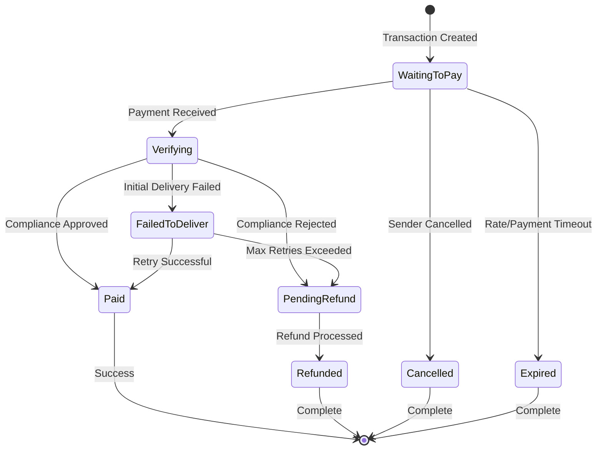

<Card title='API Endpoint' href='/api/transactions/history-data'>
  Go to transaction history endpoint.
</Card>

#### Transaction Status Definitions

<AccordionGroup>
  <Accordion title="WAITING_TO_PAY">
    **Description**: Transaction created but payment not yet received

    **Sender Actions**:
    - Complete payment via card or open banking
    - Cancel transaction

    **Next States**:
    - `VERIFYING` - Payment received
    - `CANCELLED` - Sender cancelled
    - `EXPIRED` - Quote/payment timeout

  </Accordion>

  <Accordion title="VERIFYING">
    **Description**: Payment received, undergoing compliance checks

    **System Actions**:
    - AML/CFT screening
    - Sanctions checking
    - Risk assessment
    - PEP screening (if applicable)

    **Next States**:
    - `PAID` - All checks passed
    - `PENDING_REFUND` - Compliance rejected
    - `FAILED_TO_DELIVER` - Delivery issues

  </Accordion>

  <Accordion title="PAID">
    **Description**: Transaction completed successfully, funds delivered

    **System Actions**:
    - FX conversion executed
    - Funds disbursed to beneficiary
    - Confirmations sent

    **Notifications Sent**:
    - Email receipt to sender
    - SMS to beneficiary
    - Push notification (if enabled)

    **Final State**: Transaction complete ✓

  </Accordion>

  <Accordion title="FAILED_TO_DELIVER">
    **Description**: Delivery attempt failed (wrong account, network issues, etc.)

    **Common Causes**:
    - Invalid account number
    - Inactive mobile money account
    - Bank account closed
    - Network timeout

    **System Actions**:
    - Transaction retry (if activated)
    - Notify compliance team
    - Contact customer for corrections

    **Next States**:
    - `PAID` - Retry successful
    - `PENDING_REFUND`

  </Accordion>

  <Accordion title="PENDING_REFUND">
    **Description**: Refund initiated, processing back to sender

    **Triggers**:
    - Compliance rejection
    - Delivery failure (max retries)
    - Customer request (within refund window)

    **Next State**: `REFUNDED` - Refund complete

  </Accordion>

  <Accordion title="REFUNDED">
    **Description**: Funds returned to sender's payment method

    **Details**:
    - Full refund (including fees)
    - Returns to original payment method
    - Refund confirmation sent

    **Final State**: Transaction complete (refunded)

  </Accordion>

  <Accordion title="CANCELLED">
    **Description**: Transaction cancelled before payment

    **Triggers**:
    - Sender cancelled during payment
    - Sender didn't complete payment

    **No Charges**: No funds were debited

    **Final State**: Transaction complete (cancelled)

  </Accordion>

  <Accordion title="EXPIRED">
    **Description**: Payment window expired

    **Causes**:
    - Payment not completed in time

    **Final State**: Transaction complete (expired)

  </Accordion>
</AccordionGroup>

## API Integration Checklist

Follow these steps to integrate the complete remittance flow:

<Steps>
  <Step title="User Management APIs">
    ### Implement Sender Registration & Authentication

    **Testing Checklist**:
    - [ ] Sender can register with valid details
    - [ ] Email validation works
    - [ ] Password strength requirements enforced
    - [ ] Login returns valid JWT tokens
    - [ ] KYC document upload successful
    - [ ] CRA form submission works

    <Card title="API Reference" icon="code" href="/api/users/create-customer">
      View detailed sender management endpoints
    </Card>

  </Step>

  <Step title="Transaction Flow APIs">
    ### Build Quote, Beneficiary & Transaction Creation

    **Testing Checklist**:
    - [ ] Quote returns accurate FX rates
    - [ ] Rate lock works for 15 minutes
    - [ ] Beneficiary validation catches errors
    - [ ] Transaction creation returns correct status
    - [ ] Multiple payout methods available

    <Card title="API Reference" icon="code" href="/api/transactions/call-quote">
      View transaction API documentation
    </Card>

  </Step>

  <Step title="Payment Integration">
    ### Connect Payment Gateway

    **Implementation**:
    - Integrate card payment provider (Trustpayment/Paycross)
    - Implement open banking (Volume/Volt)
    - Handle 3DS authentication flow
    - Implement payment webhooks

    **Testing Checklist**:
    - [ ] Card payments process successfully
    - [ ] 3DS authentication works
    - [ ] Open banking redirects correctly
    - [ ] Payment webhooks received
    - [ ] Failed payments handled gracefully

    <Card title="Settlement Guide" icon="building-columns" href="/remittance/settlement">
      Detailed payment integration guide
    </Card>

  </Step>

  <Step title="Status Tracking">
    ### Implement Transaction Monitoring

    **Testing Checklist**:
    - [ ] Status updates reflect in real-time
    - [ ] Webhooks received and processed
    - [ ] Polling doesn't exceed rate limits
    - [ ] All transaction states handled
    - [ ] Error states trigger appropriate UI

    <Card title="Webhooks" icon="webhook" href="/api/webhooks">
      Configure webhook endpoints
    </Card>

  </Step>

  <Step title="Testing & Validation">
    ### Comprehensive Testing in Sandbox

    **Testing Checklist**:
    - [ ] All flows tested in sandbox
    - [ ] Error handling implemented
    - [ ] Sender feedback messages clear
    - [ ] Transaction receipts generated
    - [ ] Notifications working

    <Card title="Testing Guide" icon="flask" href="/integration/testing">
      Complete testing documentation
    </Card>

  </Step>
</Steps>

## Next Steps

<Card title='Start Building' icon='rocket' href='/api/authentication'>
  Ready to integrate? Head to the API documentation and start building your
  remittance application.
</Card>
