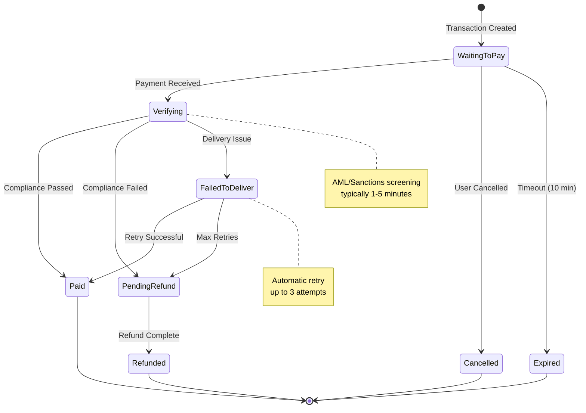
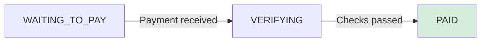
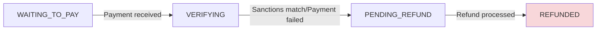
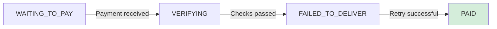

Every remittance transaction moves through a series of well-defined states from creation to completion. Understanding these states helps you build robust integrations and provide clear user feedback.



### Active States

<AccordionGroup>
  <Accordion title="WAITING_TO_PAY" icon="clock">
    **Description**: Transaction created, awaiting payment from user

    **What Happens**:
    - Transaction reference generated
    - User redirected to payment page
    - Timer starts for quote validity

    **User Actions Available**:
    - Complete payment via card or open banking
    - Cancel the transaction
    - View transaction details

    **Next Possible States**:
    - `VERIFYING` - Payment successfully received
    - `CANCELLED` - User cancelled before payment
    - `EXPIRED` - Payment not completed within 10 minutes
  </Accordion>

  <Accordion title="VERIFYING" icon="shield-check">
    **Description**: Payment received, undergoing compliance checks

    **What Happens**:
    - AML/CFT screening initiated
    - Sanctions list checking
    - Risk score calculation
    - PEP screening (if applicable)
    - Transaction pattern analysis

    **System Actions**:
    - Automated compliance checks run
    - Manual review triggered if flagged
    - Compliance team notified (if needed)

    **Next Possible States**:
    - `PAID` - All checks passed, funds disbursed
    - `PENDING_REFUND` - Compliance or payment after transaction expiration
    - `FAILED_TO_DELIVER` - Delivery issues detected

    <Info>
      Most transactions (95%+) pass automated checks and move to PAID within 0-2 minutes.
    </Info>
  </Accordion>

  <Accordion title="FAILED_TO_DELIVER" icon="triangle-exclamation">
    **Description**: Delivery attempt failed, automatic retry in progress

    **Common Causes**:
    - Invalid or closed bank account
    - Inactive mobile money account
    - Network timeout or provider downtime
    - Incorrect account details
    - Beneficiary name mismatch

    **System Actions**:
    - Exponential backoff between retries
    - Notify compliance team after 2nd failure
    - Contact user for corrections if needed

    **Next Possible States**:
    - `PAID` - Retry successful
    - `PENDING_REFUND`

    <Warning>
      Contact your customer to verify beneficiary details if this status persists.
    </Warning>
  </Accordion>

  <Accordion title="PENDING_REFUND" icon="rotate-left">
    **Description**: Refund initiated, processing back to sender

    **Triggers**:
    - Compliance rejection (AML/sanctions)
    - Delivery failure after max retries
    - Customer dispute (within refund window)
    - Technical error requiring reversal

    **What Happens**:
    - Refund request submitted to payment processor
    - Original payment method receives credit
    - Refund notification sent to user
    - Transaction marked for closure

    **Refund Amount**:
    - Full transaction amount (send amount)
    - All fees included
    - Same payment method as original

    **Next Possible State**:
    - `REFUNDED` - Refund completed successfully
  </Accordion>
</AccordionGroup>

## State Transition Triggers

Understanding what causes state changes helps you build better error handling.

### Payment-Related Transitions

| From State | To State | Trigger | Action Required |
|------------|----------|---------|-----------------|
| `WAITING_TO_PAY` | `VERIFYING` | Payment successful | Automatic |
| `WAITING_TO_PAY` | `CANCELLED` | User cancelled | None |
| `WAITING_TO_PAY` | `EXPIRED` | 10 min timeout | Request new quote |

### Compliance-Related Transitions

| From State | To State | Trigger | Action Required |
|------------|----------|---------|-----------------|
| `VERIFYING` | `PAID` | All checks passed | None - Automatic |
| `VERIFYING` | `PENDING_REFUND` | Compliance/Payment failed | Contact support |
| `VERIFYING` | `FAILED_TO_DELIVER` | Delivery issue | Check beneficiary details |

### Refund Transitions

| From State | To State | Trigger | Action Required |
|------------|----------|---------|-----------------|
| `PENDING_REFUND` | `REFUNDED` | Refund processed | Automatic |

<Card title="Webhook Configuration" href="/api/webhooks">
  Learn how to set up webhooks for real-time updates
</Card>

## Common Scenarios

### Scenario 1: Successful Transaction


### Scenario 2: Compliance Rejection



### Scenario 3: Delivery Failure with Recovery



## API Reference

<CardGroup cols={2}>
<Card title="Transaction Status Endpoint" href="/api/transactions/history-data">
  View complete API documentation for tracking transaction status
</Card>

<Card title="Beneficiary Lifecycle" href="/remittance/beneficiary-lifecycle">
  Learn how to create and validate beneficiaries
</Card>
</CardGroup>

## Quote Calculator Integration

You can easily integrate a Quote Calculator into your own website or dashboard using our ready-made widget. This handles flag updates, country selection, and real-time exchange rates automatically.

### Integration Guide

Add the following code to your HTML page where you want the widget to appear:

<Steps>
  <Step title="Add the Container">
    Place this `div` in your layout. You can customize the initial values using `data-` attributes.

    ```html
    <div 
      id="fincode-remittance-widget" 
      data-default-send-country="GBR" 
      data-default-receive-country="NGA"
      data-button-text="Send Now"
      data-button-color="#000000"
    ></div>
    ```
  </Step>
  <Step title="Include the Script">
    Add this script tag at the bottom of your `<body>` tag.

    ```html
    <script src="https://quote.trillionclues.dev/widget.js"></script>
    ```
  </Step>
</Steps>

### Configuration Options

Customize the widget behavior by adding these attributes to the container `div`:

| Attribute | Description | Default |
| :--- | :--- | :--- |
| `data-default-send-country` | ISO3 Code for the default sending country | `GBR` |
| `data-default-receive-country` | ISO3 Code for the default receiving country | `NGA` |
| `data-default-amount` | Initial amount for the "Send" field | `100` |
| `data-button-text` | Text displayed on the main button | `Send Money Now` |
| `data-button-color` | Color code for the action button | `#000000` |

<Tip>
  The widget is fully responsive and will adapt to the width of its parent container. For the best experience, place it in a column between 350px and 500px wide. To see the full usage guide, follow this link https://fxquote-widget.vercel.app/index.html
</Tip>

