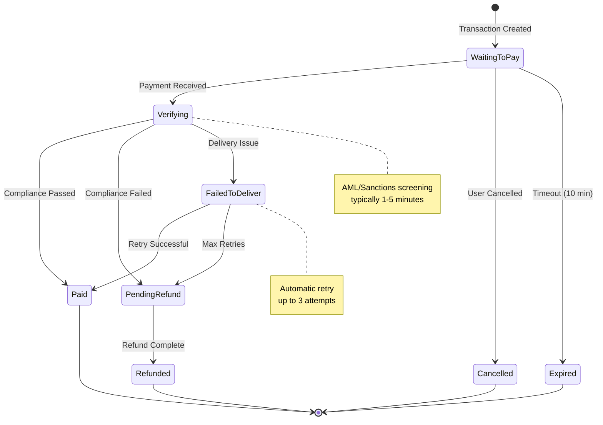
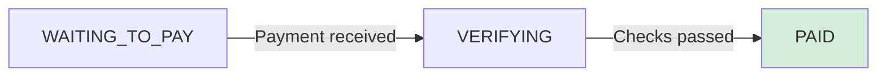
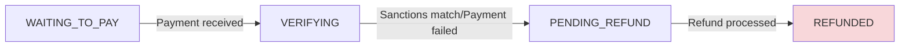
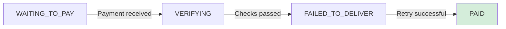

Every remittance transaction moves through a series of well-defined states from creation to completion. Understanding these states helps you build robust integrations and provide clear user feedback.



### Active States

<AccordionGroup>
  <Accordion title="WAITING_TO_PAY" icon="clock">
    **Description**: Transaction created, awaiting payment from user

    **What Happens**:
    - Transaction reference generated
    - User redirected to payment page
    - Timer starts for quote validity

    **User Actions Available**:
    - Complete payment via card or open banking
    - Cancel the transaction
    - View transaction details

    **Next Possible States**:
    - `VERIFYING` - Payment successfully received
    - `CANCELLED` - User cancelled before payment
    - `EXPIRED` - Payment not completed within 10 minutes
  </Accordion>

  <Accordion title="VERIFYING" icon="shield-check">
    **Description**: Payment received, undergoing compliance checks

    **What Happens**:
    - AML/CFT screening initiated
    - Sanctions list checking
    - Risk score calculation
    - PEP screening (if applicable)
    - Transaction pattern analysis

    **System Actions**:
    - Automated compliance checks run
    - Manual review triggered if flagged
    - Compliance team notified (if needed)

    **Next Possible States**:
    - `PAID` - All checks passed, funds disbursed
    - `PENDING_REFUND` - Compliance or payment after transaction expiration
    - `FAILED_TO_DELIVER` - Delivery issues detected

    <Info>
      Most transactions (95%+) pass automated checks and move to PAID within 0-2 minutes.
    </Info>
  </Accordion>

  <Accordion title="FAILED_TO_DELIVER" icon="triangle-exclamation">
    **Description**: Delivery attempt failed, automatic retry in progress

    **Common Causes**:
    - Invalid or closed bank account
    - Inactive mobile money account
    - Network timeout or provider downtime
    - Incorrect account details
    - Beneficiary name mismatch

    **System Actions**:
    - Exponential backoff between retries
    - Notify compliance team after 2nd failure
    - Contact user for corrections if needed

    **Next Possible States**:
    - `PAID` - Retry successful
    - `PENDING_REFUND`

    <Warning>
      Contact your customer to verify beneficiary details if this status persists.
    </Warning>
  </Accordion>

  <Accordion title="PENDING_REFUND" icon="rotate-left">
    **Description**: Refund initiated, processing back to sender

    **Triggers**:
    - Compliance rejection (AML/sanctions)
    - Delivery failure after max retries
    - Customer dispute (within refund window)
    - Technical error requiring reversal

    **What Happens**:
    - Refund request submitted to payment processor
    - Original payment method receives credit
    - Refund notification sent to user
    - Transaction marked for closure

    **Refund Amount**:
    - Full transaction amount (send amount)
    - All fees included
    - Same payment method as original

    **Next Possible State**:
    - `REFUNDED` - Refund completed successfully
  </Accordion>
</AccordionGroup>

## State Transition Triggers

Understanding what causes state changes helps you build better error handling.

### Payment-Related Transitions

| From State | To State | Trigger | Action Required |
|------------|----------|---------|-----------------|
| `WAITING_TO_PAY` | `VERIFYING` | Payment successful | Automatic |
| `WAITING_TO_PAY` | `CANCELLED` | User cancelled | None |
| `WAITING_TO_PAY` | `EXPIRED` | 10 min timeout | Request new quote |

### Compliance-Related Transitions

| From State | To State | Trigger | Action Required |
|------------|----------|---------|-----------------|
| `VERIFYING` | `PAID` | All checks passed | None - Automatic |
| `VERIFYING` | `PENDING_REFUND` | Compliance/Payment failed | Contact support |
| `VERIFYING` | `FAILED_TO_DELIVER` | Delivery issue | Check beneficiary details |

### Refund Transitions

| From State | To State | Trigger | Action Required |
|------------|----------|---------|-----------------|
| `PENDING_REFUND` | `REFUNDED` | Refund processed | Automatic |

<Card title="Webhook Configuration" href="/api/webhooks">
  Learn how to set up webhooks for real-time updates
</Card>

## Common Scenarios

### Scenario 1: Successful Transaction


### Scenario 2: Compliance Rejection



### Scenario 3: Delivery Failure with Recovery



## API Reference

<CardGroup cols={2}>
<Card title="Transaction Status Endpoint" href="/api/transactions/history-data">
  View complete API documentation for tracking transaction status
</Card>

<Card title="Beneficiary Lifecycle" href="/remittance/beneficiary-lifecycle">
  Learn how to create and validate beneficiaries
</Card>
</CardGroup>

## Quote Calculator Integration

You can easily integrate a Quote Calculator into your own website or dashboard using the ready-made widget below. This widget handles country selection, transaction types, and real-time quote generation.

### Integration Guide

1.  **Download & Customize**: Copy the code below and save it as an `.html` file (e.g., `quote_widget.html`).
2.  **Embed**: Use an `iframe` or include the code directly in your project.
3.  **Style**: Modify the CSS variables in the `<style>` section to match your brand colors.

<CodeGroup>

```html quote_widget.html
<!DOCTYPE html>
<html lang="en">

<head>
    <meta charset="UTF-8">
    <meta name="viewport" content="width=device-width, initial-scale=1.0">
    <title>Remittance Quote Calculator</title>
    <link href="https://fonts.googleapis.com/css2?family=Inter:wght@400;500;600;700&display=swap" rel="stylesheet">
    <style>
        :root {
            --primary-color: #4F46E5;
            /* Indigo 600 */
            --primary-hover: #4338CA;
            /* Indigo 700 */
            --bg-color: #F9FAFB;
            /* Gray 50 */
            --card-bg: #FFFFFF;
            --text-main: #111827;
            /* Gray 900 */
            --text-secondary: #6B7280;
            /* Gray 500 */
            --border-color: #E5E7EB;
            /* Gray 200 */
            --ring-color: #E0E7FF;
            /* Indigo 100 */
            --shadow: 0 4px 6px -1px rgba(0, 0, 0, 0.1), 0 2px 4px -1px rgba(0, 0, 0, 0.06);
            --radius: 12px;
            --input-height: 48px;
        }

        * {
            margin: 0;
            padding: 0;
            box-sizing: border-box;
            font-family: 'Inter', sans-serif;
        }

        body {
            background-color: var(--bg-color);
            display: flex;
            justify-content: center;
            align-items: center;
            min-height: 100vh;
            padding: 20px;
        }

        .quote-widget {
            background: var(--card-bg);
            border-radius: var(--radius);
            box-shadow: var(--shadow);
            width: 100%;
            max-width: 450px;
            padding: 24px;
            border: 1px solid var(--border-color);
        }

        .widget-header {
            margin-bottom: 24px;
            text-align: center;
        }

        .widget-header h2 {
            font-size: 20px;
            font-weight: 700;
            color: var(--text-main);
            margin-bottom: 8px;
        }

        .widget-header p {
            font-size: 14px;
            color: var(--text-secondary);
        }

        .form-group {
            margin-bottom: 16px;
        }

        .label {
            display: block;
            font-size: 14px;
            font-weight: 500;
            color: var(--text-main);
            margin-bottom: 6px;
        }

        .select-wrapper,
        .input-wrapper {
            position: relative;
        }

        select,
        input {
            width: 100%;
            height: var(--input-height);
            border: 1px solid var(--border-color);
            border-radius: 8px;
            padding: 0 12px;
            font-size: 15px;
            color: var(--text-main);
            outline: none;
            background: #fff;
            transition: all 0.2s;
            -webkit-appearance: none;
        }

        select:focus,
        input:focus {
            border-color: var(--primary-color);
            box-shadow: 0 0 0 3px var(--ring-color);
        }

        .select-icon {
            position: absolute;
            right: 12px;
            top: 50%;
            transform: translateY(-50%);
            pointer-events: none;
            color: var(--text-secondary);
        }

        /* Currency Input Row */
        .currency-row {
            display: flex;
            gap: 12px;
        }

        .currency-select {
            width: 100px;
            flex-shrink: 0;
        }

        .amount-input {
            flex-grow: 1;
            text-align: right;
        }

        .conversion-info {
            background: #EFF6FF;
            /* Blue 50 */
            border-radius: 8px;
            padding: 12px;
            margin: 20px 0;
            display: flex;
            justify-content: space-between;
            align-items: center;
            font-size: 13px;
        }

        .rate-text {
            color: var(--primary-color);
            font-weight: 600;
        }

        .fee-text {
            color: var(--text-secondary);
            display: none;
        }

        .submit-btn {
            width: 100%;
            height: var(--input-height);
            background: var(--primary-color);
            color: white;
            border: none;
            border-radius: 8px;
            font-size: 16px;
            font-weight: 600;
            cursor: pointer;
            transition: background 0.2s;
        }

        .submit-btn:hover {
            background: var(--primary-hover);
        }

        .submit-btn:disabled {
            background: #9CA3AF;
            cursor: not-allowed;
        }

        .loader {
            border: 2px solid #f3f3f3;
            /* Light grey */
            border-top: 2px solid var(--primary-color);
            /* Blue */
            border-radius: 50%;
            width: 16px;
            height: 16px;
            animation: spin 1s linear infinite;
            display: none;
            vertical-align: middle;
            margin-left: 8px;
        }

        @keyframes spin {
            0% {
                transform: rotate(0deg);
            }

            100% {
                transform: rotate(360deg);
            }
        }

        .flag-icon {
            margin-right: 8px;
        }

        .error-msg {
            color: #EF4444;
            font-size: 12px;
            margin-top: 4px;
            display: none;
        }
    </style>
</head>

<body>

    <div class="quote-widget" id="quoteWidget">
        <div class="widget-header">
            <h2>Get a Quote</h2>
            <p>See how much your recipient gets.</p>
        </div>

        <!-- Country Selection -->
        <div class="form-group">
            <label class="label">Sending From</label>
            <div class="select-wrapper">
                <select id="sendingCountry" onchange="onSendingCountryChange()">
                    <option value="" disabled selected>Loading...</option>
                </select>
                <div class="select-icon">▼</div>
            </div>
        </div>

        <div class="form-group">
            <label class="label">Transaction Service</label>
            <div class="select-wrapper">
                <select id="transactionType" onchange="onTransactionTypeChange()">
                    <option value="" disabled selected>Loading...</option>
                </select>
                <div class="select-icon">▼</div>
            </div>
        </div>

        <div class="form-group">
            <label class="label">Receiving In</label>
            <div class="select-wrapper">
                <select id="receivingCountry" onchange="onReceivingCountryChange()">
                    <option value="" disabled selected>Select destination</option>
                </select>
                <div class="select-icon">▼</div>
            </div>
        </div>

        <!-- Amount Inputs -->
        <div class="form-group">
            <label class="label">You Send</label>
            <div class="currency-row">
                <div class="select-wrapper currency-select">
                    <select id="sendingCurrency" onchange="getQuote()">
                    </select>
                    <div class="select-icon" style="font-size: 10px; right: 8px;">▼</div>
                </div>
                <div class="input-wrapper" style="flex-grow: 1;">
                    <input type="number" id="sendAmount" placeholder="1000" oninput="debounceQuote(this, 'send')">
                </div>
            </div>
        </div>

        <div class="form-group">
            <label class="label">They Receive</label>
            <div class="currency-row">
                <div class="select-wrapper currency-select">
                    <select id="receivingCurrency" onchange="getQuote()">
                    </select>
                    <div class="select-icon" style="font-size: 10px; right: 8px;">▼</div>
                </div>
                <div class="input-wrapper" style="flex-grow: 1;">
                    <input type="number" id="receiveAmount" placeholder="0.00" oninput="debounceQuote(this, 'receive')">
                </div>
            </div>
        </div>

        <!-- Live Rate Display -->
        <div class="conversion-info">
            <div>
                Rate: <span id="fxRate" class="rate-text">--</span> <span class="loader" id="rateLoader"></span>
            </div>
            <div id="feesInfo" class="fee-text">Fees: 0.00</div>
        </div>

        <div id="apiError" class="error-msg" style="margin-bottom: 12px; text-align: center;"></div>

        <button class="submit-btn" onclick="goToApp()">Send Money Now</button>
    </div>

    <script>
        // --- State ---
        const STATE = {
            sendingCountry: null,
            receivingCountry: null,
            transactionType: null,
            sendingCurrency: null,
            receivingCurrency: null,
            quoteData: null
        };

        // --- API Configuration ---
        const BASE_URL = 'https://agent.fincode.software/api/v6/services';
        const HEADERS = {
            'Content-Type': 'application/json',
            'platform': 'fincode',
            'uuid': '200',
            'X-Auth-Token': 'eyJ0eXAiOiJKV1QiLUwOYWNPef4RcY7Rhg...'
        };

        // --- DOM Elements ---
        const els = {
            sendCountry: document.getElementById('sendingCountry'),
            transType: document.getElementById('transactionType'),
            recCountry: document.getElementById('receivingCountry'),
            sendCurrency: document.getElementById('sendingCurrency'),
            recCurrency: document.getElementById('receivingCurrency'),
            sendAmt: document.getElementById('sendAmount'),
            recAmt: document.getElementById('receiveAmount'),
            fxRateDisplay: document.getElementById('fxRate'),
            loader: document.getElementById('rateLoader'),
            errorMsg: document.getElementById('apiError')
        };

        // --- Debounce Helper ---
        let debounceTimer;
        function debounceQuote(inputElement, source) {
            clearTimeout(debounceTimer);
            // Visual indicator of activity if needed
            els.loader.style.display = 'inline-block';

            debounceTimer = setTimeout(() => {
                getQuote(source);
            }, 800);
        }

        // --- Initial Load ---
        (async function init() {
            await Promise.all([fetchSendingCountries(), fetchTransactionTypes()]);
            if (els.sendCountry.value && els.transType.value) {
                onTransactionTypeChange(); // This starts the cascade
            }
        })();

        // --- API Calls ---
        async function fetchSendingCountries() {
            try {
                const res = await fetch(`${BASE_URL}/utilitiesmanagement/list-all-countries`, { headers: HEADERS });
                const json = await res.json();

                if (json.status === 'SUCCESS' && json.data.countries) {
                    els.sendCountry.innerHTML = '';
                    json.data.countries.forEach(c => {
                        const opt = document.createElement('option');
                        opt.value = c.iso3Code;
                        opt.text = c.common_name;
                        // Default to GBR if exists, else first one
                        if (c.iso3Code === 'GBR') opt.selected = true;
                        els.sendCountry.appendChild(opt);
                    });
                    STATE.sendingCountry = els.sendCountry.value;
                }
            } catch (e) {
                console.error("Error fetching sending countries", e);
                showError("Failed to load countries");
            }
        }

        async function fetchTransactionTypes() {
            try {
                const res = await fetch(`${BASE_URL}/transactionmanagement/transaction-types`, { headers: HEADERS });
                const json = await res.json();

                if (json.status === 'SUCCESS' && json.data.transactionTypes) {
                    els.transType.innerHTML = '';
                    const types = json.data.transactionTypes.filter(t => t.enabled);

                    types.forEach(t => {
                        const opt = document.createElement('option');
                        opt.value = t.serviceType;
                        opt.text = formatServiceType(t.serviceType);
                        if (t.serviceType === 'ACCOUNTPAYMENT') opt.selected = true;
                        els.transType.appendChild(opt);
                    });
                    STATE.transactionType = els.transType.value;
                }
            } catch (e) {
                console.error("Error fetching transaction types", e);
            }
        }

        // Triggered when Sending Country or Transaction Type changes
        async function onSendingCountryChange() {
            STATE.sendingCountry = els.sendCountry.value;
            onTransactionTypeChange(); // re-fetch destinations
        }

        async function onTransactionTypeChange() {
            STATE.transactionType = els.transType.value;
            STATE.sendingCountry = els.sendCountry.value;

            if (!STATE.sendingCountry || !STATE.transactionType) return;

            els.recCountry.innerHTML = '<option>Loading...</option>';

            const url = `${BASE_URL}/quote/destination-country-by-delivery-method/${STATE.sendingCountry}/${STATE.transactionType}`;

            try {
                const res = await fetch(url, { headers: HEADERS });
                const json = await res.json();

                els.recCountry.innerHTML = '';

                // The API returns 'countries' in data
                if (json.data && json.data.countries && json.data.countries.length > 0) {
                    json.data.countries.forEach((c, index) => {
                        const opt = document.createElement('option');
                        opt.value = c.iso3Code;
                        opt.text = c.common_name;
                        if (index === 0) opt.selected = true;
                        els.recCountry.appendChild(opt);
                    });
                    onReceivingCountryChange();
                } else {
                    els.recCountry.innerHTML = '<option disabled>No destinations found</option>';
                }

            } catch (e) {
                console.error("Error fetching receiving countries", e);
                els.recCountry.innerHTML = '<option disabled>Error loading</option>';
            }
        }

        async function onReceivingCountryChange() {
            STATE.receivingCountry = els.recCountry.value;
            // Fetch Currencies in parallel
            await Promise.all([fetchSendingCurrencies(), fetchReceivingCurrencies()]);
            // Default amount if empty
            if (!els.sendAmt.value && !els.recAmt.value) {
                els.sendAmt.value = "100.00"; // Default seed
            }
            getQuote('send');
        }

        async function fetchSendingCurrencies() {
            const url = `${BASE_URL}/quote/supported-currencies/${STATE.sendingCountry}/${STATE.receivingCountry}/${STATE.transactionType}`;

            try {
                const res = await fetch(url, { headers: HEADERS });
                const json = await res.json();

                els.sendCurrency.innerHTML = '';
                if (json.data && json.data.currencies) {
                    json.data.currencies.forEach((c, index) => {
                        const opt = document.createElement('option');
                        opt.value = c;
                        opt.text = c;
                        if (index === 0) opt.selected = true;
                        els.sendCurrency.appendChild(opt);
                    });
                }
            } catch (e) { console.error(e); }
        }

        async function fetchReceivingCurrencies() {
            let sendCurr = els.sendCurrency.value;
            if (!sendCurr) {
                sendCurr = 'GBP';
            }

            const url = `${BASE_URL}/quote/supported-delivery-currencies/${STATE.sendingCountry}/${STATE.receivingCountry}/${STATE.transactionType}/${sendCurr}`;

            try {
                const res = await fetch(url, { headers: HEADERS });
                const json = await res.json();

                els.recCurrency.innerHTML = '';
                if (json.data && json.data.currencies) {
                    json.data.currencies.forEach((c, index) => {
                        const opt = document.createElement('option');
                        opt.value = c;
                        opt.text = c;
                        if (index === 0) opt.selected = true; // Auto pick first
                        if (c === 'NGN') opt.selected = true;
                        els.recCurrency.appendChild(opt);
                    });
                }
            } catch (e) { console.error(e); }
        }


        /* 
         *'send' (user typed in send box) or 'receive' (user typed in receive box)
         */
        async function getQuote(source = 'send') {
            els.loader.style.display = 'inline-block';
            els.errorMsg.style.display = 'none';
            els.fxRateDisplay.innerText = '--';

            STATE.sendingCurrency = els.sendCurrency.value;
            STATE.receivingCurrency = els.recCurrency.value;

            const isInverse = source === 'receive';
            const principalAmt = isInverse ? "0.00" : (els.sendAmt.value || "0");
            const deriveAmt = isInverse ? (els.recAmt.value || "0") : "0.00";

            const payload = {
                "paymentType": "ONLINE_CARD_PAYMENT",
                "chargeCategory": "MONEYTRANSFER",
                "principalAmount": principalAmt,
                "principalAmountCurrency": STATE.sendingCurrency,
                "deriveAmount": deriveAmt,
                "deriveAmountCurrency": STATE.receivingCurrency,
                "transactionType": STATE.transactionType,
                "destinationCountry": STATE.receivingCountry,
                "inverseCalculation": isInverse,
                "tradeOriginatingCountry": STATE.sendingCountry,
                "conversion": true,
                "promoCode": "string",
                "mobileOperator": "string"
            };

            try {
                const res = await fetch(`${BASE_URL}/quote/callQuote`, {
                    method: 'POST',
                    headers: HEADERS,
                    body: JSON.stringify(payload)
                });

                const json = await res.json();

                els.loader.style.display = 'none';

                if (json.status === 'SUCCESS' && json.data) {
                    const data = json.data;
                    // Update UI
                    if (source === 'send') {
                        els.recAmt.value = data.receivingAmount.toFixed(2);
                    } else {
                        els.sendAmt.value = data.sendingAmount.toFixed(2);
                    }

                    // Update rate display: Rate: 1 GBP = 2000.00 NGN
                    const rateVal = data.fxRate ? data.fxRate.toFixed(2) : '0.00';
                    els.fxRateDisplay.innerText = `1 ${data.sendingCurrency} = ${rateVal} ${data.receivingCurrency}`;
                    STATE.quoteData = data;
                } else {
                    showError("Could not calculate quote. Please select valid parameters.");
                }
            } catch (e) {
                els.loader.style.display = 'none';
                console.error(e);
                showError("Connection error.");
            }
        }

        function showError(msg) {
            els.errorMsg.innerText = msg;
            els.errorMsg.style.display = 'block';
            els.fxRateDisplay.innerText = '--';
        }

        function formatServiceType(str) {
            if (!str) return '';
            return str.replace(/_/g, ' ')
                .toLowerCase()
                .replace(/\b\w/g, s => s.toUpperCase());
        }

        function goToApp() {
            // Placeholder for redirecting to the actual app
            alert('This would redirect to your main app login/register page with these pre-filled values.');
        }

    </script>

</body>
</html>
```

</CodeGroup>
